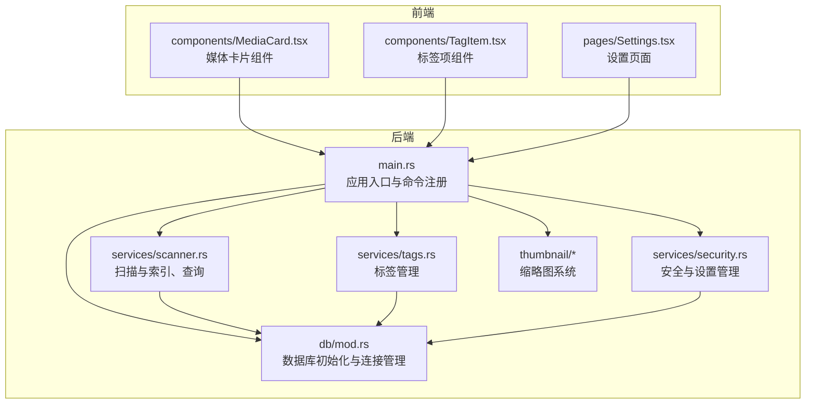
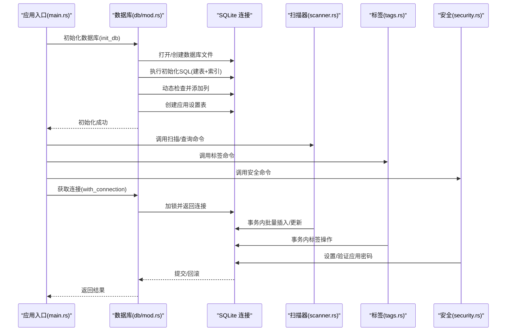
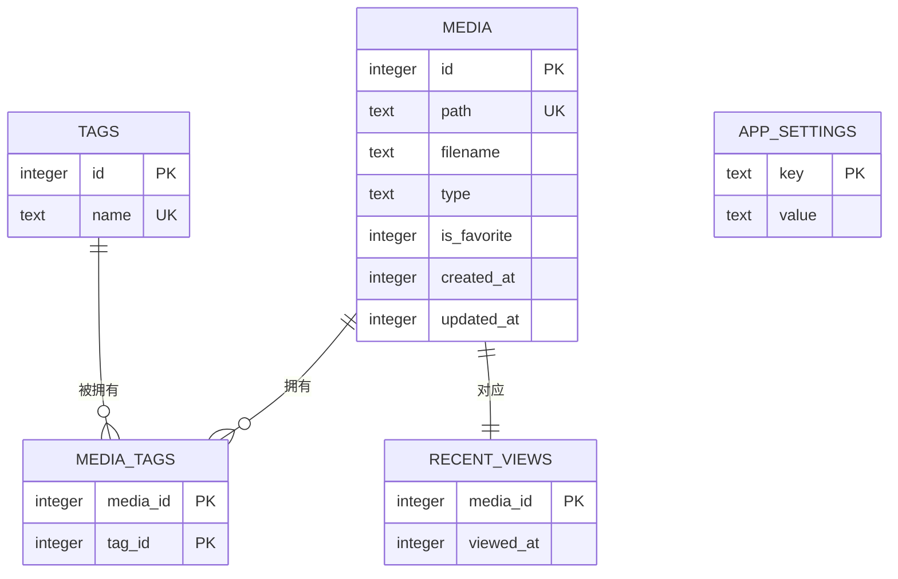
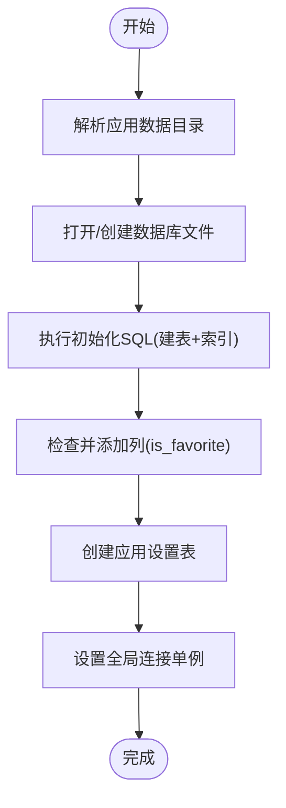
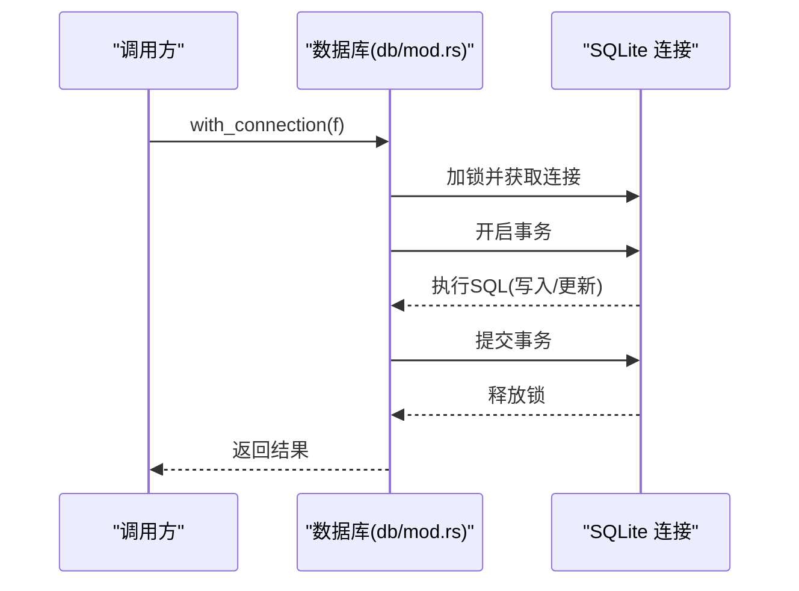
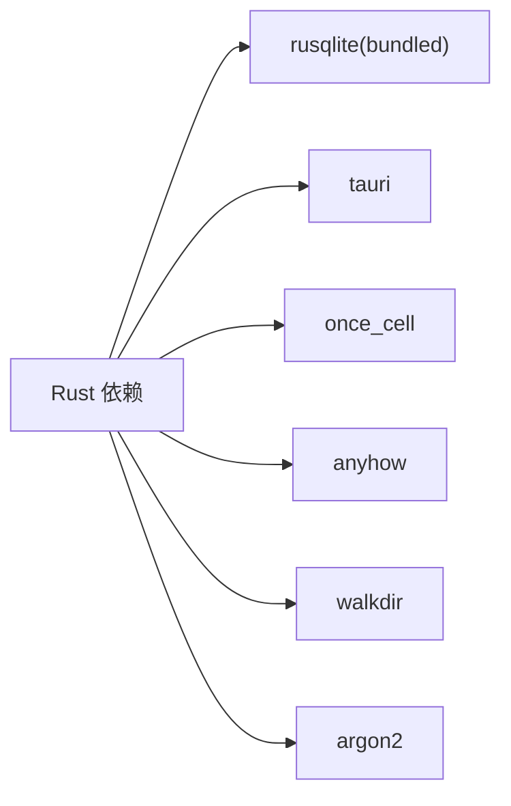

# 数据库设计

<cite>
**本文引用的文件**
- [src-tauri/src/db/mod.rs](file://src-tauri/src/db/mod.rs)
- [src-tauri/src/services/scanner.rs](file://src-tauri/src/services/scanner.rs)
- [src-tauri/src/services/tags.rs](file://src-tauri/src/services/tags.rs)
- [src-tauri/src/services/security.rs](file://src-tauri/src/services/security.rs)
- [src-tauri/src/main.rs](file://src-tauri/src/main.rs)
- [src-tauri/Cargo.toml](file://src-tauri/Cargo.toml)
- [src-tauri/src/thumbnail/manager.rs](file://src-tauri/src/thumbnail/manager.rs)
- [src-tauri/src/thumbnail/mod.rs](file://src-tauri/src/thumbnail/mod.rs)
- [src-tauri/src/thumbnail/queue.rs](file://src-tauri/src/thumbnail/queue.rs)
- [src/components/MediaCard.tsx](file://src/components/MediaCard.tsx)
- [src/components/TagItem.tsx](file://src/components/TagItem.tsx)
- [src/pages/Settings.tsx](file://src/pages/Settings.tsx)
</cite>

## 更新摘要
**变更内容**
- 新增 app_settings 表设计说明和应用设置存储机制
- 增强数据库初始化流程，包含动态表检查和列兼容性处理
- 新增应用密码功能，使用 Argon2 哈希算法保护敏感信息
- 完善数据库迁移策略，支持版本管理和向后兼容

## 目录
1. [简介](#简介)
2. [项目结构](#项目结构)
3. [核心组件](#核心组件)
4. [架构总览](#架构总览)
5. [详细组件分析](#详细组件分析)
6. [依赖分析](#依赖分析)
7. [性能考虑](#性能考虑)
8. [故障排查指南](#故障排查指南)
9. [结论](#结论)
10. [附录](#附录)

## 简介
本文件面向 Medex 桌面应用的数据库设计与实现，聚焦于基于 SQLite 的本地数据库架构。内容涵盖数据模型定义、表结构设计与索引策略；媒体文件表、标签表、媒体标签关联表、应用设置表的设计原理与字段说明；数据库初始化流程、连接管理与事务处理机制；查询优化策略、索引设计原则与性能调优方法；数据完整性约束、外键关系与一致性保障；以及数据库迁移策略与版本管理方案。文末提供 SQL 模式定义与数据访问示例路径，帮助开发者快速理解与扩展。

## 项目结构
Medex 的数据库层位于 Tauri 后端模块中，采用单例连接与线程安全封装，配合扫描器、标签服务和安全服务进行数据写入与读取。缩略图子系统独立于数据库，但与媒体数据存在间接关联（通过路径匹配）。前端组件通过 Tauri 命令调用后端服务，实现数据展示与交互。

**图表来源**
- [src-tauri/src/main.rs:10-69](file://src-tauri/src/main.rs#L10-L69)
- [src-tauri/src/db/mod.rs:1-171](file://src-tauri/src/db/mod.rs#L1-L171)
- [src-tauri/src/services/scanner.rs:1-525](file://src-tauri/src/services/scanner.rs#L1-L525)
- [src-tauri/src/services/tags.rs:1-220](file://src-tauri/src/services/tags.rs#L1-L220)
- [src-tauri/src/services/security.rs:1-44](file://src-tauri/src/services/security.rs#L1-L44)
- [src-tauri/src/thumbnail/mod.rs:1-62](file://src-tauri/src/thumbnail/mod.rs#L1-L62)
- [src/components/MediaCard.tsx:1-318](file://src/components/MediaCard.tsx#L1-L318)
- [src/components/TagItem.tsx:1-70](file://src/components/TagItem.tsx#L1-L70)
- [src/pages/Settings.tsx:1-503](file://src/pages/Settings.tsx#L1-L503)

**章节来源**
- [src-tauri/src/main.rs:10-69](file://src-tauri/src/main.rs#L10-L69)
- [src-tauri/src/db/mod.rs:1-171](file://src-tauri/src/db/mod.rs#L1-L171)

## 核心组件
- 数据库初始化与连接管理：负责解析应用数据目录、创建数据库文件、执行初始化 SQL、确保列存在性、提供线程安全的连接获取接口。
- 扫描器与索引：负责扫描指定目录中的媒体文件、批量插入媒体记录、按类型过滤、按标签筛选、标记最近观看、清空库数据等。
- 标签服务：负责标签的创建、删除、查询、为媒体添加或移除标签、统计标签使用计数。
- 安全服务：负责应用密码的设置、验证、存在性检查和清除，使用 Argon2 哈希算法确保密码安全存储。
- 缩略图系统：与数据库无直接耦合，但通过路径判断与缓存目录协作，间接影响媒体浏览体验。

**章节来源**
- [src-tauri/src/db/mod.rs:45-171](file://src-tauri/src/db/mod.rs#L45-L171)
- [src-tauri/src/services/scanner.rs:90-389](file://src-tauri/src/services/scanner.rs#L90-L389)
- [src-tauri/src/services/tags.rs:19-219](file://src-tauri/src/services/tags.rs#L19-L219)
- [src-tauri/src/services/security.rs:1-44](file://src-tauri/src/services/security.rs#L1-L44)
- [src-tauri/src/thumbnail/mod.rs:32-61](file://src-tauri/src/thumbnail/mod.rs#L32-L61)

## 架构总览
数据库采用单例连接模式，通过 OnceCell 与 Mutex 包装 rusqlite 连接，避免并发竞争。初始化时创建核心表与索引，并在运行期动态补全列。扫描器、标签服务和安全服务通过统一的连接获取函数执行 SQL，所有写操作均在事务内完成，确保原子性与一致性。

**图表来源**
- [src-tauri/src/main.rs:14-18](file://src-tauri/src/main.rs#L14-L18)
- [src-tauri/src/db/mod.rs:50-112](file://src-tauri/src/db/mod.rs#L50-L112)
- [src-tauri/src/services/scanner.rs:250-341](file://src-tauri/src/services/scanner.rs#L250-L341)
- [src-tauri/src/services/tags.rs:77-188](file://src-tauri/src/services/tags.rs#L77-L188)
- [src-tauri/src/services/security.rs:7-44](file://src-tauri/src/services/security.rs#L7-L44)

## 详细组件分析

### 数据模型与表结构设计
- 媒体表（media）
  - 主键：自增 id
  - 唯一约束：path
  - 字段：path、filename、type、is_favorite、created_at、updated_at
  - 设计要点：以绝对路径作为唯一标识，便于去重与快速定位；is_favorite 用于收藏状态；时间戳用于排序与审计。
- 标签表（tags）
  - 主键：自增 id
  - 唯一约束：name
  - 字段：id、name
  - 设计要点：标签名唯一，避免重复标签；支持后续扩展如颜色、图标等。
- 媒体标签关联表（media_tags）
  - 复合主键：(media_id, tag_id)
  - 设计要点：多对多关系的标准实现；复合主键天然去重。
- 最近观看表（recent_views）
  - 主键：media_id
  - 字段：media_id、viewed_at
  - 设计要点：记录媒体最近观看时间，限制条目数量以控制存储膨胀。
- 应用设置表（app_settings）
  - 主键：key
  - 字段：key、value
  - 设计要点：键值对存储机制，支持任意类型的应用设置；使用 ON CONFLICT 处理更新逻辑。

**图表来源**
- [src-tauri/src/db/mod.rs:12-48](file://src-tauri/src/db/mod.rs#L12-L48)

**章节来源**
- [src-tauri/src/db/mod.rs:12-48](file://src-tauri/src/db/mod.rs#L12-L48)

### 索引策略与查询优化
- 媒体表索引
  - idx_media_path：加速按路径查找与去重插入。
- 关联表索引
  - idx_media_tags_media_id：加速按媒体查询标签。
  - idx_media_tags_tag_id：加速按标签查询媒体。
- 最近观看表索引
  - idx_recent_views_viewed_at：降序索引，支持按时间取 Top N 的高效查询。
- 应用设置表索引
  - 由于 key 为主键，具有唯一性约束，查询效率高。
- 查询优化建议
  - 使用 EXPLAIN QUERY PLAN 分析复杂查询计划。
  - 对高频过滤条件（类型、标签名）建立覆盖索引或物化视图。
  - 将分页与排序结合，避免一次性加载大量数据。

**章节来源**
- [src-tauri/src/db/mod.rs:39-48](file://src-tauri/src/db/mod.rs#L39-L48)
- [src-tauri/src/services/scanner.rs:117-158](file://src-tauri/src/services/scanner.rs#L117-L158)
- [src-tauri/src/services/scanner.rs:171-247](file://src-tauri/src/services/scanner.rs#L171-L247)

### 数据库初始化流程与连接管理
- 初始化流程
  - 解析应用数据目录并创建数据库文件。
  - 批量执行初始化 SQL，创建表与索引。
  - 动态检查并添加 is_favorite 列，保证向后兼容。
  - 创建应用设置表 ensure_app_settings_table。
  - 设置全局连接单例，供后续使用。
- 连接管理
  - 使用 OnceCell 存储 Mutex 包装的 Connection，避免重复初始化。
  - 提供 with_connection 闭包接口，自动加锁并传递可变连接引用。
- 错误处理
  - 所有关键步骤均包裹上下文错误，便于定位问题。

**图表来源**
- [src-tauri/src/db/mod.rs:160-171](file://src-tauri/src/db/mod.rs#L160-L171)
- [src-tauri/src/db/mod.rs:50-112](file://src-tauri/src/db/mod.rs#L50-L112)
- [src-tauri/src/db/mod.rs:66-95](file://src-tauri/src/db/mod.rs#L66-L95)

**章节来源**
- [src-tauri/src/db/mod.rs:50-171](file://src-tauri/src/db/mod.rs#L50-L171)

### 事务处理机制
- 写入批处理：批量插入媒体时开启事务，显著提升性能并保证原子性。
- 标签操作：创建标签、添加/移除标签均在事务内执行，防止中间状态。
- 最近观看：插入最近观看记录并裁剪至 Top N，事务保证一致性。
- 清空库数据：删除媒体、关联与序列重置在事务内完成，确保状态一致。
- 应用设置：设置、获取和删除设置均在事务内执行，确保数据一致性。

**图表来源**
- [src-tauri/src/db/mod.rs:145-158](file://src-tauri/src/db/mod.rs#L145-L158)
- [src-tauri/src/services/scanner.rs:93-115](file://src-tauri/src/services/scanner.rs#L93-L115)
- [src-tauri/src/services/tags.rs:98-123](file://src-tauri/src/services/tags.rs#L98-L123)
- [src-tauri/src/services/scanner.rs:360-389](file://src-tauri/src/services/scanner.rs#L360-L389)

**章节来源**
- [src-tauri/src/services/scanner.rs:90-115](file://src-tauri/src/services/scanner.rs#L90-L115)
- [src-tauri/src/services/tags.rs:77-188](file://src-tauri/src/services/tags.rs#L77-L188)
- [src-tauri/src/services/scanner.rs:250-341](file://src-tauri/src/services/scanner.rs#L250-L341)

### 应用设置存储机制
- 设置表设计
  - 采用键值对存储模式，key 为主键，value 为 TEXT 类型。
  - 支持任意类型的应用设置，通过字符串序列化存储。
- 设置 API
  - set_setting：设置或更新应用设置，使用 ON CONFLICT(key) DO UPDATE 实现幂等更新。
  - get_setting：获取指定键的设置值，返回 Option<String>。
  - remove_setting：删除指定键的设置。
- 密码安全存储
  - 使用 Argon2 哈希算法对应用密码进行安全存储。
  - 密钥常量 PASSWORD_SETTING_KEY = "app_password_hash"。
  - 支持密码长度验证（6-20字符）。
- 设置命令
  - set_app_password：设置应用密码，返回 Result<(), String>。
  - verify_app_password：验证应用密码，返回 bool。
  - app_password_exists：检查密码是否存在。
  - clear_app_password：清除应用密码。

**章节来源**
- [src-tauri/src/db/mod.rs:103-143](file://src-tauri/src/db/mod.rs#L103-L143)
- [src-tauri/src/services/security.rs:1-44](file://src-tauri/src/services/security.rs#L1-L44)

### 查询逻辑与数据访问示例
- 获取全部媒体（含标签拼接与最近观看）
  - 示例路径：[查询构建与执行:117-158](file://src-tauri/src/services/scanner.rs#L117-L158)
- 按标签筛选媒体（支持多标签 AND 条件）
  - 示例路径：[动态 SQL 与参数绑定:171-247](file://src-tauri/src/services/scanner.rs#L171-L247)
- 按类型过滤媒体
  - 示例路径：[类型过滤与分组聚合:410-458](file://src-tauri/src/services/scanner.rs#L410-L458)
- 标签查询与计数
  - 示例路径：[标签列表与计数:19-74](file://src-tauri/src/services/tags.rs#L19-L74)
- 添加/移除标签到媒体
  - 示例路径：[添加标签到媒体:127-164](file://src-tauri/src/services/tags.rs#L127-L164)、[移除标签:167-188](file://src-tauri/src/services/tags.rs#L167-L188)
- 标记媒体为收藏与最近观看
  - 示例路径：[收藏状态更新:344-354](file://src-tauri/src/services/scanner.rs#L344-L354)、[最近观看插入与裁剪:357-389](file://src-tauri/src/services/scanner.rs#L357-L389)
- 应用设置管理
  - 示例路径：[设置密码:7-19](file://src-tauri/src/services/security.rs#L7-L19)、[验证密码:22-33](file://src-tauri/src/services/security.rs#L22-L33)

**章节来源**
- [src-tauri/src/services/scanner.rs:117-247](file://src-tauri/src/services/scanner.rs#L117-L247)
- [src-tauri/src/services/tags.rs:19-219](file://src-tauri/src/services/tags.rs#L19-L219)
- [src-tauri/src/services/security.rs:1-44](file://src-tauri/src/services/security.rs#L1-L44)

### 数据完整性约束与一致性
- 唯一性约束
  - media.path 唯一，避免重复记录。
  - tags.name 唯一，避免重复标签。
  - app_settings.key 唯一，确保设置的唯一性。
- 外键关系
  - 当前模式未显式声明外键约束，但通过复合主键与业务逻辑保证多对多关系。
- 事务与原子性
  - 所有写操作均在事务内执行，确保失败回滚。
- 向后兼容
  - 动态检查并添加 is_favorite 列，避免破坏既有数据。
  - 应用设置表的动态创建确保新旧版本兼容。

**章节来源**
- [src-tauri/src/db/mod.rs:12-48](file://src-tauri/src/db/mod.rs#L12-L48)
- [src-tauri/src/db/mod.rs:66-95](file://src-tauri/src/db/mod.rs#L66-L95)
- [src-tauri/src/services/scanner.rs:250-341](file://src-tauri/src/services/scanner.rs#L250-L341)

### 数据库迁移策略与版本管理
- 当前实现
  - 通过初始化 SQL 与动态列检查实现简单迁移：新增表、索引与列。
  - 动态表检查 ensure_app_settings_table 确保新表的创建。
- 推荐方案
  - 引入版本号字段与迁移脚本：在初始化时比较当前版本与目标版本，按顺序执行迁移。
  - 事务化迁移：每个迁移步骤在独立事务中执行，失败则回滚。
  - 备份策略：执行重大迁移前备份数据库文件。
  - 记录迁移历史：新增迁移日志表，记录已执行的迁移。
  - 向后兼容性：保持现有 API 的兼容性，逐步引入新功能。

**章节来源**
- [src-tauri/src/db/mod.rs:103-112](file://src-tauri/src/db/mod.rs#L103-L112)
- [src-tauri/src/db/mod.rs:72-101](file://src-tauri/src/db/mod.rs#L72-L101)

## 依赖分析
- Rust 依赖
  - rusqlite：SQLite 绑定，启用 bundled 特性以简化分发。
  - tauri：桌面应用框架，提供命令注册与应用生命周期。
  - once_cell：提供 OnceCell 单例容器。
  - anyhow：统一错误处理。
  - walkdir：递归遍历目录扫描媒体文件。
  - argon2：密码哈希算法，用于安全存储应用密码。
- 前端依赖
  - @tauri-apps/api：与后端命令通信。
  - @tauri-apps/plugin-dialog：系统对话框插件。

**图表来源**
- [src-tauri/Cargo.toml:13-23](file://src-tauri/Cargo.toml#L13-L23)

**章节来源**
- [src-tauri/Cargo.toml:13-23](file://src-tauri/Cargo.toml#L13-L23)

## 性能考虑
- 批量写入
  - 使用事务包裹批量插入，减少磁盘写入次数。
- 索引选择
  - 为高频过滤字段建立索引，避免全表扫描。
- 查询优化
  - 使用 LIMIT 与分页，避免一次性加载过多数据。
  - 避免不必要的 SELECT *，仅选择需要的列。
- I/O 与并发
  - 单例连接与互斥锁保证线程安全，但可能成为瓶颈。可评估连接池或读写分离。
- 缩略图与数据库解耦
  - 缩略图系统独立于数据库，降低数据库压力；但需注意路径一致性与缓存失效策略。
- 应用设置性能
  - 键值对存储模式查询效率高，适合频繁读取的设置项。
  - 密码哈希计算成本较高，建议异步处理。

## 故障排查指南
- 数据库未初始化
  - 现象：调用 with_connection 报错。
  - 排查：确认应用启动阶段已调用 init_db。
  - 参考路径：[初始化入口:14-18](file://src-tauri/src/main.rs#L14-L18)、[连接获取:145-158](file://src-tauri/src/db/mod.rs#L145-L158)
- 路径权限问题
  - 现象：无法创建/打开数据库文件。
  - 排查：检查应用数据目录权限与磁盘空间。
  - 参考路径：[路径解析与创建:160-171](file://src-tauri/src/db/mod.rs#L160-L171)
- 插入冲突
  - 现象：重复路径导致插入失败。
  - 排查：使用 INSERT OR IGNORE 或先查询后插入。
  - 参考路径：[批量插入:90-115](file://src-tauri/src/services/scanner.rs#L90-L115)
- 标签删除失败
  - 现象：提示标签仍被使用。
  - 排查：确认是否仍有媒体关联该标签。
  - 参考路径：[删除前检查:96-124](file://src-tauri/src/services/tags.rs#L96-L124)
- 最近观看裁剪异常
  - 现象：recent_views 表过大。
  - 排查：确认裁剪逻辑是否按时间倒序取 Top N。
  - 参考路径：[裁剪逻辑:372-382](file://src-tauri/src/services/scanner.rs#L372-L382)
- 应用设置访问失败
  - 现象：设置读取或写入失败。
  - 排查：检查数据库连接状态和事务提交情况。
  - 参考路径：[设置API:114-143](file://src-tauri/src/db/mod.rs#L114-L143)
- 密码验证失败
  - 现象：密码验证返回 false。
  - 排查：确认密码长度和哈希存储格式。
  - 参考路径：[密码验证:22-33](file://src-tauri/src/services/security.rs#L22-L33)

**章节来源**
- [src-tauri/src/db/mod.rs:145-171](file://src-tauri/src/db/mod.rs#L145-L171)
- [src-tauri/src/services/scanner.rs:90-115](file://src-tauri/src/services/scanner.rs#L90-L115)
- [src-tauri/src/services/tags.rs:96-124](file://src-tauri/src/services/tags.rs#L96-L124)
- [src-tauri/src/services/scanner.rs:372-382](file://src-tauri/src/services/scanner.rs#L372-L382)
- [src-tauri/src/services/security.rs:22-33](file://src-tauri/src/services/security.rs#L22-L33)

## 结论
Medex 的数据库设计以简洁实用为核心：通过合理的表结构与索引策略满足媒体浏览与标签管理需求；借助事务与单例连接保障一致性与稳定性；通过动态列检查和表创建实现平滑演进。新增的应用设置表和密码安全机制进一步增强了系统的实用性与安全性。未来可在迁移版本管理、外键约束与并发优化方面进一步增强，以支撑更大规模的媒体库与更复杂的查询场景。

## 附录

### SQL 模式定义（文本版）
- 媒体表（media）
  - 主键：id
  - 唯一：path
  - 字段：id、path、filename、type、is_favorite、created_at、updated_at
- 标签表（tags）
  - 主键：id
  - 唯一：name
  - 字段：id、name
- 媒体标签关联表（media_tags）
  - 主键：(media_id, tag_id)
  - 字段：media_id、tag_id
- 最近观看表（recent_views）
  - 主键：media_id
  - 字段：media_id、viewed_at
- 应用设置表（app_settings）
  - 主键：key
  - 字段：key、value

**章节来源**
- [src-tauri/src/db/mod.rs:12-48](file://src-tauri/src/db/mod.rs#L12-L48)

### 数据访问示例路径清单
- 批量插入媒体
  - [insert_media_batch:90-115](file://src-tauri/src/services/scanner.rs#L90-L115)
- 获取全部媒体（含标签与最近观看）
  - [get_all_media_inner:117-158](file://src-tauri/src/services/scanner.rs#L117-L158)
- 按标签筛选媒体（多标签 AND）
  - [filter_media:171-247](file://src-tauri/src/services/scanner.rs#L171-L247)
- 按类型过滤媒体
  - [get_all_media_with_type_inner:410-458](file://src-tauri/src/services/scanner.rs#L410-L458)
- 标签列表与计数
  - [get_all_tags:19-42](file://src-tauri/src/services/tags.rs#L19-L42)
  - [get_all_tags_with_count:44-74](file://src-tauri/src/services/tags.rs#L44-L74)
- 创建/删除标签
  - [create_tag:77-93](file://src-tauri/src/services/tags.rs#L77-L93)
  - [delete_tag:96-124](file://src-tauri/src/services/tags.rs#L96-L124)
- 为媒体添加/移除标签
  - [add_tag_to_media:127-164](file://src-tauri/src/services/tags.rs#L127-L164)
  - [remove_tag_from_media:167-188](file://src-tauri/src/services/tags.rs#L167-L188)
- 标记媒体为收藏与最近观看
  - [set_media_favorite:344-354](file://src-tauri/src/services/scanner.rs#L344-L354)
  - [mark_media_viewed:357-389](file://src-tauri/src/services/scanner.rs#L357-L389)
- 应用设置管理
  - [set_setting:114-124](file://src-tauri/src/db/mod.rs#L114-L124)
  - [get_setting:126-136](file://src-tauri/src/db/mod.rs#L126-L136)
  - [remove_setting:138-143](file://src-tauri/src/db/mod.rs#L138-L143)
- 密码安全操作
  - [set_app_password:7-19](file://src-tauri/src/services/security.rs#L7-L19)
  - [verify_app_password:22-33](file://src-tauri/src/services/security.rs#L22-L33)
  - [app_password_exists:35-39](file://src-tauri/src/services/security.rs#L35-L39)
  - [clear_app_password:41-44](file://src-tauri/src/services/security.rs#L41-L44)

**章节来源**
- [src-tauri/src/services/scanner.rs:90-389](file://src-tauri/src/services/scanner.rs#L90-L389)
- [src-tauri/src/services/tags.rs:19-219](file://src-tauri/src/services/tags.rs#L19-L219)
- [src-tauri/src/db/mod.rs:114-143](file://src-tauri/src/db/mod.rs#L114-L143)
- [src-tauri/src/services/security.rs:7-44](file://src-tauri/src/services/security.rs#L7-L44)