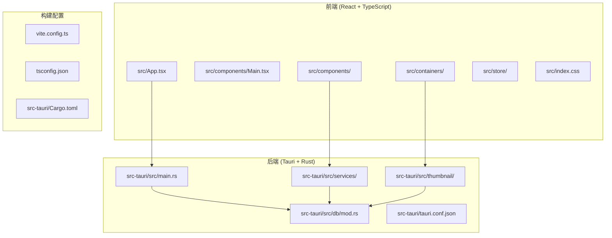

# 开发指南

<cite>
**本文引用的文件**
- [DEVELOPMENT.md](file://doc/DEVELOPMENT.md)
- [README.md](file://README.md)
- [package.json](file://package.json)
- [vite.config.ts](file://vite.config.ts)
- [tsconfig.json](file://tsconfig.json)
- [src-tauri/Cargo.toml](file://src-tauri/Cargo.toml)
- [src-tauri/src/main.rs](file://src-tauri/src/main.rs)
- [src-tauri/src/db/mod.rs](file://src-tauri/src/db/mod.rs)
- [src-tauri/src/services/scanner.rs](file://src-tauri/src/services/scanner.rs)
- [src-tauri/src/thumbnail/manager.rs](file://src-tauri/src/thumbnail/manager.rs)
- [src-tauri/src/thumbnail/queue.rs](file://src-tauri/src/thumbnail/queue.rs)
- [src-tauri/src/thumbnail/worker.rs](file://src-tauri/src/thumbnail/worker.rs)
- [src/main.tsx](file://src/main.tsx)
- [src/App.tsx](file://src/App.tsx)
- [src/store/useAppStore.ts](file://src/store/useAppStore.ts)
- [src/components/MediaGrid.tsx](file://src/components/MediaGrid.tsx)
- [src/components/MediaCard.tsx](file://src/components/MediaCard.tsx)
- [src/containers/MediaGridContainer.tsx](file://src/containers/MediaGridContainer.tsx)
</cite>

## 更新摘要
**变更内容**
- 开发指南已重构并移动到 `doc/DEVELOPMENT.md`，提供更完整的项目开发信息
- 更新了项目概览、技术栈、架构设计、数据库设计、核心服务实现等内容
- 新增了详细的开发工作流程、性能优化策略、调试与测试指南
- 完善了构建配置、权限管理、故障排除等实用信息

## 目录
1. [项目概览](#项目概览)
2. [技术栈与版本](#技术栈与版本)
3. [项目结构](#项目结构)
4. [架构设计](#架构设计)
5. [数据库设计](#数据库设计)
6. [核心服务实现](#核心服务实现)
7. [前端组件架构](#前端组件架构)
8. [缩略图系统](#缩略图系统)
9. [开发工作流程](#开发工作流程)
10. [性能优化策略](#性能优化策略)
11. [调试与测试](#调试与测试)
12. [构建与部署](#构建与部署)
13. [故障排除](#故障排除)
14. [代码规范](#代码规范)
15. [未来规划](#未来规划)

## 项目概览

Medex 是一个基于 **React + TypeScript + Tauri v2 + Rust + SQLite** 的桌面媒体管理软件，核心目标是：

- 扫描本地目录并建立媒体索引（图片/视频）
- 支持标签体系（新增、删除、绑定媒体、筛选）
- 支持收藏/最近查看等状态持久化
- 支持大规模媒体列表展示（虚拟列表 + 缩略图懒加载）
- 支持双击全屏 Viewer 进行图片查看与视频播放

当前实现以「高性能列表浏览 + 标签组织能力 + 本地数据持久化」为主。

**章节来源**
- [DEVELOPMENT.md:8-18](file://doc/DEVELOPMENT.md#L8-L18)

## 技术栈与版本

### 前端技术栈
- **框架**: React 18.3 + TypeScript 5.5
- **构建工具**: Vite 5.4
- **样式**: TailwindCSS 3.4 + PostCSS + Autoprefixer
- **状态管理**: Zustand 4.5
- **虚拟化**: react-window 1.8
- **拖拽**: react-dnd 14.0

### 后端技术栈
- **框架**: Tauri v2
- **语言**: Rust 1.77.2+
- **数据库**: rusqlite（bundled）
- **文件扫描**: walkdir 1.0
- **并发**: once_cell 1.19, tokio 1.0
- **序列化**: serde 1.0

### 外部依赖
- **ffmpeg**: 用于视频首帧缩略图生成
- **平台支持**: Windows、macOS、Linux

**章节来源**
- [DEVELOPMENT.md:22-47](file://doc/DEVELOPMENT.md#L22-L47)

## 项目结构



**图表来源**
- [DEVELOPMENT.md:51-116](file://doc/DEVELOPMENT.md#L51-L116)
- [README.md:97-119](file://README.md#L97-L119)

**章节来源**
- [DEVELOPMENT.md:51-116](file://doc/DEVELOPMENT.md#L51-L116)
- [README.md:97-119](file://README.md#L97-L119)

## 架构设计

### 前后端通信机制

主要通过 Tauri `invoke` + `event`：
- `invoke`: 前端调用 Rust command（同步请求/响应）
- `event`: 后端推送扫描进度与缩略图完成事件

关键事件：
- `scan_progress`: 扫描进度（current / total / filename）
- `scan_done`: 扫描结束信号
- `thumbnail_ready`: 视频缩略图生成完成（video_path / thumbnail_path）

前端内部还使用 `window.dispatchEvent` 做轻量刷新信号：
- `medex:media-updated`
- `medex:tags-updated`
- `medex:media-tags-updated`

**章节来源**
- [DEVELOPMENT.md:122-140](file://doc/DEVELOPMENT.md#L122-L140)

### 状态分层设计

- **全局业务状态**: `useAppStore`（媒体列表、筛选状态、标签状态、导航状态等）
- **拖拽临时状态**: `useTagDragStore`
- **组件局部状态**: 输入框、loading、队列等

**章节来源**
- [DEVELOPMENT.md:141-146](file://doc/DEVELOPMENT.md#L141-L146)

## 数据库设计

### 数据库路径
通过 Tauri 提供路径 API 获取：
- `app_handle.path().app_data_dir()`
- 数据库文件：`medex.db`

### 表结构设计

#### media 表
- `id` INTEGER PK AUTOINCREMENT
- `path` TEXT UNIQUE
- `filename` TEXT
- `type` TEXT (`image` / `video`)
- `is_favorite` INTEGER DEFAULT 0
- `created_at` INTEGER
- `updated_at` INTEGER

#### tags 表
- `id` INTEGER PK AUTOINCREMENT
- `name` TEXT UNIQUE

#### media_tags 表
- `media_id` INTEGER
- `tag_id` INTEGER
- 复合主键 `(media_id, tag_id)`

#### recent_views 表
- `media_id` INTEGER PRIMARY KEY
- `viewed_at` INTEGER

### 索引优化
- `idx_media_path` on `media(path)`
- `idx_media_tags_media_id` on `media_tags(media_id)`
- `idx_media_tags_tag_id` on `media_tags(tag_id)`
- `idx_recent_views_viewed_at` on `recent_views(viewed_at DESC)`

**章节来源**
- [DEVELOPMENT.md:163-204](file://doc/DEVELOPMENT.md#L163-L204)

## 核心服务实现

### 扫描目录并写入数据库

实现位置：`src-tauri/src/services/scanner.rs`

流程：
1. `walkdir` 递归扫描目录
2. 过滤支持格式（图片：jpg/jpeg/png/webp/gif；视频：mp4/mov/mkv/webm）
3. 使用事务批量写入：`INSERT OR IGNORE INTO media (...)`
4. 每处理一个文件发出 `scan_progress`
5. 完成后发出 `scan_done`

优化点：
- `INSERT OR IGNORE` 防重复
- 事务写入提高批量性能
- `walkdir` 错误容错（跳过不可读项）

**章节来源**
- [DEVELOPMENT.md:242-258](file://doc/DEVELOPMENT.md#L242-L258)

### 多标签交集筛选

实现：`filter_media`（scanner.rs）

- 无标签时：按 `media_type` 可选过滤后全量返回
- 有标签时：通过子查询匹配 `t.name IN (...)`，`GROUP BY + HAVING COUNT(DISTINCT t.id) = selected_tag_count`，实现"媒体同时拥有所有选中标签（交集）"

**章节来源**
- [DEVELOPMENT.md:263-268](file://doc/DEVELOPMENT.md#L263-L268)

### 标签管理系统

实现：`src-tauri/src/services/tags.rs`

- 新增标签：`create_tag`
- 删除标签：`delete_tag`（只有 `mediaCount=0` 时允许）
- 给媒体加标签：`add_tag_to_media`
  - 先 `INSERT OR IGNORE tags`
  - 再建 `media_tags` 关系
- 从媒体移除标签：`remove_tag_from_media`
  - 移除关联后若无人使用会自动删除孤立 tag

**章节来源**
- [DEVELOPMENT.md:273-280](file://doc/DEVELOPMENT.md#L273-L280)

### 收藏与最近查看持久化

- 收藏：写入 `media.is_favorite`
- 最近查看：在双击打开 Viewer 时调用 `mark_media_viewed`
  - upsert 到 `recent_views`
  - 自动保留最近 100 条（超出删除最旧）

**章节来源**
- [DEVELOPMENT.md:283-287](file://doc/DEVELOPMENT.md#L283-L287)

## 前端组件架构

### 媒体网格与虚拟化

实现：`src/components/MediaGrid.tsx`

- Grid：`FixedSizeGrid`
- List：`FixedSizeList`
- 实际默认固定为 Grid（容器传入 `viewMode="grid"`）
- 仅渲染可见区域 + overscan，显著减少 DOM 数量

**章节来源**
- [DEVELOPMENT.md:312-316](file://doc/DEVELOPMENT.md#L312-L316)

### 缩略图懒加载与优先级调度

实现：`src/containers/MediaGridContainer.tsx`

策略：
- `onItemsRendered` 反馈当前视口范围
- 任务优先级：可见区域（priority 0）> 下一屏（priority 1）> overscan 其余（priority 2）
- 去重：已完成缓存 `thumbnails`、请求中集合 `requestingSet`、队列中集合 `queuedSet`
- 并发限制：`MAX_CONCURRENT = 5`
- 队列上限：`MAX_QUEUE_SIZE = 400`

**章节来源**
- [DEVELOPMENT.md:323-334](file://doc/DEVELOPMENT.md#L323-L334)

### 视频卡片渲染策略

- Grid 中视频不直接挂 `<video>`（避免滚动卡顿）
- 优先显示静态缩略图（后端 ffmpeg 首帧）
- 缩略图未到达时 skeleton 占位
- 只在 Viewer 中挂单个 `<video>` 播放

**章节来源**
- [DEVELOPMENT.md:337-341](file://doc/DEVELOPMENT.md#L337-L341)

## 缩略图系统

### 模块职责

- `mod.rs`: 初始化与 command 暴露
- `manager.rs`: 任务入口、去重、入队
- `queue.rs`: 有界队列（sync_channel）
- `worker.rs`: 固定 worker 消费任务
- `utils.rs`: hash、缓存路径、ffmpeg 调用、二进制解析

### 关键机制

- worker 固定并发：`THUMBNAIL_WORKER_COUNT = 4`
- 队列容量：`THUMBNAIL_QUEUE_CAPACITY = 2048`
- 去重集合：`processing: HashSet<String>`
- 缓存路径：`~/.medex/thumbnails/{hash}.jpg`
- 结果事件：`thumbnail_ready`

### ffmpeg 解析策略

顺序：
1. Tauri resources 内置二进制
2. 开发目录 `src-tauri/binaries`
3. 系统 PATH
4. macOS 常见路径（`/opt/homebrew/bin/ffmpeg`、`/usr/local/bin/ffmpeg`）

若最终不存在：
- `request_thumbnail` 直接返回错误
- 不会再入队阻塞任务流

**章节来源**
- [DEVELOPMENT.md:356-377](file://doc/DEVELOPMENT.md#L356-L377)

## 开发工作流程

### 安装与运行

```bash
# 安装依赖
npm install

# 开发模式
npm run tauri dev

# 构建生产版本
npm run build
npm run tauri build
```

### 开发环境配置

- Node.js 18+
- Rust 1.77.2+
- Cargo 镜像源（清华大学）
- Tauri 开发工具链

**章节来源**
- [DEVELOPMENT.md:442-467](file://doc/DEVELOPMENT.md#L442-L467)

## 性能优化策略

### 前端性能优化

- **虚拟化渲染**: react-window 固定尺寸网格/列表，overscan 控制可见区域外渲染数量
- **缩略图优先级**: 可见区域优先，下一屏次之，其余再次之，最大并发与队列上限控制资源占用
- **图片懒加载与骨架屏**: 减少首屏与滚动卡顿
- **状态缓存**: useMemo/useCallback 缓存计算结果，避免频繁重建

### 后端性能优化

- **事务批量写入**: INSERT OR IGNORE + 事务提交，显著降低 IO
- **索引优化**: media(path)、media_tags(media_id/tag_id)、recent_views(viewed_at DESC)
- **固定并发 worker**: 4 个 worker + 2048 容量队列，避免资源耗尽，提升吞吐

### 内存管理

- **前端**: useRef 缓存引用，useMemo/useCallback 缓存计算与回调
- **后端**: OnceCell 全局连接、processing 去重集合，避免重复任务

**章节来源**
- [DEVELOPMENT.md:317-341](file://doc/DEVELOPMENT.md#L317-L341)

## 调试与测试

### 前端调试

- 使用浏览器 DevTools 检查网络与事件监听，确认 invoke 返回与事件是否触发
- 通过 window.dispatchEvent 触发本地刷新，定位状态不同步问题
- 使用 React DevTools 检查组件渲染与状态更新

### 后端调试

- 在 main.rs 中打印初始化与菜单事件，检查数据库初始化与缩略图初始化
- 在 scanner.rs 中观察扫描进度事件与事务提交日志
- 使用 println! 输出调试信息

### 跨语言调试

- 通过 Tauri 事件桥接：前端监听 thumbnail_ready、scan_progress、scan_done
- 使用 convertFileSrc 将本地文件路径转换为可预览 URL
- 事件驱动的异步调试模式

### 常见问题排查

- **dialog.open 权限**: 检查 capabilities/default.json 是否包含 dialog:allow-open
- **ffmpeg 未找到**: 确认内置二进制或 PATH，必要时配置 externalBin
- **页面卡顿**: 检查是否在网格内挂载过多 <video>，是否启用虚拟化与合理并发

**章节来源**
- [DEVELOPMENT.md:564-595](file://doc/DEVELOPMENT.md#L564-L595)

## 构建与部署

### 构建配置

#### 前端构建
- Vite：开发服务器端口 1420，React 插件
- TypeScript：严格模式、模块解析 bundler、JSX 使用 react-jsx
- TailwindCSS：按需生成，支持暗色主题

#### 后端构建
- Cargo：bundled SQLite，启用 protocol-asset
- Tauri：插件 dialog、store、updater
- 多平台支持：Windows、macOS、Linux

### 资源协议

`tauri.conf.json` 中已启用 asset protocol：
- `assetProtocol.enable = true`
- `assetProtocol.scope = ["**"]`

用于本地文件预览（`convertFileSrc`）非常关键。

**章节来源**
- [DEVELOPMENT.md:429-437](file://doc/DEVELOPMENT.md#L429-L437)

## 故障排除

### ffmpeg 分发问题

当前代码已支持"内置优先 + PATH 回退"，但如果要真正随安装包分发，仍需：
- 准备各平台 ffmpeg 二进制
- 添加 `bundle.externalBin`
- 确认许可与发布体积

> 注意：`externalBin` 一旦配置，缺少对应目标文件会导致构建失败。

### 缩略图请求释放边界

前端当前以 `thumbnail_ready` 或 invoke 直接返回路径为主来释放请求；若出现异常路径或事件丢失，可能有个别任务滞留。可加"超时回收"机制。

### 全局事件总线

当前使用 `window.dispatchEvent` 做跨容器同步，灵活但分散。后续建议迁移到：
- Zustand action 编排
- 或统一 query 层（如 TanStack Query）

**章节来源**
- [DEVELOPMENT.md:472-496](file://doc/DEVELOPMENT.md#L472-L496)

## 代码规范

### TypeScript 编码规范

- 严格模式开启，明确类型定义，避免 any
- 使用 useMemo/useCallback 缓存计算与回调，减少重渲染
- 组件 props 使用 memo + 自定义相等比较，避免不必要的重渲染

### React 组件规范

- 函数式组件优先，hooks 拆分关注点
- 容器组件负责状态与调度，展示组件专注渲染
- 事件与副作用集中在容器组件，避免在纯展示组件中产生副作用

### Rust 编码规范

- 使用 anyhow 进行错误处理，with_context 提供上下文信息
- OnceCell 管理全局连接，Mutex 保护共享状态
- 任务队列使用 sync_channel，固定 worker 数量，避免资源耗尽

**章节来源**
- [DEVELOPMENT.md:597-604](file://doc/DEVELOPMENT.md#L597-L604)

## 未来规划

### P0 优先级（建议先做）

1. 完成 ffmpeg 内置打包链路
2. 增加缩略图任务超时与失败重试策略
3. 补齐媒体删除后端 command（含 DB 清理）
4. 增加统一错误提示组件（替换 window.alert）

### P1 优先级

1. 复用 Inspector（可折叠右栏）
2. 搜索功能（按文件名/标签模糊搜索）
3. 批量选择与批量打标签/收藏
4. 初步分页加载或增量拉取策略

### P2 优先级

1. 后台扫描任务可取消
2. 缩略图优先级升级（按视口位置/交互行为动态提权）
3. 数据迁移框架（schema version + migration）
4. 增加 E2E 自动化（扫描、筛选、打标、viewer）

**章节来源**
- [DEVELOPMENT.md:503-525](file://doc/DEVELOPMENT.md#L503-L525)