# 前后端通信机制

<cite>
**本文引用的文件**
- [src-tauri/src/main.rs](file://src-tauri/src/main.rs)
- [src-tauri/tauri.conf.json](file://src-tauri/tauri.conf.json)
- [src-tauri/Cargo.toml](file://src-tauri/Cargo.toml)
- [src/App.tsx](file://src/App.tsx)
- [src/main.tsx](file://src/main.tsx)
- [src-tauri/src/services/scanner.rs](file://src-tauri/src/services/scanner.rs)
- [src-tauri/src/services/tags.rs](file://src-tauri/src/services/tags.rs)
- [src-tauri/src/db/mod.rs](file://src-tauri/src/db/mod.rs)
- [src-tauri/src/thumbnail/manager.rs](file://src-tauri/src/thumbnail/manager.rs)
- [src/components/MediaGrid.tsx](file://src/components/MediaGrid.tsx)
- [src/store/useAppStore.ts](file://src/store/useAppStore.ts)
- [src/containers/MediaGridContainer.tsx](file://src/containers/MediaGridContainer.tsx)
- [src/containers/ToolbarContainer.tsx](file://src/containers/ToolbarContainer.tsx)
- [src/containers/SidebarContainer.tsx](file://src/containers/SidebarContainer.tsx)
</cite>

## 更新摘要
**变更内容**
- 新增事件驱动架构章节，详细说明 scan_done 事件监听机制
- 新增 medex:scan-started 和 medex:scan-completed 自定义事件系统
- 新增前后端分离刷新机制的详细分析
- 更新事件系统工作原理，包括 Tauri 事件与 window 事件的协同
- 新增全局事件总线（Global Event Bus）的设计模式

## 目录
1. [简介](#简介)
2. [项目结构](#项目结构)
3. [核心组件](#核心组件)
4. [架构总览](#架构总览)
5. [详细组件分析](#详细组件分析)
6. [事件驱动架构](#事件驱动架构)
7. [依赖关系分析](#依赖关系分析)
8. [性能考量](#性能考量)
9. [故障排查指南](#故障排查指南)
10. [结论](#结论)
11. [附录](#附录)

## 简介
本文件系统性阐述 Medex 应用在 Tauri 2 下的前后端通信机制，重点覆盖以下方面：
- Tauri 命令系统：前端如何通过 invoke 调用后端 Rust 函数；命令注册、参数传递、返回值与错误处理。
- 事件系统：后端如何向前端推送数据（如扫描进度、完成通知）。
- 事件驱动架构：新增的 scan_done 事件监听、medex:scan-started 和 medex:scan-completed 自定义事件，以及前后端分离的刷新机制。
- 异步通信与线程安全：命令执行、数据库访问、缩略图生成的并发模型与线程安全策略。
- 典型通信场景：媒体扫描、标签管理、缩略图生成。
- 协议与性能：Tauri 协议选择、跨语言序列化、以及性能优化策略。

## 项目结构
Medex 采用 Tauri 2 的前后端分离架构：
- 前端：基于 React/Vite，使用 @tauri-apps/api 提供的 invoke、事件监听等能力。
- 后端：Rust 模块化组织，通过 Builder::invoke_handler 注册命令，通过 Manager/Emit 发送事件。

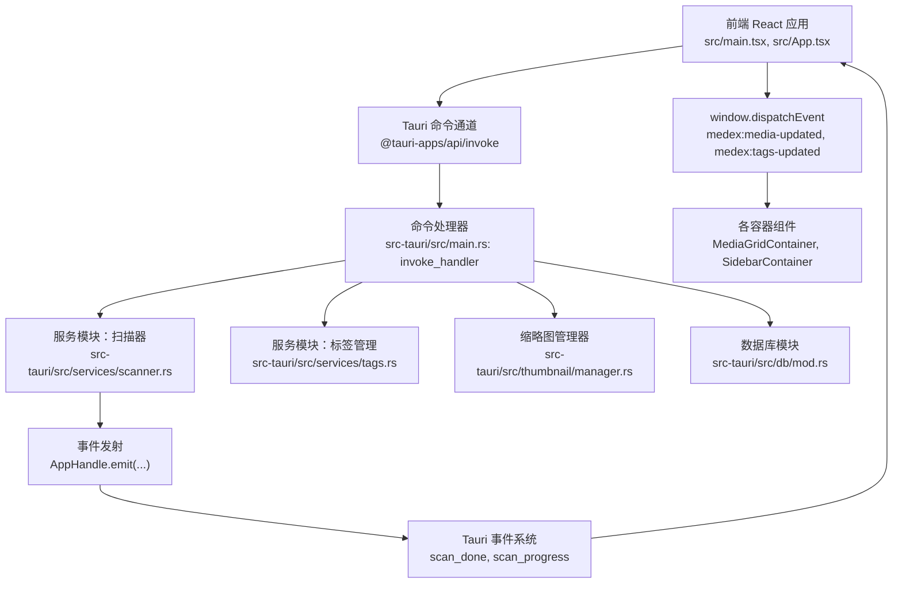

**图表来源**
- [src-tauri/src/main.rs:49-65](file://src-tauri/src/main.rs#L49-L65)
- [src/App.tsx:28-42](file://src/App.tsx#L28-L42)
- [src-tauri/src/services/scanner.rs:250-341](file://src-tauri/src/services/scanner.rs#L250-L341)
- [src-tauri/src/services/tags.rs:19-220](file://src-tauri/src/services/tags.rs#L19-L220)
- [src-tauri/src/db/mod.rs:45-123](file://src-tauri/src/db/mod.rs#L45-L123)
- [src-tauri/src/thumbnail/manager.rs:24-108](file://src-tauri/src/thumbnail/manager.rs#L24-L108)

**章节来源**
- [src-tauri/src/main.rs:10-68](file://src-tauri/src/main.rs#L10-L68)
- [src-tauri/tauri.conf.json:1-46](file://src-tauri/tauri.conf.json#L1-L46)
- [src-tauri/Cargo.toml:1-23](file://src-tauri/Cargo.toml#L1-L23)

## 核心组件
- 命令注册与入口
  - 在应用启动时，通过 Builder::invoke_handler 将 Rust 命令函数注册到 Tauri 命令通道，前端以字符串命令名调用。
- 前端调用
  - 使用 @tauri-apps/api/core 的 invoke 方法，传入命令名与参数对象，接收 Promise 返回值或错误。
- 数据层与事务
  - 数据库初始化与连接池封装，提供 with_connection 宏包装的事务安全访问。
- 事件系统
  - 后端通过 AppHandle.emit 推送 Tauri 事件，前端通过 window.addEventListener 订阅事件。
- 事件驱动架构
  - 新增 window.dispatchEvent 自定义事件，实现前后端分离的刷新机制。
- 缩略图子系统
  - 基于多工作线程与无阻塞队列的异步生成，避免主线程阻塞。

**章节来源**
- [src-tauri/src/main.rs:49-65](file://src-tauri/src/main.rs#L49-L65)
- [src/App.tsx:28-42](file://src/App.tsx#L28-L42)
- [src-tauri/src/db/mod.rs:97-110](file://src-tauri/src/db/mod.rs#L97-L110)
- [src-tauri/src/thumbnail/manager.rs:24-108](file://src-tauri/src/thumbnail/manager.rs#L24-L108)

## 架构总览
Medex 的通信路径遵循"前端发起请求 → Tauri 命令分发 → Rust 业务逻辑处理 → 数据库/外部工具交互 → 返回结果/推送事件"的闭环，新增了事件驱动的刷新机制。

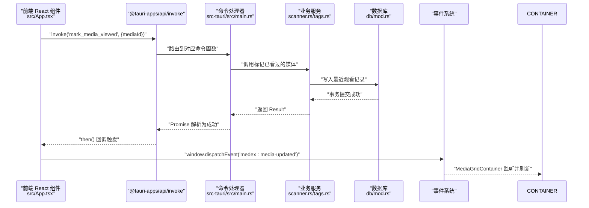

**图表来源**
- [src-tauri/src/main.rs:49-65](file://src-tauri/src/main.rs#L49-L65)
- [src-tauri/src/services/scanner.rs:356-389](file://src-tauri/src/services/scanner.rs#L356-L389)
- [src-tauri/src/db/mod.rs:97-110](file://src-tauri/src/db/mod.rs#L97-L110)
- [src/App.tsx:35-41](file://src/App.tsx#L35-L41)

## 详细组件分析

### 命令系统：注册、调用、参数与返回
- 命令注册
  - 在 main.rs 中通过 generate_handler! 将多个命令函数注册到 Tauri，前端以命令名字符串调用。
- 参数传递
  - 前端 invoke('cmd', payload) 将 JSON 对象传递给后端，Tauri 自动序列化/反序列化。
  - 后端命令函数签名可包含 AppHandle、参数类型（如 i64、Vec<String>、String），返回 Result<T, String>。
- 返回值与错误
  - 成功返回 Result::Ok(T)；失败返回 Result::Err(String)，前端 Promise 拒绝，可在 catch 中处理。
- 示例命令
  - 扫描与索引：scan_and_index(path, AppHandle) → 触发扫描进度与完成事件。
  - 获取媒体列表：get_all_media() → 返回 Vec<MediaItem>。
  - 标签管理：create_tag、add_tag_to_media、get_tags_by_media 等。
  - 媒体操作：set_media_favorite、mark_media_viewed、clear_library_data。

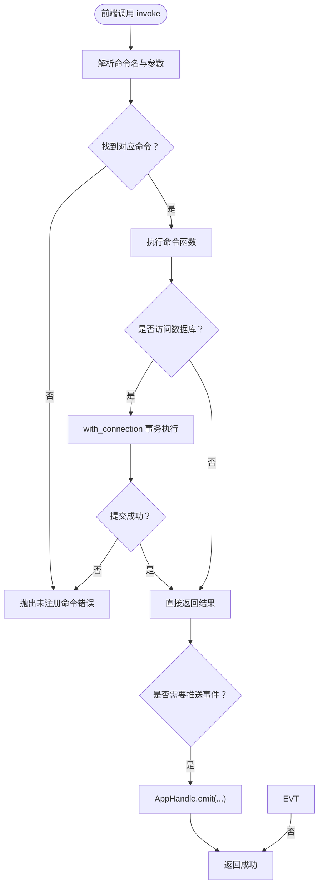

**图表来源**
- [src-tauri/src/main.rs:49-65](file://src-tauri/src/main.rs#L49-L65)
- [src-tauri/src/services/scanner.rs:250-341](file://src-tauri/src/services/scanner.rs#L250-L341)
- [src-tauri/src/db/mod.rs:97-110](file://src-tauri/src/db/mod.rs#L97-L110)

**章节来源**
- [src-tauri/src/main.rs:49-65](file://src-tauri/src/main.rs#L49-L65)
- [src-tauri/src/services/scanner.rs:160-163](file://src-tauri/src/services/scanner.rs#L160-L163)
- [src-tauri/src/services/tags.rs:19-220](file://src-tauri/src/services/tags.rs#L19-L220)

### 事件系统：后端向前端推送数据
- 事件发射
  - 扫描器在插入媒体时周期性发射 scan_progress 事件，完成后发射 scan_done 事件。
  - 清理媒体库后，向非设置窗口广播刷新指令。
- 事件订阅
  - 前端通过 window.addEventListener('scan_progress' | 'scan_done' | 'medex:media-updated', handler) 订阅事件。
- 实际使用
  - 媒体查看器在标记已看后，通过事件触发全局刷新，确保 UI 与数据库状态一致。

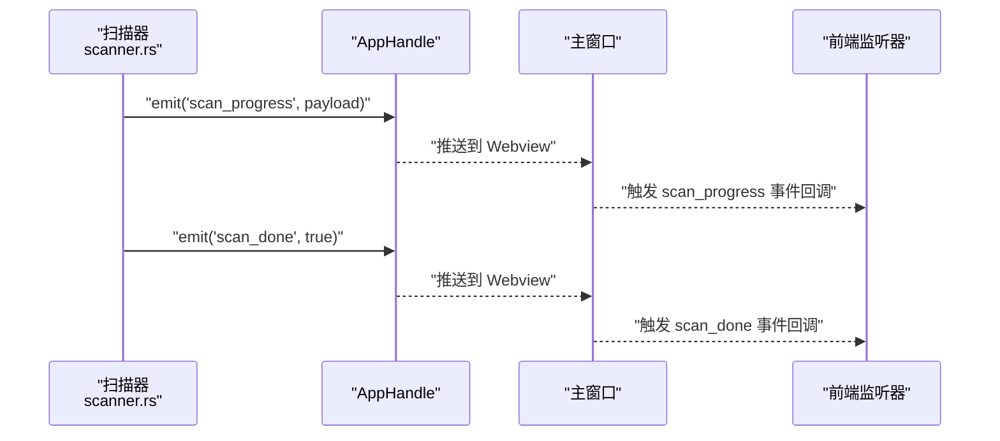

**图表来源**
- [src-tauri/src/services/scanner.rs:306-330](file://src-tauri/src/services/scanner.rs#L306-L330)
- [src/App.tsx:38-41](file://src/App.tsx#L38-L41)

**章节来源**
- [src-tauri/src/services/scanner.rs:250-341](file://src-tauri/src/services/scanner.rs#L250-L341)
- [src/App.tsx:35-41](file://src/App.tsx#L35-L41)

### 异步通信与线程安全
- 命令执行
  - 每个命令在 Tauri 的命令线程中执行，避免阻塞 UI。
- 数据库访问
  - 使用 OnceCell + Mutex 包装 SQLite 连接，with_connection 提供互斥锁保护，确保并发安全。
- 缩略图生成
  - 多工作线程 + 有界通道队列，支持 try_send 非阻塞入队，避免队列满时阻塞 UI。
  - 使用 HashSet 记录正在处理的视频路径，去重避免重复任务。

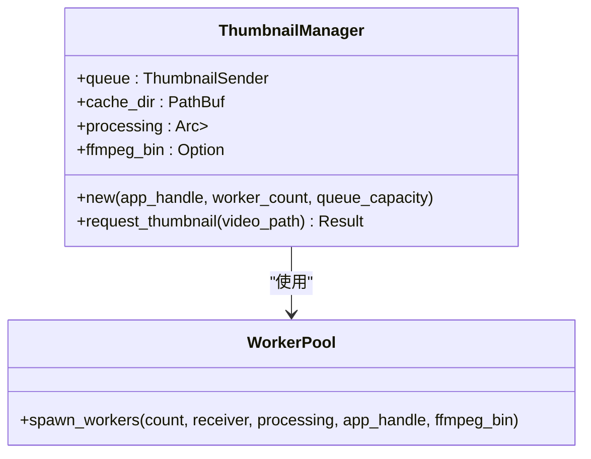

**图表来源**
- [src-tauri/src/thumbnail/manager.rs:16-108](file://src-tauri/src/thumbnail/manager.rs#L16-L108)

**章节来源**
- [src-tauri/src/db/mod.rs:97-110](file://src-tauri/src/db/mod.rs#L97-L110)
- [src-tauri/src/thumbnail/manager.rs:24-108](file://src-tauri/src/thumbnail/manager.rs#L24-L108)

### 典型通信场景

#### 场景一：媒体扫描与索引
- 前端触发：调用 scan_and_index(path)。
- 后端流程：清理旧数据 → 扫描目录 → 批量插入媒体 → 发射扫描进度事件 → 发射完成事件 → 刷新主窗口。
- 前端响应：监听 scan_progress 与 scan_done，更新 UI 状态。

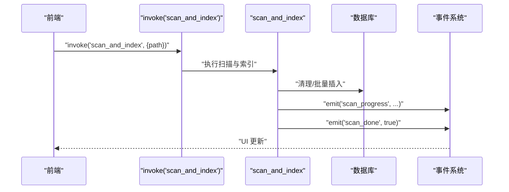

**图表来源**
- [src-tauri/src/services/scanner.rs:250-341](file://src-tauri/src/services/scanner.rs#L250-L341)

**章节来源**
- [src-tauri/src/services/scanner.rs:250-341](file://src-tauri/src/services/scanner.rs#L250-L341)

#### 场景二：标签管理
- 获取标签：invoke('get_all_tags') / invoke('get_all_tags_with_count')。
- 添加/移除标签：invoke('add_tag_to_media', {media_id, tag_name}) / invoke('remove_tag_from_media', {media_id, tag_id})。
- 后端校验：创建标签前规范化名称；删除标签前检查是否仍被使用。

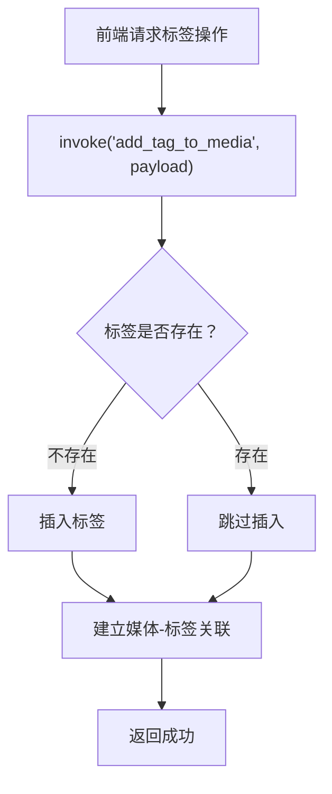

**图表来源**
- [src-tauri/src/services/tags.rs:127-164](file://src-tauri/src/services/tags.rs#L127-L164)

**章节来源**
- [src-tauri/src/services/tags.rs:19-220](file://src-tauri/src/services/tags.rs#L19-L220)

#### 场景三：缩略图生成
- 请求缩略图：前端传入视频路径，调用 request_thumbnail。
- 后端策略：若缓存存在则直接返回；否则检查是否正在处理；若队列未满则入队；否则返回占位符。

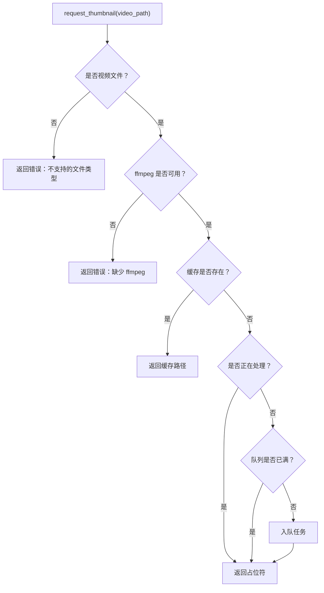

**图表来源**
- [src-tauri/src/thumbnail/manager.rs:51-106](file://src-tauri/src/thumbnail/manager.rs#L51-L106)

**章节来源**
- [src-tauri/src/thumbnail/manager.rs:24-108](file://src-tauri/src/thumbnail/manager.rs#L24-L108)

## 事件驱动架构

### scan_done 事件监听机制
Medex 新增了专门的 scan_done 事件监听机制，用于处理媒体扫描完成后的刷新逻辑：

- **事件监听**：前端在 App.tsx 中监听后端发出的 scan_done 事件
- **事件转换**：将 scan_done 事件转换为 medex:media-updated 自定义事件
- **刷新触发**：各容器组件监听 medex:media-updated 事件并执行相应的数据刷新

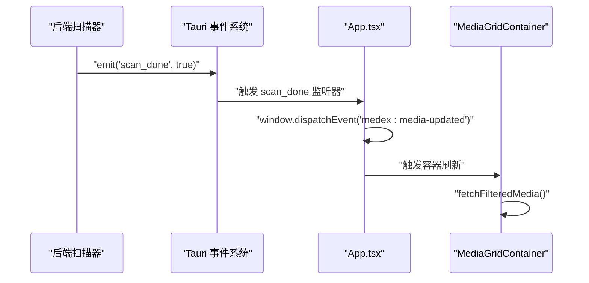

**图表来源**
- [src-tauri/src/services/scanner.rs:330-332](file://src-tauri/src/services/scanner.rs#L330-L332)
- [src/App.tsx:98-120](file://src/App.tsx#L98-L120)

### medex:scan-started 和 medex:scan-completed 自定义事件
应用新增了完整的扫描生命周期事件系统：

- **扫描开始**：window.dispatchEvent(new CustomEvent('medex:scan-started')) 
- **扫描完成**：window.dispatchEvent(new CustomEvent('medex:scan-completed'))
- **扫描错误**：window.dispatchEvent(new CustomEvent('medex:scan-error', { detail: error }))

这些事件用于：
- 通知其他窗口或组件扫描状态变化
- 触发 UI 状态更新（如进度条、状态消息）
- 实现跨组件的状态同步

**章节来源**
- [src/App.tsx:77-91](file://src/App.tsx#L77-L91)

### 前后端分离刷新机制
Medex 实现了前后端分离的刷新机制，避免直接的页面刷新：

- **后端职责**：通过 Tauri 事件系统通知扫描完成
- **前端职责**：监听事件并触发局部刷新，而非整页刷新
- **容器职责**：各容器组件独立监听并执行相应的数据获取逻辑

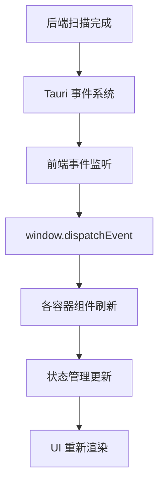

**图表来源**
- [src/App.tsx:98-120](file://src/App.tsx#L98-L120)
- [src/containers/MediaGridContainer.tsx:488-494](file://src/containers/MediaGridContainer.tsx#L488-L494)

**章节来源**
- [src/App.tsx:98-120](file://src/App.tsx#L98-L120)
- [src/containers/MediaGridContainer.tsx:488-494](file://src/containers/MediaGridContainer.tsx#L488-L494)

## 依赖关系分析
- 前端依赖
  - @tauri-apps/api 提供 invoke、convertFileSrc、listen 等能力。
  - Zustand 状态管理用于本地 UI 状态与数据库同步后的合并。
  - window.dispatchEvent 用于自定义事件的跨组件通信。
- 后端依赖
  - tauri、serde、rusqlite、walkdir、anyhow 等。
- 配置
  - tauri.conf.json 定义构建、安全策略与插件配置。

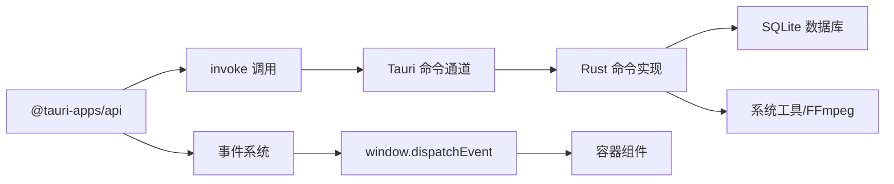

**图表来源**
- [src-tauri/Cargo.toml:13-22](file://src-tauri/Cargo.toml#L13-L22)
- [src-tauri/tauri.conf.json:35-44](file://src-tauri/tauri.conf.json#L35-L44)

**章节来源**
- [src-tauri/Cargo.toml:13-22](file://src-tauri/Cargo.toml#L13-L22)
- [src-tauri/tauri.conf.json:1-46](file://src-tauri/tauri.conf.json#L1-L46)

## 性能考量
- 序列化与传输
  - 使用 serde 进行结构化数据序列化，减少跨语言开销。
- 数据库并发
  - OnceCell + Mutex 保证连接独占访问；事务包裹批量写入，降低锁竞争。
- 异步与背压
  - 缩略图队列采用 try_send 非阻塞入队，避免 UI 阻塞；队列满时返回占位符，前端可降级显示。
- UI 渲染优化
  - react-window 按需渲染网格/列表，结合可见范围回调减少重绘。
- 文件路径转换
  - convertFileSrc 将绝对路径转换为可加载的 asset URL，避免跨平台路径差异导致的资源加载失败。
- 事件风暴防护
  - 通过 window.dispatchEvent 实现事件去重和防抖，避免频繁刷新导致的性能问题。

**章节来源**
- [src-tauri/src/db/mod.rs:97-110](file://src-tauri/src/db/mod.rs#L97-L110)
- [src-tauri/src/thumbnail/manager.rs:83-106](file://src-tauri/src/thumbnail/manager.rs#L83-L106)
- [src/components/MediaGrid.tsx:312-321](file://src/components/MediaGrid.tsx#L312-L321)
- [src/store/useAppStore.ts:258-288](file://src/store/useAppStore.ts#L258-L288)

## 故障排查指南
- 命令未注册
  - 症状：invoke 抛出未注册命令错误。
  - 排查：确认命令已在 main.rs 的 invoke_handler 中注册。
- 数据库未初始化
  - 症状：with_connection 报错"数据库未初始化"或"无法加锁"。
  - 排查：确认 init_db 已在 setup 阶段调用；检查应用数据目录权限。
- 事件未到达
  - 症状：前端未收到 scan_progress/scan_done。
  - 排查：确认 AppHandle.emit 调用成功；确认前端监听器已注册；检查窗口标签过滤逻辑。
- 事件监听失效
  - 症状：scan_done 事件监听器无法触发。
  - 排查：确认 useEffect 清理函数正确执行；检查监听器注册时机；验证事件名称一致性。
- 自定义事件未传播
  - 症状：window.dispatchEvent 无法触发容器组件刷新。
  - 排查：确认事件监听器在组件挂载时注册；检查事件名称和参数格式；验证事件冒泡机制。
- 缩略图生成失败
  - 症状：返回占位符或报错"缺少 ffmpeg"。
  - 排查：确认 FFmpeg 可执行文件路径；检查队列容量与工作线程数；查看日志输出。

**章节来源**
- [src-tauri/src/main.rs:14-22](file://src-tauri/src/main.rs#L14-L22)
- [src-tauri/src/db/mod.rs:45-64](file://src-tauri/src/db/mod.rs#L45-L64)
- [src-tauri/src/services/scanner.rs:306-330](file://src-tauri/src/services/scanner.rs#L306-L330)
- [src-tauri/src/thumbnail/manager.rs:27-31](file://src-tauri/src/thumbnail/manager.rs#L27-L31)

## 结论
Medex 的前后端通信以 Tauri 2 的命令与事件系统为核心，结合 Rust 的并发与数据库事务保障，实现了稳定高效的桌面应用数据流。新增的事件驱动架构进一步增强了系统的解耦性和可维护性，通过 scan_done 事件监听、medex:scan-started 和 medex:scan-completed 自定义事件，以及前后端分离的刷新机制，实现了更加灵活和响应式的用户界面更新。通过合理的异步与线程安全设计、序列化优化与 UI 渲染策略，满足了媒体扫描、标签管理与缩略图生成等复杂场景的需求。建议在后续迭代中持续关注事件风暴与队列背压的监控，进一步完善可观测性与错误恢复策略。

## 附录
- 前端入口与页面路由
  - main.tsx 根据路径渲染不同页面（主应用、设置页、更新页），App.tsx 作为主容器承载媒体浏览与事件驱动的刷新。
- 命令清单（节选）
  - 扫描与索引：scan_and_index、get_all_media、filter_media、filter_media_by_tags、clear_library_data。
  - 标签管理：get_all_tags、get_all_tags_with_count、create_tag、delete_tag、add_tag_to_media、remove_tag_from_media、get_tags_by_media。
  - 媒体操作：set_media_favorite、mark_media_viewed。
  - 缩略图：request_thumbnail。
- 事件清单（新增）
  - Tauri 事件：scan_done、scan_progress、thumbnail_ready。
  - 自定义事件：medex:media-updated、medex:tags-updated、medex:scan-started、medex:scan-completed、medex:scan-error。

**章节来源**
- [src/main.tsx:9-44](file://src/main.tsx#L9-L44)
- [src/App.tsx:8-73](file://src/App.tsx#L8-L73)
- [src-tauri/src/main.rs:49-65](file://src-tauri/src/main.rs#L49-L65)