# 架构设计

<cite>
**本文档引用的文件**
- [README.md](file://README.md)
- [package.json](file://package.json)
- [src-tauri/Cargo.toml](file://src-tauri/Cargo.toml)
- [src-tauri/tauri.conf.json](file://src-tauri/tauri.conf.json)
- [src/main.tsx](file://src/main.tsx)
- [src/App.tsx](file://src/App.tsx)
- [src/store/useAppStore.ts](file://src/store/useAppStore.ts)
- [src/contexts/I18nContext.tsx](file://src/contexts/I18nContext.tsx)
- [src/i18n/zh-CN.json](file://src/i18n/zh-CN.json)
- [src/i18n/en-US.json](file://src/i18n/en-US.json)
- [src/components/Sidebar.tsx](file://src/components/Sidebar.tsx)
- [src/components/Main.tsx](file://src/components/Main.tsx)
- [src/containers/SidebarContainer.tsx](file://src/containers/SidebarContainer.tsx)
- [src/containers/MediaGridContainer.tsx](file://src/containers/MediaGridContainer.tsx)
- [src/containers/ToolbarContainer.tsx](file://src/containers/ToolbarContainer.tsx)
- [src/pages/Settings.tsx](file://src/pages/Settings.tsx)
- [src-tauri/src/main.rs](file://src-tauri/src/main.rs)
- [src-tauri/src/db/mod.rs](file://src-tauri/src/db/mod.rs)
- [src-tauri/src/services/scanner.rs](file://src-tauri/src/services/scanner.rs)
- [src-tauri/src/services/tags.rs](file://src-tauri/src/services/tags.rs)
</cite>

## 更新摘要
**变更内容**
- 新增国际化系统章节，详细说明 I18nContext 上下文和语言资源管理
- 更新状态管理架构，增加国际化状态管理的说明
- 扩展 MVVM 模式与 Zustand 状态管理的国际化集成
- 更新三栏式布局的国际化实现细节
- 增强事件驱动架构中的语言变更事件处理

## 目录
1. [引言](#引言)
2. [项目结构](#项目结构)
3. [核心组件](#核心组件)
4. [架构总览](#架构总览)
5. [详细组件分析](#详细组件分析)
6. [国际化系统](#国际化系统)
7. [事件驱动架构](#事件驱动架构)
8. [依赖分析](#依赖分析)
9. [性能考量](#性能考量)
10. [故障排查指南](#故障排查指南)
11. [结论](#结论)
12. [附录](#附录)

## 引言
本文件面向 Medex 应用，系统化阐述其"Tauri + React + Rust"三层架构设计，解释前后端分离理念与通信机制，详解前端 MVVM 模式与 Zustand 状态管理在本项目中的落地，剖析三栏式布局（Sidebar/Main/Inspector）的组件关系与职责划分，并以序列图与流程图呈现"用户操作 → React UI → Tauri 命令 → Rust 后端 → SQLite 数据库 → 事件通知 → React UI"的完整数据流。同时给出系统边界、集成模式、技术决策与权衡、基础设施要求、可扩展性与部署拓扑建议。

**更新** 新增国际化系统章节，详细说明 I18nContext 上下文和语言资源管理，以及状态管理架构中国际化状态的集成。

## 项目结构
Medex 采用前后端分离的工程组织方式：
- 前端（React + TypeScript + Vite + TailwindCSS + Zustand + 国际化）：位于 src/ 目录，负责 UI、状态管理、国际化与 Tauri 的命令通信。
- 桌面层（Tauri V2）：位于 src-tauri/ 目录，负责应用生命周期、插件、菜单、命令注册与跨语言桥接。
- 后端（Rust + SQLite）：位于 src-tauri/src/ 下，提供数据库访问、业务服务（扫描、标签、缩略图等）与命令实现。

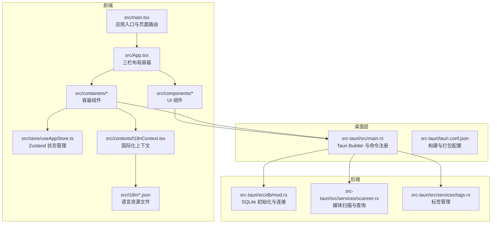

**图表来源**
- [src/main.tsx:1-51](file://src/main.tsx#L1-L51)
- [src/App.tsx:1-185](file://src/App.tsx#L1-L185)
- [src/store/useAppStore.ts:1-395](file://src/store/useAppStore.ts#L1-L395)
- [src/contexts/I18nContext.tsx:1-51](file://src/contexts/I18nContext.tsx#L1-L51)
- [src-tauri/src/main.rs:1-69](file://src-tauri/src/main.rs#L1-L69)
- [src-tauri/src/db/mod.rs:1-123](file://src-tauri/src/db/mod.rs#L1-L123)
- [src-tauri/src/services/scanner.rs:1-536](file://src-tauri/src/services/scanner.rs#L1-L536)
- [src-tauri/src/services/tags.rs:1-220](file://src-tauri/src/services/tags.rs#L1-L220)

**章节来源**
- [README.md:97-119](file://README.md#L97-L119)
- [src/main.tsx:9-41](file://src/main.tsx#L9-L41)
- [src-tauri/tauri.conf.json:6-11](file://src-tauri/tauri.conf.json#L6-L11)

## 核心组件
- 前端入口与页面路由：根据 URL 决定渲染 App、设置页或更新页，统一注入主题上下文和国际化上下文。
- 应用根容器：负责三栏布局（Sidebar/Main/Viewer），协调媒体列表与查看器状态。
- 状态管理：Zustand Store 定义导航、标签、媒体项、视图模式与筛选条件，并提供本地变更与从数据库同步的方法。
- 容器组件：将 UI 组件与 Tauri 命令解耦，负责调用 invoke 并监听后端事件。
- 国际化系统：I18nContext 提供语言状态管理和翻译函数，支持运行时语言切换和多窗口同步。
- Tauri 命令系统：在 main.rs 中集中注册命令，桥接前端与 Rust 后端。
- 数据库与服务：SQLite 初始化、媒体扫描与查询、标签 CRUD、最近观看记录维护。

**章节来源**
- [src/main.tsx:9-41](file://src/main.tsx#L9-L41)
- [src/App.tsx:8-72](file://src/App.tsx#L8-L72)
- [src/store/useAppStore.ts:48-394](file://src/store/useAppStore.ts#L48-L394)
- [src/contexts/I18nContext.tsx:1-51](file://src/contexts/I18nContext.tsx#L1-L51)
- [src-tauri/src/main.rs:49-65](file://src-tauri/src/main.rs#L49-L65)
- [src-tauri/src/db/mod.rs:45-64](file://src-tauri/src/db/mod.rs#L45-L64)

## 架构总览
Medex 采用"前端 UI（React/Zustand/I18n）—桌面桥接（Tauri）—后端服务（Rust/SQLite）"的分层架构。前端通过 @tauri-apps/api 的 invoke 机制调用后端命令；后端通过命令处理业务逻辑，访问 SQLite 数据库；完成后端通过事件广播（emit）通知前端刷新 UI。三栏布局将导航、媒体网格与媒体详情（Inspector）解耦，便于扩展与维护。国际化系统通过 I18nContext 提供全局语言状态管理，支持运行时语言切换和多窗口同步。

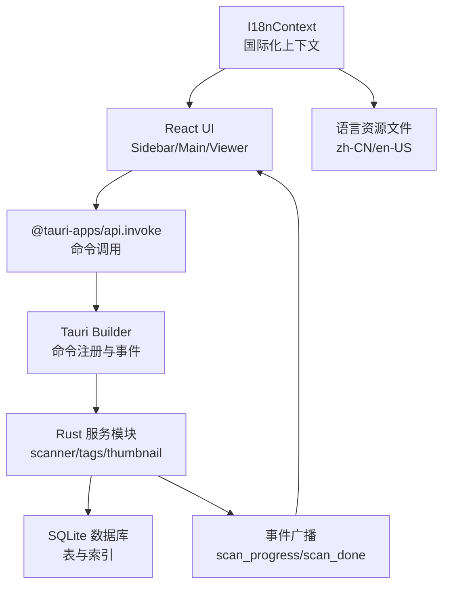

**图表来源**
- [src-tauri/src/main.rs:49-65](file://src-tauri/src/main.rs#L49-L65)
- [src-tauri/src/services/scanner.rs:330-332](file://src-tauri/src/services/scanner.rs#L330-L332)
- [src-tauri/src/db/mod.rs:45-64](file://src-tauri/src/db/mod.rs#L45-L64)
- [src/contexts/I18nContext.tsx:1-51](file://src/contexts/I18nContext.tsx#L1-L51)

## 详细组件分析

### MVVM 与 Zustand 状态管理
- 视图模型（ViewModel）由 Zustand Store 承担，定义导航、标签、媒体项、视图模式与筛选条件等状态字段及派生计算。
- 前端组件仅负责渲染与用户交互，状态变更通过 Store 方法完成，避免直接访问后端。
- 本地变更方法（如标记已看、添加/移除标签）与从数据库同步方法（如 setMediaItemsFromDb、setTagsFromDb）清晰分离，保证一致性与可追踪性。
- 国际化状态集成：状态管理中包含语言偏好设置，支持运行时语言切换。

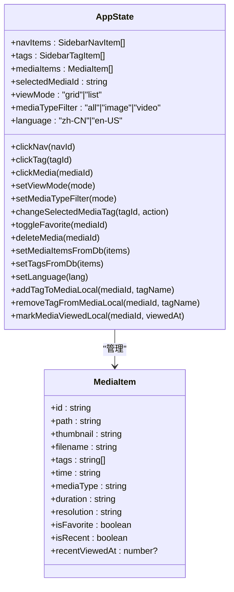

**图表来源**
- [src/store/useAppStore.ts:48-394](file://src/store/useAppStore.ts#L48-L394)

**章节来源**
- [src/store/useAppStore.ts:145-394](file://src/store/useAppStore.ts#L145-L394)

### 三栏式布局（Sidebar/Main/Inspector）
- Sidebar：负责应用导航与标签列表，支持新建/删除标签、标签选择与导航切换，所有文本均通过国际化系统提供。
- Main：承载工具栏与媒体网格，作为媒体展示与交互的主要区域，支持批量标签操作和多选功能。
- Inspector：预留媒体详情与属性编辑（当前为占位），与选中媒体状态联动，显示媒体信息和标签管理界面。
- 布局容器：App.tsx 以 Flex 布局组织三列，SidebarContainer 与 Main 组件分别承担状态与命令桥接职责，均集成了国际化支持。

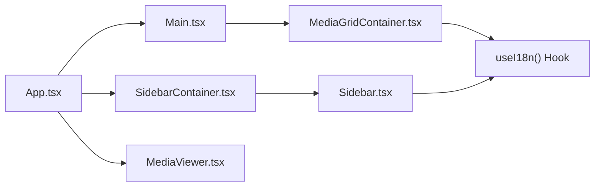

**图表来源**
- [src/App.tsx:60-71](file://src/App.tsx#L60-L71)
- [src/components/Sidebar.tsx:17-144](file://src/components/Sidebar.tsx#L17-L144)
- [src/components/Main.tsx:8-24](file://src/components/Main.tsx#L8-L24)
- [src/containers/SidebarContainer.tsx:7-79](file://src/containers/SidebarContainer.tsx#L7-L79)
- [src/containers/MediaGridContainer.tsx:1-200](file://src/containers/MediaGridContainer.tsx#L1-L200)

**章节来源**
- [src/App.tsx:8-72](file://src/App.tsx#L8-L72)
- [src/components/Sidebar.tsx:17-144](file://src/components/Sidebar.tsx#L17-L144)
- [src/components/Main.tsx:8-24](file://src/components/Main.tsx#L8-L24)
- [src/containers/SidebarContainer.tsx:7-79](file://src/containers/SidebarContainer.tsx#L7-L79)

### Tauri 命令系统与前端通信
- 命令注册：在 main.rs 中通过 generate_handler! 注册扫描、标签、缩略图等命令，供前端 invoke 调用。
- 前端调用：SidebarContainer.tsx 等容器组件通过 @tauri-apps/api 的 invoke 发起命令，传入参数并接收返回值。
- 事件通知：扫描过程通过 emit 发送 scan_progress/scan_done 事件，前端监听后刷新 UI。
- 页面路由：main.tsx 根据路径选择渲染 App、设置页或更新页，统一注入主题上下文和国际化上下文。

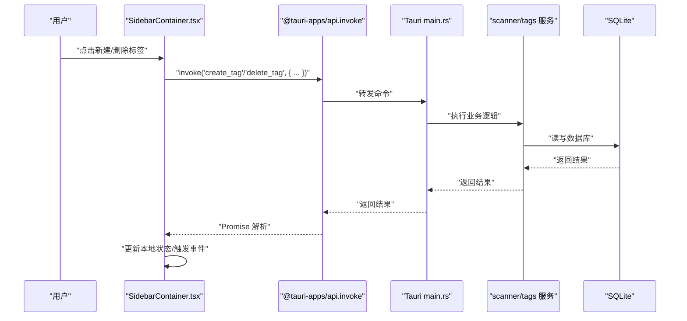

**图表来源**
- [src-tauri/src/main.rs:49-65](file://src-tauri/src/main.rs#L49-L65)
- [src-tauri/src/services/tags.rs:76-124](file://src-tauri/src/services/tags.rs#L76-L124)
- [src-tauri/src/db/mod.rs:97-110](file://src-tauri/src/db/mod.rs#L97-L110)

**章节来源**
- [src-tauri/src/main.rs:49-65](file://src-tauri/src/main.rs#L49-L65)
- [src/containers/SidebarContainer.tsx:16-63](file://src/containers/SidebarContainer.tsx#L16-L63)

### 数据流向：从用户到数据库再到 UI
- 用户操作：在 Sidebar 选择导航或标签，在 Main 点击媒体卡片打开查看器。
- 前端处理：App.tsx 计算当前视图媒体列表，调用 invoke 标记已看并触发"medex:media-updated"事件。
- 后端处理：scanner.rs 更新 recent_views 表，保持最近观看记录上限。
- 事件回推：后端通过 emit 广播扫描进度与完成事件，前端监听并刷新。
- 数据库：SQLite 存储媒体、标签、关联关系与最近观看记录，提供索引优化查询。

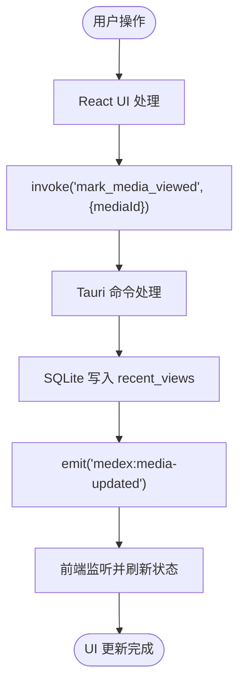

**图表来源**
- [src/App.tsx:35-42](file://src/App.tsx#L35-L42)
- [src-tauri/src/services/scanner.rs:375-393](file://src-tauri/src/services/scanner.rs#L375-L393)

**章节来源**
- [src/App.tsx:28-57](file://src/App.tsx#L28-L57)
- [src-tauri/src/services/scanner.rs:375-393](file://src-tauri/src/services/scanner.rs#L375-L393)

## 国际化系统

### I18nContext 上下文与语言资源管理
Medex 采用基于 React Context 的国际化系统，提供全局语言状态管理和翻译函数：

- **语言状态管理**：I18nContext 维护当前语言状态，支持运行时语言切换和本地存储持久化
- **翻译函数**：提供 `t()` 函数用于获取翻译文本，支持键值对映射和默认回退机制
- **资源管理**：集中管理 zh-CN.json 和 en-US.json 语言资源文件，确保双语一致性
- **默认语言检测**：根据浏览器语言偏好自动检测默认语言，支持简体中文和英语

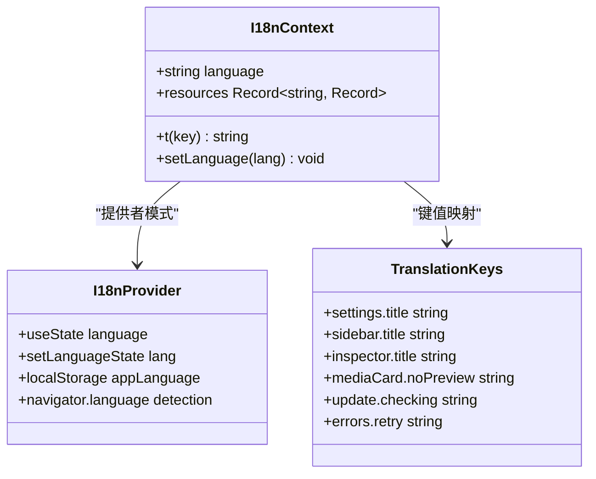

**图表来源**
- [src/contexts/I18nContext.tsx:5-20](file://src/contexts/I18nContext.tsx#L5-L20)
- [src/contexts/I18nContext.tsx:40-43](file://src/contexts/I18nContext.tsx#L40-L43)

### 语言资源文件结构
系统包含两个主要的语言资源文件，每个文件包含114个翻译键值对：

**中文资源文件 (zh-CN.json)**：
- 覆盖设置、侧边栏、检查器、媒体卡片等所有界面元素
- 提供完整的中文本地化支持
- 键结构与英文资源文件保持完全一致

**英文资源文件 (en-US.json)**：
- 与中文资源文件保持相同的键结构
- 确保双语一致性，便于维护和扩展
- 支持国际化标准的英文表达

**章节来源**
- [src/contexts/I18nContext.tsx:1-51](file://src/contexts/I18nContext.tsx#L1-L51)
- [src/i18n/zh-CN.json:1-114](file://src/i18n/zh-CN.json#L1-L114)
- [src/i18n/en-US.json:1-114](file://src/i18n/en-US.json#L1-L114)

### 设置页面语言切换实现
设置页面是语言切换的主要入口点，实现了完整的语言切换流程：

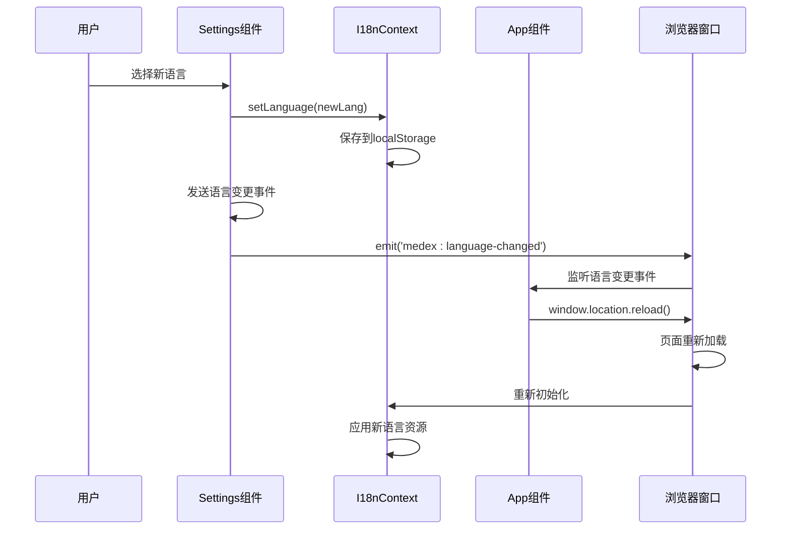

**图表来源**
- [src/pages/Settings.tsx:146-160](file://src/pages/Settings.tsx#L146-L160)
- [src/App.tsx:131-136](file://src/App.tsx#L131-L136)

### 组件本地化实现
各个 UI 组件通过 `useI18n` Hook 实现本地化，确保界面文本的动态切换：

**侧边栏组件 (Sidebar)**：
- 标题和副标题显示：`t('sidebar.title')`、`t('sidebar.subtitle')`
- 导航项本地化：`t('nav.all')`、`t('nav.favorites')`、`t('nav.recent')`
- 标签输入框占位符：`t('sidebar.addTag.placeholder')`
- 添加按钮文本：`t('sidebar.addTag.button')`

**检查器组件 (Inspector)**：
- 标题显示：`t('inspector.title')`
- 提示文本：`t('inspector.selectPrompt')`
- 标签信息显示：`t('inspector.tagsLabel')`
- 操作按钮文本：`t('inspector.actions')`

**媒体卡片组件 (MediaCard)**：
- 无预览提示：`t('mediaCard.noPreview')`
- 缩略图生成提示：`t('mediaCard.generatingThumb')`
- 标签移除错误提示：`t('mediaCard.removeTagFailedPrefix')`

**章节来源**
- [src/components/Sidebar.tsx:44-47](file://src/components/Sidebar.tsx#L44-L47)
- [src/components/Sidebar.tsx:55](file://src/components/Sidebar.tsx#L55)
- [src/components/Sidebar.tsx:105](file://src/components/Sidebar.tsx#L105)
- [src/components/Sidebar.tsx:144](file://src/components/Sidebar.tsx#L144)
- [src/components/Inspector.tsx:106](file://src/components/Inspector.tsx#L106)
- [src/components/Inspector.tsx:161](file://src/components/Inspector.tsx#L161)
- [src/components/MediaCard.tsx:210](file://src/components/MediaCard.tsx#L210)
- [src/components/MediaCard.tsx:230](file://src/components/MediaCard.tsx#L230)

### 多窗口语言同步机制
系统支持多窗口场景下的语言同步，确保用户在任一窗口切换语言后，所有窗口都能及时更新：

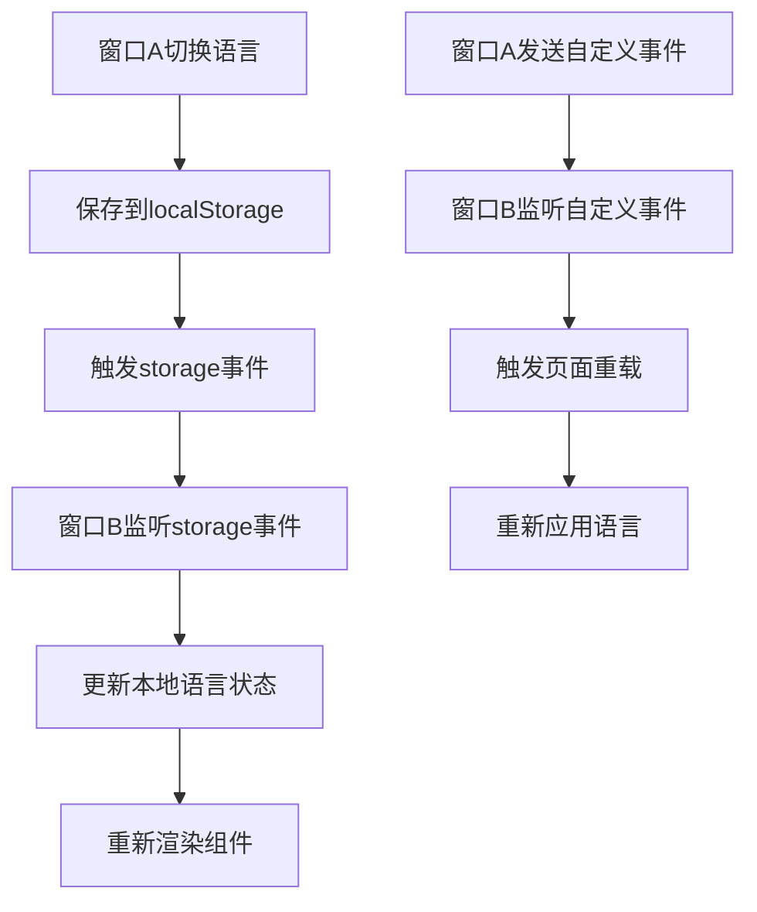

**图表来源**
- [src/App.tsx:127-158](file://src/App.tsx#L127-L158)

**章节来源**
- [src/App.tsx:127-158](file://src/App.tsx#L127-L158)

## 事件驱动架构

### scan_done 事件监听机制
Medex 实现了完整的事件驱动架构，其中 scan_done 事件是扫描完成的核心通知机制：

- **后端触发**：扫描完成后，后端通过 `app_handle.emit("scan_done", true)` 发送事件
- **前端监听**：App.tsx 在 useEffect 中注册监听器，捕获 scan_done 事件
- **状态同步**：事件触发后，前端派发 medex:media-updated 事件，通知各容器组件刷新数据

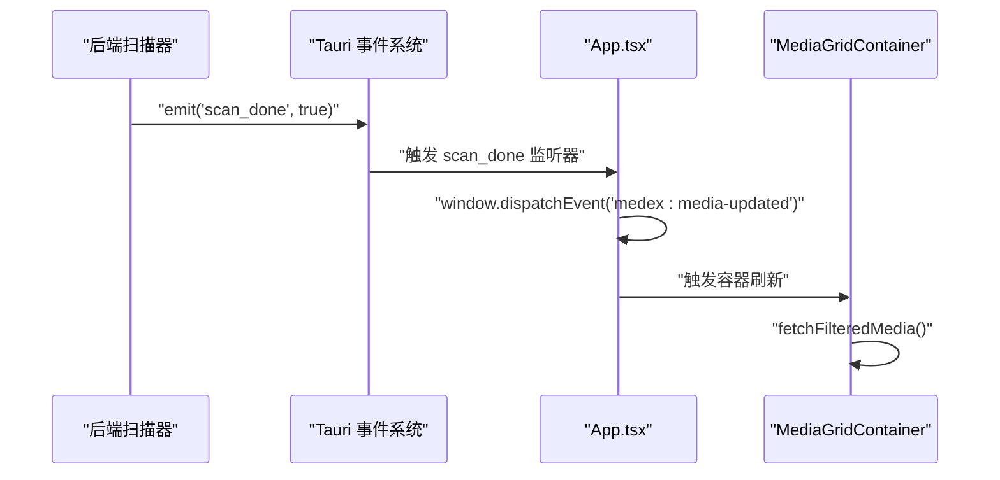

**图表来源**
- [src-tauri/src/services/scanner.rs:330-332](file://src-tauri/src/services/scanner.rs#L330-L332)
- [src/App.tsx:98-120](file://src/App.tsx#L98-L120)

### medex:scan-started 和 medex:scan-completed 自定义事件系统
应用新增了完整的扫描生命周期事件系统，用于精确控制扫描过程中的 UI 状态：

- **扫描开始**：`window.dispatchEvent(new CustomEvent('medex:scan-started'))`
- **扫描完成**：`window.dispatchEvent(new CustomEvent('medex:scan-completed'))`
- **扫描错误**：`window.dispatchEvent(new CustomEvent('medex:scan-error', { detail: error }))`

这些事件用于：
- 通知其他窗口或组件扫描状态变化
- 触发 UI 状态更新（如进度条、状态消息）
- 实现跨组件的状态同步

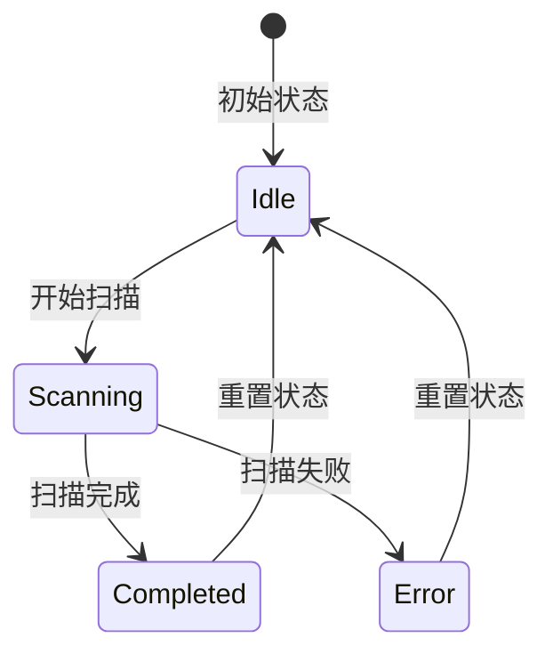

**图表来源**
- [src/pages/Settings.tsx:28](file://src/pages/Settings.tsx#L28)
- [src/pages/Settings.tsx:58](file://src/pages/Settings.tsx#L58)

### 全局事件总线设计模式
Medex 采用了全局事件总线设计模式，通过 window.dispatchEvent 实现跨组件通信：

- **medex:media-updated**：媒体数据更新事件，通知各容器刷新媒体列表
- **medex:tags-updated**：标签数据更新事件，通知侧边栏刷新标签列表
- **medex:library-path-cleared**：媒体库路径清除事件，通知所有窗口重置状态
- **medex:language-changed**：语言变更事件，通知所有窗口重新加载应用

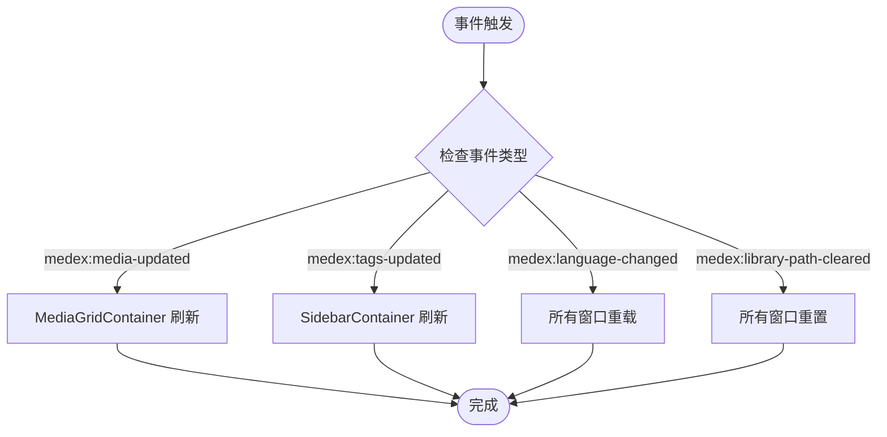

**图表来源**
- [src/containers/MediaGridContainer.tsx:488-494](file://src/containers/MediaGridContainer.tsx#L488-L494)
- [src/containers/SidebarContainer.tsx:28-33](file://src/containers/SidebarContainer.tsx#L28-L33)

**章节来源**
- [src/containers/MediaGridContainer.tsx:488-494](file://src/containers/MediaGridContainer.tsx#L488-L494)
- [src/containers/SidebarContainer.tsx:28-33](file://src/containers/SidebarContainer.tsx#L28-L33)

### 前后端分离刷新机制
Medex 实现了前后端分离的刷新机制，避免直接的页面刷新：

- **后端职责**：通过 Tauri 事件系统通知扫描完成
- **前端职责**：监听事件并触发局部刷新，而非整页刷新
- **容器职责**：各容器组件独立监听并执行相应的数据获取逻辑
- **国际化职责**：语言变更通过事件系统通知所有窗口，确保界面文本同步更新

**章节来源**
- [src-tauri/src/services/scanner.rs:330-343](file://src-tauri/src/services/scanner.rs#L330-L343)
- [src/App.tsx:98-120](file://src/App.tsx#L98-L120)

## 依赖分析
- 前端依赖：React、Zustand、@tauri-apps/api、React Context 及相关插件，构建工具链由 Vite + TypeScript + TailwindCSS 支撑。
- 桌面层依赖：Tauri V2、Serde、rusqlite、tauri-plugin-* 等，负责命令、对话框、更新与存储插件。
- 国际化依赖：React Context API、localStorage API、navigator API，支持运行时语言切换。
- 配置文件：package.json、Cargo.toml、tauri.conf.json 分别定义前端脚本、Rust 依赖与 Tauri 构建/打包策略。

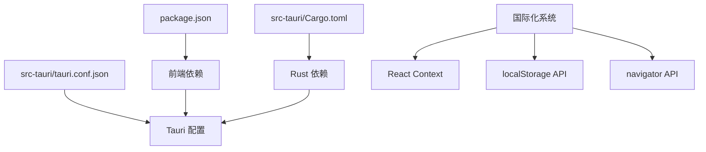

**图表来源**
- [package.json:12-34](file://package.json#L12-L34)
- [src-tauri/Cargo.toml:13-24](file://src-tauri/Cargo.toml#L13-L24)
- [src-tauri/tauri.conf.json:6-44](file://src-tauri/tauri.conf.json#L6-L44)
- [src/contexts/I18nContext.tsx:1-3](file://src/contexts/I18nContext.tsx#L1-L3)

**章节来源**
- [package.json:6-11](file://package.json#L6-L11)
- [src-tauri/Cargo.toml:1-8](file://src-tauri/Cargo.toml#L1-L8)
- [src-tauri/tauri.conf.json:1-46](file://src-tauri/tauri.conf.json#L1-L46)

## 性能考量
- 数据库事务批处理：扫描与插入采用事务，减少磁盘写入次数，提升批量导入性能。
- 索引优化：对媒体路径、标签关联与最近观看时间建立索引，降低查询成本。
- 事件驱动刷新：通过事件而非轮询刷新 UI，降低前端开销。
- 前端虚拟化：媒体网格可结合 react-window 实现虚拟滚动，减少 DOM 节点数量。
- I/O 限制：扫描目录时使用 walkdir，注意大库路径遍历的内存与 CPU 占用，建议分批处理与进度反馈。
- 事件监听优化：各容器组件独立管理事件监听器的注册与清理，避免内存泄漏。
- 国际化性能优化：语言资源文件一次性加载到内存，翻译函数查找复杂度 O(1)，使用 useMemo 优化翻译函数计算。

**更新** 新增国际化系统的性能优化措施，包括资源加载优化、状态管理优化和运行时性能优化。

## 故障排查指南
- 命令调用失败：检查 invoke 参数类型与命令签名是否一致，确认 main.rs 中命令已注册。
- 数据库未初始化：确认 init_db 已在 setup 阶段调用，数据库路径解析正确。
- 事件未触发：确认 emit 调用位置与窗口标签，确保前端监听事件名称一致。
- 事件监听失效：检查 useEffect 中的取消函数是否正确返回，确保组件卸载时清理监听器。
- 权限与作用域：Tauri 配置中 assetProtocol 的 scope 与安全策略需允许前端资源加载。
- 国际化问题：检查语言资源文件完整性，确认所有语言文件包含相同键结构，验证 localStorage 中的语言设置。
- 语言切换失效：确认 I18nContext 正确提供给组件树，检查事件监听器是否正常工作，验证页面重载逻辑。

**更新** 新增国际化相关的故障排查指导，包括语言资源文件检查、事件监听器验证和页面重载逻辑。

**章节来源**
- [src-tauri/src/main.rs:16-24](file://src-tauri/src/main.rs#L16-L24)
- [src-tauri/src/db/mod.rs:45-64](file://src-tauri/src/db/mod.rs#L45-L64)
- [src-tauri/tauri.conf.json:21-27](file://src-tauri/tauri.conf.json#L21-L27)
- [src/contexts/I18nContext.tsx:1-51](file://src/contexts/I18nContext.tsx#L1-L51)

## 结论
Medex 以清晰的前后端分层与命令桥接实现了稳定的数据流与良好的可扩展性。Zustand 简化了前端状态管理，三栏布局明确了职责边界。通过 SQLite 与事件驱动机制，系统在桌面环境下具备高效、可控的本地数据能力。新增的国际化系统通过 I18nContext 提供了完整的语言支持，包括运行时语言切换、多窗口同步和本地存储持久化。事件驱动架构进一步增强了系统的解耦性和可维护性，特别是 scan_done 事件监听机制和 medex:* 自定义事件系统，为复杂的异步操作提供了可靠的通信通道。后续可在媒体导入、搜索过滤、批量操作等方面沿用现有模式持续演进。

**更新** 结论部分新增对国际化系统和事件驱动架构的总结，强调其在系统解耦、可维护性和用户体验方面的贡献。

## 附录
- 基础设施要求
  - Node.js 18+、Rust 1.77.2+、包管理器（npm/pnpm）
  - 开发模式：前端热更新（npm run dev）、完整开发（npm run tauri dev）
  - 生产构建：先前端构建，再 Tauri 构建，产物位于 src-tauri/target/release/
- 可扩展性考虑
  - 命令模块化：按领域拆分命令（scanner/tags/thumbnail），便于测试与维护
  - 插件化：利用 Tauri 插件体系扩展能力（对话框、更新、存储）
  - 数据迁移：通过数据库迁移脚本或版本化初始化 SQL 管理结构演进
  - 事件系统扩展：可按需新增自定义事件类型，保持命名规范和类型安全
  - 国际化扩展：支持更多语言，通过添加新的语言资源文件和语言选项
- 部署拓扑
  - 单机桌面应用，数据存储于应用数据目录下的 SQLite 文件
  - 可选外部二进制（如 ffmpeg）通过 externalBin 配置集成

**更新** 新增国际化系统的可扩展性考虑，包括支持更多语言和语言资源文件的管理。

**章节来源**
- [README.md:50-94](file://README.md#L50-L94)
- [src-tauri/tauri.conf.json:29-34](file://src-tauri/tauri.conf.json#L29-L34)