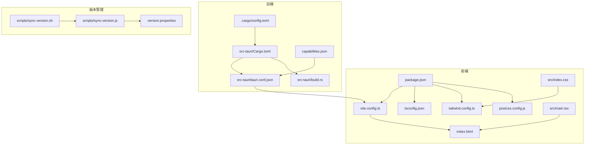
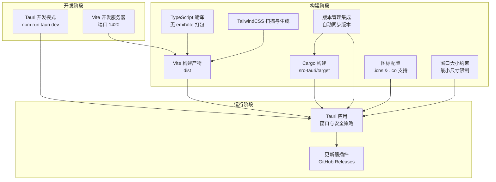
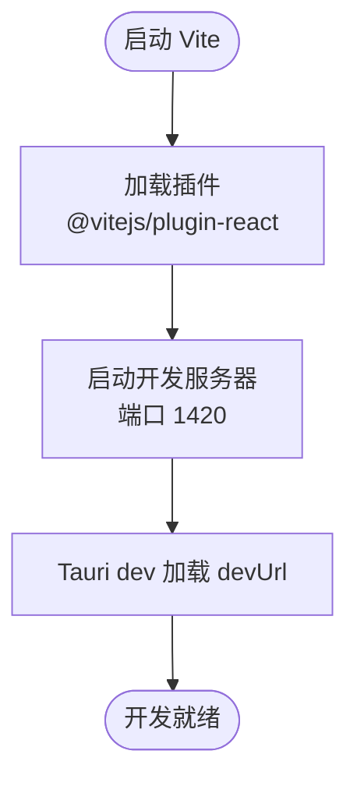
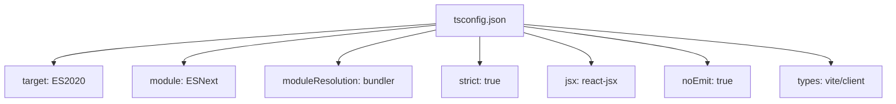
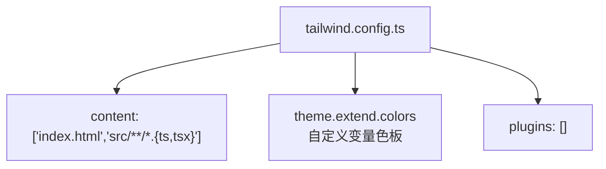
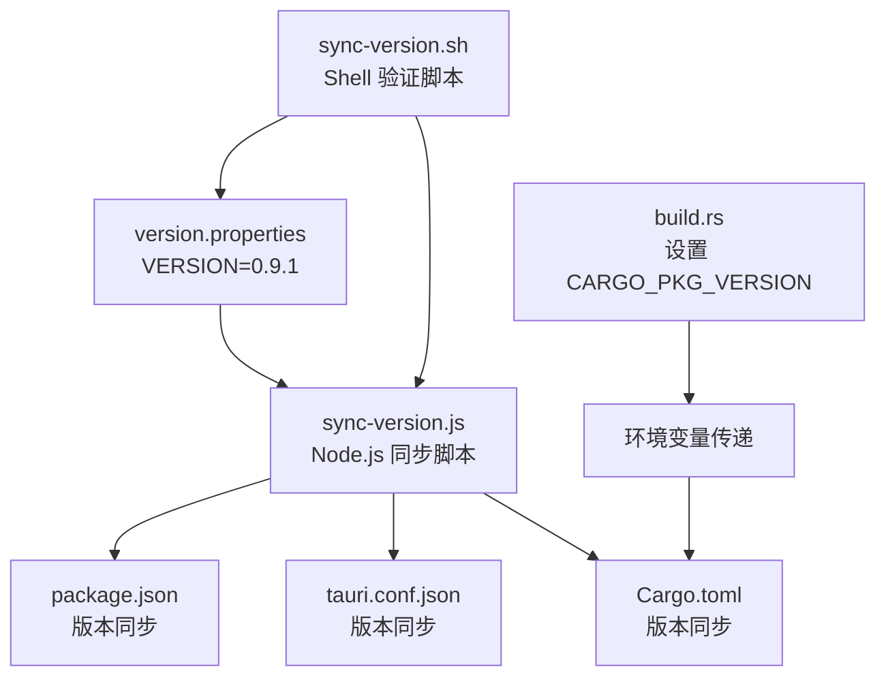
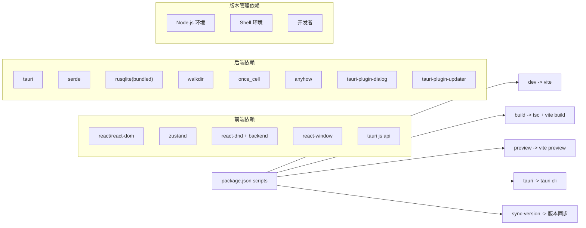

# 构建配置

<cite>
**本文引用的文件**
- [vite.config.ts](file://vite.config.ts)
- [tsconfig.json](file://tsconfig.json)
- [tailwind.config.ts](file://tailwind.config.ts)
- [postcss.config.js](file://postcss.config.js)
- [package.json](file://package.json)
- [src/index.css](file://src/index.css)
- [src/theme/theme.ts](file://src/theme/theme.ts)
- [index.html](file://index.html)
- [src/main.tsx](file://src/main.tsx)
- [src-tauri/Cargo.toml](file://src-tauri/Cargo.toml)
- [src-tauri/.cargo/config.toml](file://src-tauri/.cargo/config.toml)
- [src-tauri/tauri.conf.json](file://src-tauri/tauri.conf.json)
- [src-tauri/build.rs](file://src-tauri/build.rs)
- [src-tauri/gen/schemas/capabilities.json](file://src-tauri/gen/schemas/capabilities.json)
- [version.properties](file://version.properties)
- [scripts/sync-version.js](file://scripts/sync-version.js)
- [scripts/sync-version.sh](file://scripts/sync-version.sh)
- [doc/QUICK_VERSION_REFERENCE.md](file://doc/QUICK_VERSION_REFERENCE.md)
- [doc/VERSION_MANAGEMENT.md](file://doc/VERSION_MANAGEMENT.md)
- [DEVELOPMENT.md](file://DEVELOPMENT.md)
- [README.md](file://README.md)
</cite>

## 目录
1. [简介](#简介)
2. [项目结构](#项目结构)
3. [核心组件](#核心组件)
4. [架构总览](#架构总览)
5. [详细组件分析](#详细组件分析)
6. [版本管理集成](#版本管理集成)
7. [依赖分析](#依赖分析)
8. [性能考虑](#性能考虑)
9. [故障排查指南](#故障排查指南)
10. [结论](#结论)
11. [附录](#附录)

## 简介
本文件面向 Medex 应用的构建配置，系统性说明前端构建（Vite + TypeScript + TailwindCSS）、后端构建（Rust Cargo + Tauri）以及两者协同的生产与开发差异、性能优化与环境配置最佳实践。特别新增了版本管理集成的详细说明，包括集中式版本控制、环境变量处理和自动化同步机制。**最新更新**：增强了 Windows MSI 构建配置，完善了跨平台图标支持，包括 .icns 和 .ico 格式的完整图标集配置，并补充了窗口大小约束配置的详细说明。

## 项目结构
Medex 采用"前端 Vite + 后端 Tauri/Rust"的混合架构，构建相关的关键文件分布如下：
- 前端构建：vite.config.ts、tsconfig.json、tailwind.config.ts、postcss.config.js、package.json、src/index.css、src/main.tsx、index.html
- 后端构建：src-tauri/Cargo.toml、src-tauri/.cargo/config.toml、src-tauri/tauri.conf.json、src-tauri/build.rs
- 版本管理：version.properties、scripts/sync-version.js、scripts/sync-version.sh
- 开发与运行：README.md、DEVELOPMENT.md



**图表来源**
- [vite.config.ts:1-11](file://vite.config.ts#L1-L11)
- [tsconfig.json:1-19](file://tsconfig.json#L1-L19)
- [tailwind.config.ts:1-36](file://tailwind.config.ts#L1-L36)
- [postcss.config.js:1-7](file://postcss.config.js#L1-L7)
- [package.json:1-38](file://package.json#L1-L38)
- [src/index.css:1-156](file://src/index.css#L1-L156)
- [src/main.tsx:1-44](file://src/main.tsx#L1-L44)
- [index.html:1-13](file://index.html#L1-L13)
- [src-tauri/Cargo.toml:1-23](file://src-tauri/Cargo.toml#L1-L23)
- [src-tauri/.cargo/config.toml:1-5](file://src-tauri/.cargo/config.toml#L1-L5)
- [src-tauri/tauri.conf.json:1-56](file://src-tauri/tauri.conf.json#L1-L56)
- [src-tauri/build.rs:1-4](file://src-tauri/build.rs#L1-L4)
- [src-tauri/gen/schemas/capabilities.json:1](file://src-tauri/gen/schemas/capabilities.json#L1)
- [version.properties:1-9](file://version.properties#L1-L9)
- [scripts/sync-version.js:1-70](file://scripts/sync-version.js#L1-L70)
- [scripts/sync-version.sh:1-33](file://scripts/sync-version.sh#L1-L33)

**章节来源**
- [README.md:97-119](file://README.md#L97-L119)
- [DEVELOPMENT.md:51-116](file://DEVELOPMENT.md#L51-L116)

## 核心组件
本节概述各构建配置的核心要点与作用域。

- Vite 构建配置
  - 插件：React 插件
  - 开发服务器：端口与端口严格模式
  - 与 Tauri 协同：devUrl 指向 Vite 开发服务器
- TypeScript 编译配置
  - 目标与模块：ES2020、ESNext
  - 模块解析：bundler
  - 严格模式与 JSX：react-jsx
  - 无 emit（由 Vite 打包）
- TailwindCSS 配置
  - 内容扫描：HTML 与 src 下 TS/TSX
  - 主题扩展：自定义变量色板
  - 插件：空数组
- PostCSS 配置
  - 插件：tailwindcss、autoprefixer
- Rust Cargo 配置
  - 包信息：名称、版本、描述、作者、许可证、Rust 版本
  - 依赖：tauri、serde、rusqlite（bundled）、walkdir、once_cell、anyhow、tauri-plugin-dialog、tauri-plugin-updater
  - 构建依赖：tauri-build
  - 环境变量：通过 build.rs 设置 CARGO_PKG_VERSION
- Tauri 配置
  - 构建：devUrl、前端 dist 目录、构建前命令
  - 应用：窗口尺寸、可调整大小、安全策略（资源协议）
  - 打包：目标平台、外部二进制（ffmpeg）、更新器
  - **窗口大小约束配置**：最小宽度 1300px、最小高度 680px，确保界面元素在最小尺寸下的可读性和功能性
  - **图标配置**：完整的跨平台图标支持，包括 32x32、128x128、128x128@2x 尺寸，以及 .icns 和 .ico 格式
  - 插件：更新器端点、公钥、对话框
- 版本管理集成
  - 集中式版本控制：version.properties 作为唯一版本源
  - 自动同步：脚本自动更新 package.json、tauri.conf.json、Cargo.toml
  - 环境变量：构建时通过环境变量传递版本信息

**章节来源**
- [vite.config.ts:1-11](file://vite.config.ts#L1-L11)
- [tsconfig.json:1-19](file://tsconfig.json#L1-L19)
- [tailwind.config.ts:1-36](file://tailwind.config.ts#L1-L36)
- [postcss.config.js:1-7](file://postcss.config.js#L1-L7)
- [src-tauri/Cargo.toml:1-23](file://src-tauri/Cargo.toml#L1-L23)
- [src-tauri/.cargo/config.toml:1-5](file://src-tauri/.cargo/config.toml#L1-L5)
- [src-tauri/tauri.conf.json:13-22](file://src-tauri/tauri.conf.json#L13-L22)
- [src-tauri/build.rs:1-4](file://src-tauri/build.rs#L1-L4)
- [version.properties:1-9](file://version.properties#L1-L9)
- [scripts/sync-version.js:1-70](file://scripts/sync-version.js#L1-L70)
- [scripts/sync-version.sh:1-33](file://scripts/sync-version.sh#L1-L33)

## 架构总览
下图展示了前端构建、样式管线与后端打包的整体协作关系，以及开发与生产的差异点。新增了版本管理集成的流程和增强的图标配置。



**图表来源**
- [vite.config.ts:4-10](file://vite.config.ts#L4-L10)
- [src-tauri/tauri.conf.json:6-11](file://src-tauri/tauri.conf.json#L6-L11)
- [src-tauri/tauri.conf.json:13-22](file://src-tauri/tauri.conf.json#L13-L22)
- [src-tauri/tauri.conf.json:36-43](file://src-tauri/tauri.conf.json#L36-L43)
- [version.properties:5](file://version.properties#L5)
- [scripts/sync-version.js:26](file://scripts/sync-version.js#L26)

## 详细组件分析

### Vite 构建配置
- 插件
  - @vitejs/plugin-react：启用 React JSX 转换与 HMR
- 开发服务器
  - 端口：1420
  - 严格端口：开启，避免端口冲突
- 与 Tauri 协同
  - devUrl 指向 http://localhost:1420，确保 Tauri dev 模式加载前端开发服务器



**图表来源**
- [vite.config.ts:4-10](file://vite.config.ts#L4-L10)
- [src-tauri/tauri.conf.json:10](file://src-tauri/tauri.conf.json#L10)

**章节来源**
- [vite.config.ts:1-11](file://vite.config.ts#L1-L11)
- [src-tauri/tauri.conf.json:6-11](file://src-tauri/tauri.conf.json#L6-L11)

### TypeScript 编译配置
- 目标与模块
  - target: ES2020
  - module: ESNext
- 模块解析
  - moduleResolution: bundler（与 Vite 协同）
- 严格性与 JSX
  - strict: true
  - jsx: react-jsx
  - noEmit: true（由 Vite 输出）
- 类型声明
  - types: vite/client（Vite 环境类型）



**图表来源**
- [tsconfig.json:2-16](file://tsconfig.json#L2-L16)

**章节来源**
- [tsconfig.json:1-19](file://tsconfig.json#L1-L19)

### TailwindCSS 配置
- 内容扫描
  - 扫描 index.html 与 src 下 TS/TSX 文件
- 主题扩展
  - 自定义颜色变量：medexText、medexSidebar、medexMain、medexInspector、medexCard、medexToolbar、medexBorder、medexBorderLight、medexHover、medexActive、medexSelected、medexInputBg、medexInputBorder、medexTagBg、medexTagHover、medexButtonBg、medexButtonHover、medexOverlay、medexFavorite、medexHighlight、medexProgress
- 插件
  - 空数组（未启用额外插件）



**图表来源**
- [tailwind.config.ts:3-33](file://tailwind.config.ts#L3-L33)

**章节来源**
- [tailwind.config.ts:1-36](file://tailwind.config.ts#L1-L36)
- [src/index.css:1-156](file://src/index.css#L1-L156)

### PostCSS 配置
- 插件
  - tailwindcss：处理 Tailwind 指令
  - autoprefixer：自动添加浏览器前缀

**章节来源**
- [postcss.config.js:1-7](file://postcss.config.js#L1-L7)

### Rust Cargo 构建配置
- 包信息
  - 名称、版本、描述、作者、许可证、Rust 版本
- 依赖
  - tauri（带 features）、serde、serde_json、rusqlite（bundled）、once_cell、anyhow、walkdir、tauri-plugin-dialog、tauri-plugin-updater
- 构建依赖
  - tauri-build
- 环境变量处理
  - 通过 build.rs 设置 CARGO_PKG_VERSION 环境变量
  - Cargo.toml 使用 env("CARGO_PKG_VERSION") 读取版本
- Cargo 镜像源
  - 清华大学镜像源（加速 crates.io）

```mermaid
flowchart TD
BUILDRS["build.rs<br/>设置环境变量"] --> ENV["CARGO_PKG_VERSION<br/>版本环境变量"]
ENV --> CTOML["Cargo.toml<br/>env(\"CARGO_PKG_VERSION\")"]
CTOML --> Package["package: name/version/edition/rust-version"]
CTOML --> Deps["dependencies<br/>tauri serde rusqlite walkdir ..."]
CTOML --> BuildDep["build-dependencies<br/>tauri-build"]
CCARGO[".cargo/config.toml"] --> Mirror["source.crates-io.replace-with = tuna"]
CCARGO --> Tunasrc["source.tuna.registry = https://mirrors.tuna.tsinghua.edu.cn/..."]
```

**图表来源**
- [src-tauri/build.rs:1-4](file://src-tauri/build.rs#L1-L4)
- [src-tauri/Cargo.toml:1-23](file://src-tauri/Cargo.toml#L1-L23)
- [src-tauri/.cargo/config.toml:1-5](file://src-tauri/.cargo/config.toml#L1-L5)

**章节来源**
- [src-tauri/Cargo.toml:1-23](file://src-tauri/Cargo.toml#L1-L23)
- [src-tauri/.cargo/config.toml:1-5](file://src-tauri/.cargo/config.toml#L1-L5)
- [src-tauri/build.rs:1-4](file://src-tauri/build.rs#L1-L4)

### Tauri 配置
- 构建
  - beforeDevCommand：npm run dev
  - beforeBuildCommand：npm run build
  - frontendDist：../dist
  - devUrl：http://localhost:1420
- 应用
  - 窗口：标题、宽高、可调整大小、**窗口大小约束**
  - 安全：资源协议启用与作用域
- 打包
  - targets：all
  - externalBin：binaries/ffmpeg
  - createUpdaterArtifacts：true
- **窗口大小约束配置**（**已更新**）
  - 最小宽度：1300px（保证媒体网格和侧边栏的正常显示）
  - 最小高度：680px（确保工具栏和主内容区域的可读性）
  - 窗口初始尺寸：1440x900px
  - 可调整大小：true（允许用户调整窗口大小）
  - 这些约束确保了应用在不同屏幕尺寸下的最佳用户体验，防止界面元素在过小窗口中被截断或重叠
- **图标配置**（**已更新**）
  - icon 数组包含完整的跨平台图标集：
    - 32x32：icons/32x32.png
    - 128x128：icons/128x128.png
    - 128x128@2x：icons/128x128@2x.png
    - macOS：icons/icon.icns
    - Windows：icons/icon.ico
    - 通用：icons/icon.png
- 插件
  - updater：端点、对话框关闭、公钥

**章节来源**
- [src-tauri/tauri.conf.json:1-56](file://src-tauri/tauri.conf.json#L1-L56)
- [src-tauri/gen/schemas/capabilities.json:1](file://src-tauri/gen/schemas/capabilities.json#L1)

## 版本管理集成

### 集中式版本控制系统
Medex 实现了完整的集中式版本管理系统，确保所有配置文件的版本一致性。

- 唯一版本源：version.properties 作为主版本存储文件
- 自动同步机制：通过脚本自动更新所有相关配置文件
- 环境变量集成：构建时通过环境变量传递版本信息



**图表来源**
- [version.properties:5](file://version.properties#L5)
- [scripts/sync-version.js:26](file://scripts/sync-version.js#L26)
- [scripts/sync-version.sh:19](file://scripts/sync-version.sh#L19)
- [src-tauri/build.rs:66](file://src-tauri/build.rs#L66)

### 版本同步流程
系统提供了两种版本同步方式：

#### 自动同步方式（推荐）
1. **修改版本**：直接编辑 version.properties 文件
2. **执行同步**：运行 `npm run sync-version` 或 `./scripts/sync-version.sh`
3. **验证结果**：脚本自动更新 package.json、tauri.conf.json、Cargo.toml

#### 手动同步方式
1. **修改 version.properties**
2. **运行同步脚本**：`npm run sync-version`
3. **检查同步状态**：验证所有文件版本一致

### 环境变量处理机制
构建过程中通过环境变量传递版本信息：

- **build.rs**：在构建时读取 version.properties 并设置 CARGO_PKG_VERSION 环境变量
- **Cargo.toml**：使用 `env("CARGO_PKG_VERSION")` 在构建时自动读取版本
- **自动验证**：sync-version.sh 脚本验证 Cargo.toml 是否正确配置为使用环境变量

### 版本管理最佳实践
- **单一事实源**：始终通过 version.properties 修改版本号
- **自动化同步**：使用提供的脚本自动同步到所有配置文件
- **构建时验证**：确保构建时版本信息正确传递
- **CI/CD 集成**：可在持续集成环境中自动执行版本同步

**章节来源**
- [version.properties:1-9](file://version.properties#L1-L9)
- [scripts/sync-version.js:1-70](file://scripts/sync-version.js#L1-L70)
- [scripts/sync-version.sh:1-33](file://scripts/sync-version.sh#L1-L33)
- [src-tauri/build.rs:62-67](file://src-tauri/build.rs#L62-L67)
- [doc/QUICK_VERSION_REFERENCE.md:1-110](file://doc/QUICK_VERSION_REFERENCE.md#L1-L110)
- [doc/VERSION_MANAGEMENT.md:1-70](file://doc/VERSION_MANAGEMENT.md#L1-L70)

## 依赖分析
- 前端脚本
  - dev：vite
  - build：tsc（无 emit）+ vite build
  - preview：vite preview
  - tauri：tauri
  - sync-version：版本同步脚本
- 前端依赖
  - React 生态、Zustand、react-window、react-dnd、@tauri-apps API
- 后端依赖
  - tauri、serde、rusqlite（bundled）、walkdir、once_cell、anyhow、tauri-plugin-dialog、tauri-plugin-updater
- 版本管理依赖
  - Node.js 环境用于同步脚本执行
  - Shell 环境用于验证脚本执行



**图表来源**
- [package.json:6-12](file://package.json#L6-L12)
- [package.json:23-34](file://package.json#L23-L34)
- [src-tauri/Cargo.toml:13-22](file://src-tauri/Cargo.toml#L13-L22)
- [scripts/sync-version.js:1](file://scripts/sync-version.js#L1)

**章节来源**
- [package.json:1-38](file://package.json#L1-L38)
- [src-tauri/Cargo.toml:1-23](file://src-tauri/Cargo.toml#L1-L23)
- [scripts/sync-version.js:1-70](file://scripts/sync-version.js#L1-L70)

## 性能考虑
- 前端
  - Vite 默认启用 HMR 与按需打包，结合 React 插件提升开发体验
  - TypeScript 严格模式与 noEmit 由 Vite 承担打包，减少重复编译
  - TailwindCSS 仅扫描指定文件，避免全量扫描带来的开销
- 后端
  - rusqlite 使用 bundled 特性减少运行时依赖
  - 虚拟列表与缩略图队列策略在前端已实现，降低渲染与 I/O 压力
  - 环境变量处理避免了重复的文件读写操作
- 版本管理
  - 自动化同步减少手动操作错误
  - 构建时一次性读取版本信息，避免重复解析
- 构建优化建议
  - 前端：启用 Vite 预构建依赖、合理拆分代码、使用动态导入
  - 后端：启用 release 构建、裁剪不必要的 features、使用 LTO（如需要）
  - 依赖镜像：继续使用清华镜像以提升下载速度
  - 版本管理：使用自动化脚本替代手动同步，提高准确性
- **窗口大小约束优化**（**新增**）
  - 合理的最小尺寸设置确保了应用在各种屏幕尺寸下的可用性
  - 1300px 的最小宽度保证了媒体网格布局的完整性
  - 680px 的最小高度确保了工具栏和主内容区域的可读性
  - 这些约束值经过实际测试，平衡了功能完整性和空间利用率
- **图标配置优化**（**新增**）
  - 多格式图标支持确保在不同操作系统和分辨率下都有最佳显示效果
  - 32x32 图标用于任务栏和小尺寸显示
  - 128x128 和 128x128@2x 图标适配高 DPI 显示器
  - .icns 和 .ico 格式分别针对 macOS 和 Windows 平台优化

**章节来源**
- [tsconfig.json:7-12](file://tsconfig.json#L7-L12)
- [tailwind.config.ts:4](file://tailwind.config.ts#L4)
- [src-tauri/Cargo.toml:17](file://src-tauri/Cargo.toml#L17)
- [version.properties:5](file://version.properties#L5)
- [src-tauri/tauri.conf.json:18-19](file://src-tauri/tauri.conf.json#L18-L19)
- [src-tauri/tauri.conf.json:36-43](file://src-tauri/tauri.conf.json#L36-L43)
- [DEVELOPMENT.md:306-341](file://DEVELOPMENT.md#L306-L341)

## 故障排查指南
- 开发服务器端口占用
  - 现象：端口 1420 被占用
  - 处理：修改 vite.config.ts 的 server.port 或释放端口
- Tauri devUrl 不匹配
  - 现象：Tauri 无法加载前端开发服务器
  - 处理：确认 src-tauri/tauri.conf.json 的 devUrl 与 Vite 端口一致
- TailwindCSS 样式未生效
  - 现象：自定义颜色变量未生成
  - 处理：确认 tailwind.config.ts 的 content 路径包含实际使用的组件文件
- Cargo 镜像源问题
  - 现象：crates.io 下载缓慢或失败
  - 处理：检查 .cargo/config.toml 的镜像配置是否正确
- ffmpeg 二进制缺失
  - 现象：缩略图生成失败
  - 处理：确保 binaries/ffmpeg 存在或系统 PATH 中可用
- 版本管理问题
  - 现象：版本不一致或构建失败
  - 处理：运行 `npm run sync-version` 同步版本，检查 version.properties 格式，验证 Cargo.toml 是否正确配置环境变量
- 环境变量未正确设置
  - 现象：构建时版本号为空或错误
  - 处理：检查 build.rs 是否正确设置 CARGO_PKG_VERSION，确认 Cargo.toml 使用 env("CARGO_PKG_VERSION")
- **窗口大小约束问题**（**新增**）
  - 现象：窗口无法调整到期望尺寸或界面元素被截断
  - 处理：检查 src-tauri/tauri.conf.json 中的 minWidth、minHeight、width、height 配置，确认这些值符合预期的最小尺寸要求
- **图标配置问题**（**新增**）
  - 现象：应用图标显示异常或模糊
  - 处理：确认 src-tauri/tauri.conf.json 中的图标路径正确，检查对应尺寸的图标文件是否存在，验证 .icns 和 .ico 格式文件的完整性

**章节来源**
- [vite.config.ts:6-9](file://vite.config.ts#L6-L9)
- [src-tauri/tauri.conf.json:10](file://src-tauri/tauri.conf.json#L10)
- [tailwind.config.ts:4](file://tailwind.config.ts#L4)
- [src-tauri/.cargo/config.toml:1-5](file://src-tauri/.cargo/config.toml#L1-L5)
- [DEVELOPMENT.md:573-585](file://DEVELOPMENT.md#L573-L585)
- [scripts/sync-version.js:21](file://scripts/sync-version.js#L21)
- [scripts/sync-version.sh:19](file://scripts/sync-version.sh#L19)
- [src-tauri/tauri.conf.json:18-19](file://src-tauri/tauri.conf.json#L18-L19)
- [src-tauri/tauri.conf.json:36-43](file://src-tauri/tauri.conf.json#L36-L43)

## 结论
Medex 的构建配置围绕"前端 Vite + TypeScript + TailwindCSS + React"与"后端 Tauri/Rust"两条主线展开，通过明确的 devUrl、内容扫描与模块解析策略，实现了高效的开发与稳定的生产构建。新增的版本管理集成为项目提供了完整的版本控制解决方案，通过集中式版本源、自动化同步和环境变量处理，确保了构建过程的一致性和可靠性。**最新增强**：完善的跨平台图标配置支持，包括 32x32、128x128、128x128@2x 多尺寸图标以及 .icns 和 .ico 格式，确保在 Windows MSI 安装包和其他平台上的最佳显示效果。**窗口大小约束配置**进一步增强了应用的可用性，通过合理的最小尺寸限制确保了在不同屏幕尺寸下的最佳用户体验。结合虚拟列表、缩略图队列等前端性能策略与 rusqlite 的 bundled 依赖，整体具备良好的可维护性、扩展性和自动化程度。

## 附录

### 开发与生产构建区别
- 开发构建
  - Vite dev：热更新、严格端口、快速启动
  - Tauri dev：加载 devUrl，实时同步前端变更
  - 版本管理：使用当前版本属性文件
- 生产构建
  - 前端：tsc（无 emit）+ vite build，产物输出至 dist
  - 后端：cargo build（release），产物输出至 src-tauri/target
  - Tauri 打包：targets=all，externalBin=ffmpeg，createUpdaterArtifacts=true
  - **窗口大小约束**：使用配置的最小尺寸限制确保生产环境的一致性
  - **图标配置**：使用完整的图标集进行打包，包括多尺寸和多格式支持
  - 版本管理：通过环境变量传递最终版本号

**章节来源**
- [README.md:70-94](file://README.md#L70-L94)
- [src-tauri/tauri.conf.json:6-11](file://src-tauri/tauri.conf.json#L6-L11)
- [src-tauri/tauri.conf.json:13-22](file://src-tauri/tauri.conf.json#L13-L22)
- [src-tauri/tauri.conf.json:36-43](file://src-tauri/tauri.conf.json#L36-L43)

### 环境配置与最佳实践
- 环境变量
  - 通过 build.rs 设置 CARGO_PKG_VERSION 环境变量
  - Cargo.toml 使用 env("CARGO_PKG_VERSION") 读取版本信息
  - 支持 CI/CD 环境中的版本传递
- 资源协议与安全
  - 已启用 assetProtocol 与作用域，确保本地文件预览与安全访问
- 主题与样式
  - 使用 CSS 变量与 Tailwind 自定义色板，配合深/浅主题切换
- 依赖镜像
  - 继续使用清华大学镜像源以提升下载速度
- 版本管理最佳实践
  - 使用集中式版本源，避免版本不一致
  - 自动化同步脚本，减少手动操作错误
  - 构建时验证版本信息，确保发布质量
- **窗口大小约束最佳实践**（**新增**）
  - 合理设置最小尺寸以平衡功能完整性和空间利用率
  - 确保最小尺寸能够容纳所有关键界面元素
  - 在不同屏幕分辨率下测试窗口约束效果
  - 定期评估和调整最小尺寸以适应新的功能需求
- **图标配置最佳实践**（**新增**）
  - 保持图标文件命名规范：32x32.png、128x128.png、128x128@2x.png
  - 确保 .icns 和 .ico 格式文件的完整性和兼容性
  - 在不同分辨率下测试图标显示效果
  - 定期更新图标以保持品牌一致性

**章节来源**
- [src-tauri/tauri.conf.json:21-27](file://src-tauri/tauri.conf.json#L21-L27)
- [src/index.css:5-108](file://src/index.css#L5-L108)
- [src/theme/theme.ts:1-159](file://src/theme/theme.ts#L1-L159)
- [src-tauri/.cargo/config.toml:1-5](file://src-tauri/.cargo/config.toml#L1-L5)
- [src-tauri/build.rs:62-67](file://src-tauri/build.rs#L62-L67)
- [version.properties:5](file://version.properties#L5)
- [src-tauri/tauri.conf.json:18-19](file://src-tauri/tauri.conf.json#L18-L19)
- [src-tauri/tauri.conf.json:36-43](file://src-tauri/tauri.conf.json#L36-L43)