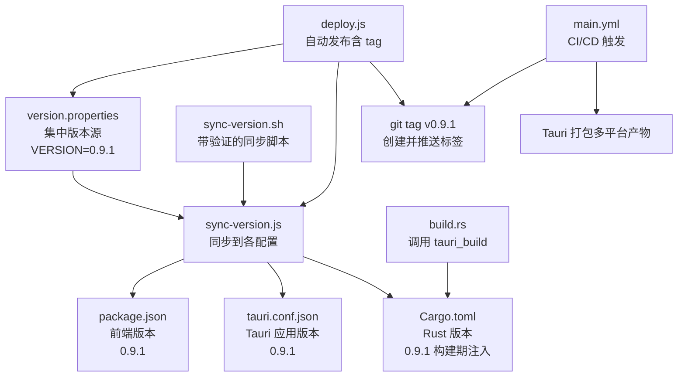
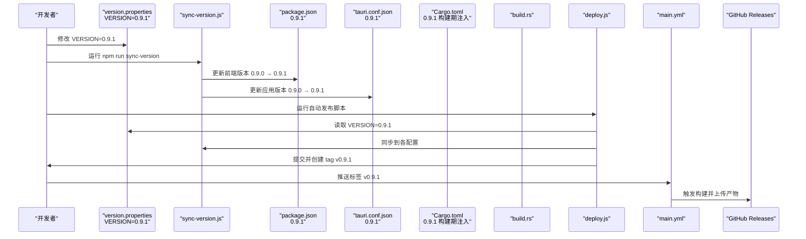
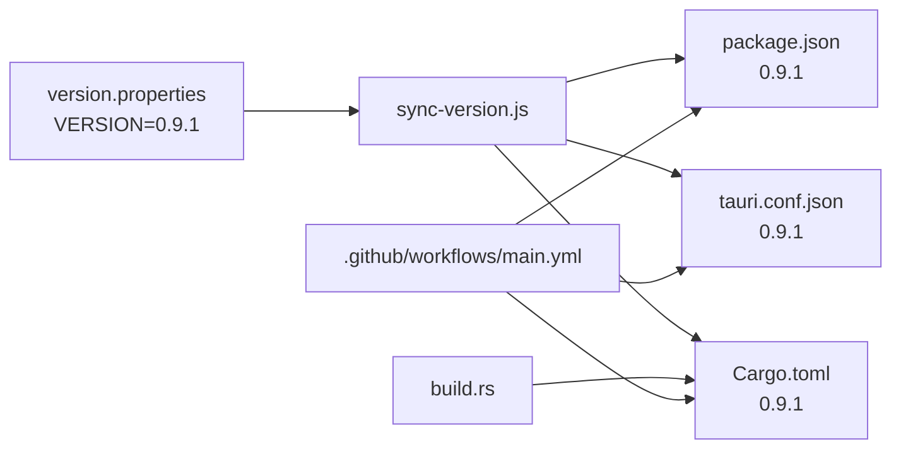

# 版本管理

<cite>
**本文引用的文件**
- [VERSION_MANAGEMENT.md](file://doc/VERSION_MANAGEMENT.md)
- [QUICK_VERSION_REFERENCE.md](file://doc/QUICK_VERSION_REFERENCE.md)
- [version.properties](file://version.properties)
- [package.json](file://package.json)
- [src-tauri/Cargo.toml](file://src-tauri/Cargo.toml)
- [src-tauri/tauri.conf.json](file://src-tauri/tauri.conf.json)
- [scripts/sync-version.js](file://scripts/sync-version.js)
- [scripts/sync-version.sh](file://scripts/sync-version.sh)
- [scripts/deploy.js](file://scripts/deploy.js)
- [.github/workflows/main.yml](file://.github/workflows/main.yml)
- [src-tauri/build.rs](file://src-tauri/build.rs)
- [src-tauri/.cargo/config.toml](file://src-tauri/.cargo/config.toml)
</cite>

## 更新摘要
**变更内容**
- 版本从 0.9.0 升级到 0.9.1
- 更新了所有相关配置文件中的版本号
- 保持了现有的版本管理架构和流程不变

## 目录
1. [简介](#简介)
2. [项目结构](#项目结构)
3. [核心组件](#核心组件)
4. [架构总览](#架构总览)
5. [详细组件分析](#详细组件分析)
6. [依赖分析](#依赖分析)
7. [性能考虑](#性能考虑)
8. [故障排查指南](#故障排查指南)
9. [结论](#结论)
10. [附录](#附录)

## 简介
本文件系统性阐述 Medex 项目的版本管理方案，涵盖集中式版本源、跨文件同步机制、构建期版本注入、发布流程与自动化集成。通过单一版本源驱动前端、桌面端与构建配置的一致性，配合脚本与 CI/CD 实现高效、可追溯的版本发布。

**更新** 当前版本已升级至 0.9.1，所有相关配置文件已完成同步更新。

## 项目结构
围绕版本管理的关键文件分布如下：
- 集中式版本源：version.properties（当前版本：0.9.1）
- 前端版本：package.json（当前版本：0.9.1）
- 桌面端版本：src-tauri/tauri.conf.json（当前版本：0.9.1）
- Rust 版本：src-tauri/Cargo.toml（当前版本：0.9.1，通过构建期注入）
- 同步脚本：scripts/sync-version.js、scripts/sync-version.sh
- 自动发布脚本：scripts/deploy.js
- CI/CD：.github/workflows/main.yml
- 构建入口：src-tauri/build.rs
- Cargo 镜像源：src-tauri/.cargo/config.toml

**图表来源**
- [version.properties:1-9](file://version.properties#L1-L9)
- [scripts/sync-version.js:1-70](file://scripts/sync-version.js#L1-L70)
- [scripts/sync-version.sh:1-33](file://scripts/sync-version.sh#L1-L33)
- [scripts/deploy.js:1-171](file://scripts/deploy.js#L1-L171)
- [.github/workflows/main.yml:1-42](file://.github/workflows/main.yml#L1-L42)
- [src-tauri/Cargo.toml:1-23](file://src-tauri/Cargo.toml#L1-L23)
- [src-tauri/tauri.conf.json:1-58](file://src-tauri/tauri.conf.json#L1-L58)
- [src-tauri/build.rs:1-4](file://src-tauri/build.rs#L1-L4)

**章节来源**
- [VERSION_MANAGEMENT.md:1-121](file://doc/VERSION_MANAGEMENT.md#L1-L121)
- [QUICK_VERSION_REFERENCE.md:1-110](file://doc/QUICK_VERSION_REFERENCE.md#L1-L110)

## 核心组件
- 集中式版本源：version.properties，当前版本为 0.9.1，仅需在此处修改 VERSION，即可驱动全链路同步。
- 同步脚本：sync-version.js 负责读取版本并更新 package.json、tauri.conf.json；sync-version.sh 在此基础上增加 Cargo.toml 配置验证。
- Rust 版本注入：Cargo.toml 使用环境变量 CARGO_PKG_VERSION，通过构建入口 build.rs 间接由 Tauri 构建系统注入。
- 自动发布：deploy.js 串联版本读取、同步、提交与 tag 创建，简化发布流程。
- CI/CD：main.yml 基于语义化版本标签触发，自动安装 Node/Rust 并执行多平台打包。

**章节来源**
- [VERSION_MANAGEMENT.md:7-121](file://doc/VERSION_MANAGEMENT.md#L7-L121)
- [QUICK_VERSION_REFERENCE.md:55-110](file://doc/QUICK_VERSION_REFERENCE.md#L55-L110)
- [scripts/sync-version.js:1-70](file://scripts/sync-version.js#L1-L70)
- [scripts/sync-version.sh:1-33](file://scripts/sync-version.sh#L1-L33)
- [scripts/deploy.js:1-171](file://scripts/deploy.js#L1-L171)
- [.github/workflows/main.yml:1-42](file://.github/workflows/main.yml#L1-L42)

## 架构总览
版本管理的端到端流程包括：版本源修改、同步更新、构建注入、打包发布与标签管理。

**图表来源**
- [scripts/sync-version.js:1-70](file://scripts/sync-version.js#L1-L70)
- [scripts/deploy.js:1-171](file://scripts/deploy.js#L1-L171)
- [.github/workflows/main.yml:1-42](file://.github/workflows/main.yml#L1-L42)

## 详细组件分析

### 集中式版本源（version.properties）
- 作用：唯一可信版本来源，集中维护语义化版本号。
- 格式：键值对，VERSION=0.9.1；可选 BUILD_NUMBER 用于 CI/CD。
- 位置：根目录 version.properties。
- **更新** 当前版本已升级到 0.9.1。

**章节来源**
- [VERSION_MANAGEMENT.md:7-14](file://doc/VERSION_MANAGEMENT.md#L7-L14)
- [QUICK_VERSION_REFERENCE.md:57-61](file://doc/QUICK_VERSION_REFERENCE.md#L57-L61)
- [version.properties:1-9](file://version.properties#L1-L9)

### 前端版本（package.json）
- 作用：记录 NPM 包版本，供前端构建与依赖管理使用。
- 当前版本：0.9.1。
- 同步：通过 sync-version.js 自动更新，保持与集中版本源一致。
- 脚本：提供 sync-version 脚本，便于一键同步。

**章节来源**
- [VERSION_MANAGEMENT.md:57-61](file://doc/VERSION_MANAGEMENT.md#L57-L61)
- [QUICK_VERSION_REFERENCE.md:69-74](file://doc/QUICK_VERSION_REFERENCE.md#L69-L74)
- [package.json:1-38](file://package.json#L1-L38)

### 桌面端版本（tauri.conf.json）
- 作用：记录 Tauri 应用版本，影响打包产物与更新元数据。
- 当前版本：0.9.1。
- 同步：通过 sync-version.js 自动更新，保证与前端版本一致。
- 插件：启用 tauri-plugin-updater，支持自动更新机制。

**章节来源**
- [VERSION_MANAGEMENT.md:62-66](file://doc/VERSION_MANAGEMENT.md#L62-L66)
- [QUICK_VERSION_REFERENCE.md:69-74](file://doc/QUICK_VERSION_REFERENCE.md#L69-L74)
- [src-tauri/tauri.conf.json:1-58](file://src-tauri/tauri.conf.json#L1-L58)

### Rust 版本（Cargo.toml）
- 作用：记录 Rust 包版本，参与最终打包与签名。
- 当前版本：0.9.1。
- 注入方式：使用环境变量 CARGO_PKG_VERSION，构建期由 Tauri 构建系统注入，无需手动更新。
- 构建入口：build.rs 调用 tauri_build，间接完成版本注入。

**章节来源**
- [VERSION_MANAGEMENT.md:67-71](file://doc/VERSION_MANAGEMENT.md#L67-L71)
- [QUICK_VERSION_REFERENCE.md:62-74](file://doc/QUICK_VERSION_REFERENCE.md#L62-L74)
- [src-tauri/Cargo.toml:1-23](file://src-tauri/Cargo.toml#L1-L23)
- [src-tauri/build.rs:1-4](file://src-tauri/build.rs#L1-L4)

### 同步脚本（sync-version.js）
- 功能：读取 version.properties 中的 VERSION=0.9.1，依次更新 package.json、tauri.conf.json；对 Cargo.toml 使用正则替换 version 行。
- 输出：打印同步前后版本对比，提示同步完成。

**章节来源**
- [scripts/sync-version.js:1-70](file://scripts/sync-version.js#L1-L70)

### 同步脚本（sync-version.sh）
- 功能：加载 version.properties 环境变量，调用 sync-version.js，并验证 Cargo.toml 是否使用环境变量注入。
- 输出：汇总同步结果与验证信息。

**章节来源**
- [scripts/sync-version.sh:1-33](file://scripts/sync-version.sh#L1-L33)

### 自动发布脚本（deploy.js）
- 功能：读取 VERSION=0.9.1 → 同步到各配置 → 检查并提交更改 → 创建并推送 tag v0.9.1，简化发布流程。
- 错误处理：对命令执行失败进行捕获与提示，支持手动补救。

**章节来源**
- [scripts/deploy.js:1-171](file://scripts/deploy.js#L1-L171)

### CI/CD（main.yml）
- 触发条件：推送语义化版本标签（v*）。
- 步骤：安装 Node/Rust、前端构建、Rust 检查、多平台 Tauri 打包、上传制品与更新 JSON。
- 权限：赋予 contents 与 packages 写权限，支持发布与签名。

**章节来源**
- [.github/workflows/main.yml:1-42](file://.github/workflows/main.yml#L1-L42)

### 构建入口（build.rs）
- 作用：调用 tauri_build，作为 Rust 构建入口，配合 Tauri 构建系统完成版本注入与打包。

**章节来源**
- [src-tauri/build.rs:1-4](file://src-tauri/build.rs#L1-L4)

### Cargo 镜像源（.cargo/config.toml）
- 作用：配置清华大学镜像源，加速 crates.io 下载，降低网络波动影响。
- 影响：提升 Rust 依赖安装稳定性与速度。

**章节来源**
- [src-tauri/.cargo/config.toml:1-5](file://src-tauri/.cargo/config.toml#L1-L5)

## 依赖分析
- 前端版本与脚本：package.json 定义版本号与构建脚本，用于前端产物生成与预览。
- 桌面端版本与打包：Cargo.toml 定义 Rust 项目版本；tauri.conf.json 控制产品名称、版本与打包配置。
- CI 触发：GitHub Actions 通过标签触发，自动安装 Node 与 Rust 工具链并执行打包。
- 构建期注入：build.rs 与 Tauri 构建系统共同完成版本注入，确保 Rust 产物版本与集中源一致。

**图表来源**
- [scripts/sync-version.js:1-70](file://scripts/sync-version.js#L1-L70)
- [src-tauri/build.rs:1-4](file://src-tauri/build.rs#L1-L4)
- [.github/workflows/main.yml:1-42](file://.github/workflows/main.yml#L1-L42)

**章节来源**
- [VERSION_MANAGEMENT.md:175-178](file://doc/VERSION_MANAGEMENT.md#L175-L178)

## 性能考虑
- 同步脚本采用一次性读取与写入，避免重复解析，减少 I/O 开销。
- 构建期注入版本避免频繁修改 Cargo.toml，降低磁盘写入次数。
- CI/CD 使用矩阵并行构建多平台产物，缩短整体发布周期。
- Cargo 镜像源提升依赖下载速度，间接优化构建时延。

## 故障排查指南
- 问题：Cargo.toml 版本未更新
  - 说明：Cargo.toml 使用环境变量注入，构建时自动读取，无需手动更新。
  - 参考：[QUICK_VERSION_REFERENCE.md:98-99](file://doc/QUICK_VERSION_REFERENCE.md#L98-L99)

- 问题：tauri.conf.json 版本不一致
  - 说明：运行 npm run sync-version 自动更新。
  - 参考：[VERSION_MANAGEMENT.md:101-102](file://doc/VERSION_MANAGEMENT.md#L101-L102)

- 问题：如何回退版本
  - 说明：修改 version.properties 为旧版本，重新运行 npm run sync-version。
  - 参考：[QUICK_VERSION_REFERENCE.md:104-105](file://doc/QUICK_VERSION_REFERENCE.md#L104-L105)

- 问题：同步脚本执行失败
  - 说明：检查 version.properties 是否存在 VERSION；确认 Node.js 环境可用。
  - 参考：[scripts/sync-version.js:20-24](file://scripts/sync-version.js#L20-L24)

- 问题：CI/CD 未触发
  - 说明：确认推送标签符合 v* 格式；检查 GITHUB_TOKEN 权限。
  - 参考：[VERSION_MANAGEMENT.md:106-109](file://doc/VERSION_MANAGEMENT.md#L106-L109)

**章节来源**
- [QUICK_VERSION_REFERENCE.md:96-105](file://doc/QUICK_VERSION_REFERENCE.md#L96-L105)
- [scripts/sync-version.js:20-24](file://scripts/sync-version.js#L20-L24)
- [VERSION_MANAGEMENT.md:106-109](file://doc/VERSION_MANAGEMENT.md#L106-L109)

## 结论
Medex 通过集中式版本源与自动化脚本，实现了前端、桌面端与构建配置的版本一致性；结合 CI/CD 与自动发布脚本，形成从版本修改到多平台发布的闭环。当前版本已升级至 0.9.1，所有相关配置文件已完成同步更新，该方案降低了人为疏漏风险，提升了发布效率与可追溯性。

## 附录
- 常用命令
  - 查看当前版本：cat version.properties | grep VERSION
  - 同步版本：npm run sync-version
  - 使用 shell 脚本：./scripts/sync-version.sh
  - 构建项目：npm run tauri build
  - 自动发布：node scripts/deploy.js

**章节来源**
- [QUICK_VERSION_REFERENCE.md:80-94](file://doc/QUICK_VERSION_REFERENCE.md#L80-L94)