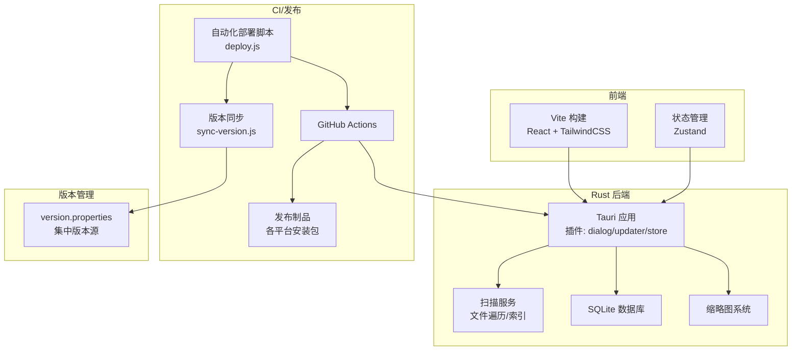
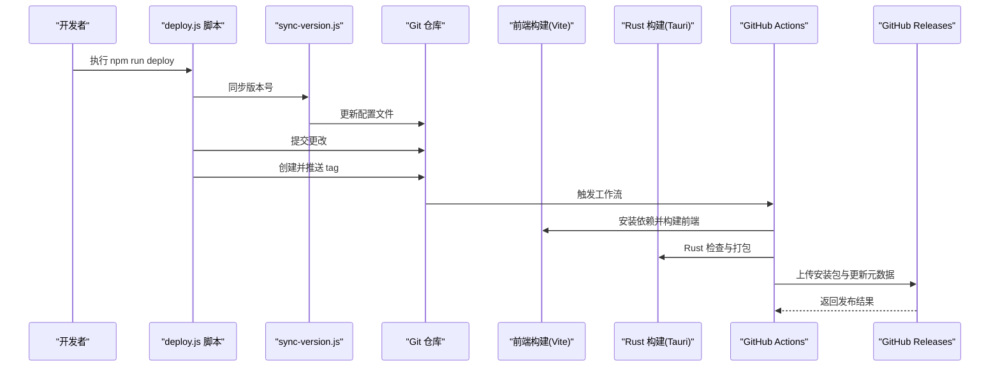
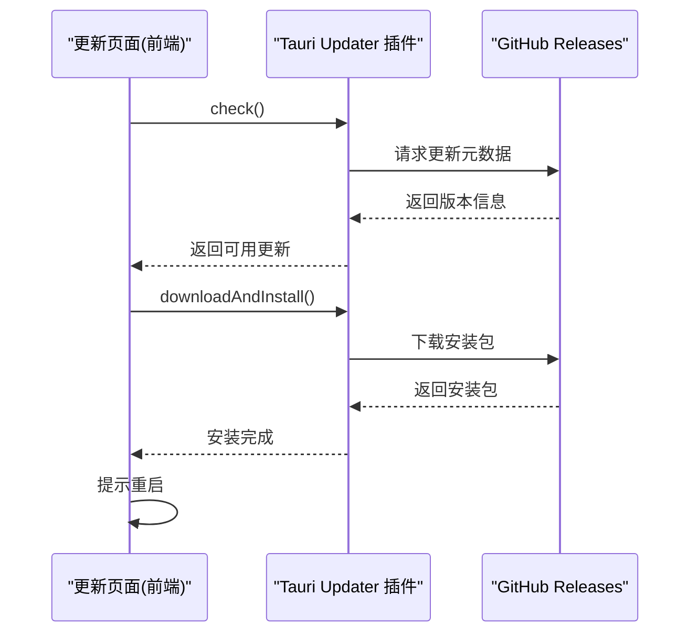
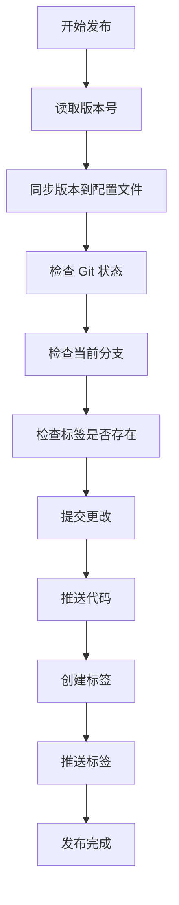
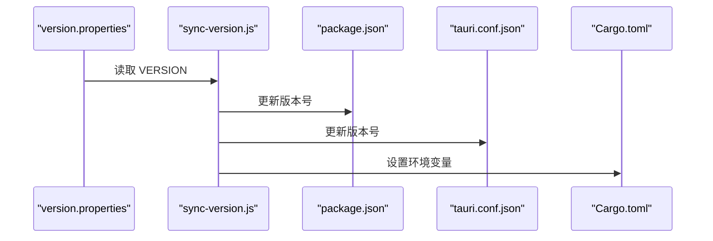
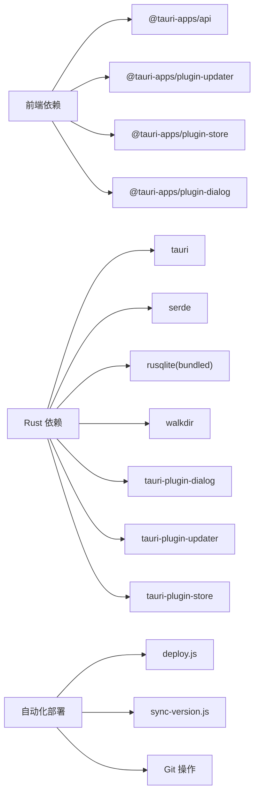

# 部署与发布

<cite>
**本文引用的文件**
- [package.json](file://package.json)
- [vite.config.ts](file://vite.config.ts)
- [Cargo.toml](file://src-tauri/Cargo.toml)
- [tauri.conf.json](file://src-tauri/tauri.conf.json)
- [main.yml](file://.github/workflows/main.yml)
- [RELEASE_GUIDE.md](file://RELEASE_GUIDE.md)
- [UpdatePage.tsx](file://src/pages/UpdatePage.tsx)
- [Update.tsx](file://src/pages/Update.tsx)
- [main.rs](file://src-tauri/src/main.rs)
- [scanner.rs](file://src-tauri/src/services/scanner.rs)
- [default.json](file://src-tauri/capabilities/default.json)
- [useAppStore.ts](file://src/store/useAppStore.ts)
- [tailwind.config.ts](file://tailwind.config.ts)
- [postcss.config.js](file://postcss.config.js)
- [deploy.js](file://scripts/deploy.js)
- [sync-version.js](file://scripts/sync-version.js)
- [sync-version.sh](file://scripts/sync-version.sh)
- [version.properties](file://version.properties)
- [DEPLOYMENT_GUIDE.md](file://doc/DEPLOYMENT_GUIDE.md)
- [DEPLOYMENT_QUICKREF.md](file://doc/DEPLOYMENT_QUICKREF.md)
- [VERSION_MANAGEMENT.md](file://doc/VERSION_MANAGEMENT.md)
- [QUICK_VERSION_REFERENCE.md](file://doc/QUICK_VERSION_REFERENCE.md)
</cite>

## 更新摘要
**所做更改**
- 新增完整的自动化部署系统章节，包括 deploy.js 脚本、版本管理自动化和 CI/CD 集成
- 更新版本管理策略，详细介绍 version.properties 集中管理模式
- 新增自动化发布流程和故障排除指南
- 更新 CI/CD 集成配置和发布流程文档

## 目录
1. [简介](#简介)
2. [项目结构](#项目结构)
3. [核心组件](#核心组件)
4. [架构总览](#架构总览)
5. [详细组件分析](#详细组件分析)
6. [自动化部署系统](#自动化部署系统)
7. [版本管理策略](#版本管理策略)
8. [依赖分析](#依赖分析)
9. [性能考量](#性能考量)
10. [故障排除指南](#故障排除指南)
11. [结论](#结论)
12. [附录](#附录)

## 简介
本文件面向 Medex 应用的部署与发布，覆盖生产构建流程、前端资源优化、Rust 二进制构建与 Tauri 打包、平台特定配置与签名、自动更新机制、版本管理与发布流程、跨平台部署注意事项、安全与权限配置、发布后监控与维护，以及常见问题排查。

**更新** 新增完整的自动化部署系统，包括 deploy.js 脚本、版本管理自动化和 CI/CD 集成，提供一键式发布流程。

## 项目结构
- 前端基于 Vite + React + TailwindCSS，使用 TypeScript。
- Rust 层通过 Tauri v2 提供桌面应用能力，包含数据库、缩略图、扫描服务等。
- CI 使用 GitHub Actions，支持 macOS 与 Windows 平台的自动化打包与发布。
- 更新机制通过 Tauri Updater 插件与外部 JSON 元数据对接。
- **新增** 自动化部署系统，通过 deploy.js 脚本实现完整的发布流程自动化。

**图表来源**
- [package.json:1-37](file://package.json#L1-L37)
- [vite.config.ts:1-11](file://vite.config.ts#L1-L11)
- [Cargo.toml:1-24](file://src-tauri/Cargo.toml#L1-L24)
- [tauri.conf.json:1-49](file://src-tauri/tauri.conf.json#L1-L49)
- [main.rs:1-98](file://src-tauri/src/main.rs#L1-L98)
- [scanner.rs:1-597](file://src-tauri/src/services/scanner.rs#L1-L597)
- [main.yml:1-42](file://.github/workflows/main.yml#L1-L42)
- [deploy.js:1-171](file://scripts/deploy.js#L1-L171)
- [sync-version.js:1-70](file://scripts/sync-version.js#L1-L70)
- [version.properties:1-9](file://version.properties#L1-L9)

**章节来源**
- [package.json:1-37](file://package.json#L1-L37)
- [vite.config.ts:1-11](file://vite.config.ts#L1-L11)
- [Cargo.toml:1-24](file://src-tauri/Cargo.toml#L1-L24)
- [tauri.conf.json:1-49](file://src-tauri/tauri.conf.json#L1-L49)
- [main.rs:1-98](file://src-tauri/src/main.rs#L1-L98)
- [scanner.rs:1-597](file://src-tauri/src/services/scanner.rs#L1-L597)
- [main.yml:1-42](file://.github/workflows/main.yml#L1-L42)
- [deploy.js:1-171](file://scripts/deploy.js#L1-L171)
- [sync-version.js:1-70](file://scripts/sync-version.js#L1-L70)
- [version.properties:1-9](file://version.properties#L1-L9)

## 核心组件
- 前端构建与优化
  - 使用 Vite + React 插件进行开发与生产构建；TailwindCSS 与 PostCSS 配置用于样式管线。
  - 生产构建命令串联 TypeScript 编译与 Vite 构建，输出静态资源至 dist 目录，供 Tauri 嵌入。
- Rust 与 Tauri
  - Cargo.toml 声明 Tauri v2 依赖及插件（dialog、updater、store），并启用 SQLite 与相关特性。
  - tauri.conf.json 定义应用名称、版本、窗口尺寸、安全策略、打包目标、外部二进制（如 ffmpeg）、更新器端点与公钥。
  - main.rs 初始化数据库、缩略图系统，注册菜单与命令，启用插件。
- 自动更新
  - 前端 UpdatePage.tsx 使用 @tauri-apps/plugin-updater 的 check 与 downloadAndInstall 流程；tauri.conf.json 的 updater 配置包含 endpoint、公钥与对话框行为。
- CI/CD
  - GitHub Actions 在推送以 v 开头的标签时触发，矩阵构建 macOS 与 Windows，使用 tauri-action 完成签名与发布，包含更新器 JSON 注入。
- **新增** 自动化部署系统
  - deploy.js 脚本实现完整的发布流程自动化，包括版本读取、同步、Git 操作和标签管理。
  - sync-version.js 脚本负责将版本号从 version.properties 同步到所有配置文件。
  - version.properties 作为单一版本源，确保版本一致性。

**章节来源**
- [package.json:6-11](file://package.json#L6-L11)
- [vite.config.ts:4-10](file://vite.config.ts#L4-L10)
- [tailwind.config.ts:1-36](file://tailwind.config.ts#L1-L36)
- [postcss.config.js:1-7](file://postcss.config.js#L1-L7)
- [Cargo.toml:13-24](file://src-tauri/Cargo.toml#L13-L24)
- [tauri.conf.json:36-47](file://src-tauri/tauri.conf.json#L36-L47)
- [main.rs:11-96](file://src-tauri/src/main.rs#L11-L96)
- [UpdatePage.tsx:26-86](file://src/pages/UpdatePage.tsx#L26-L86)
- [main.yml:12-42](file://.github/workflows/main.yml#L12-L42)
- [deploy.js:1-171](file://scripts/deploy.js#L1-L171)
- [sync-version.js:1-70](file://scripts/sync-version.js#L1-L70)
- [version.properties:1-9](file://version.properties#L1-L9)

## 架构总览
下图展示从开发到发布的整体流程，包括前端构建、Rust 打包、外部二进制集成、更新器配置、CI 发布和自动化部署系统。

**图表来源**
- [package.json:11-12](file://package.json#L11-L12)
- [deploy.js:117-157](file://scripts/deploy.js#L117-L157)
- [sync-version.js:29-62](file://scripts/sync-version.js#L29-L62)
- [main.yml:29-42](file://.github/workflows/main.yml#L29-L42)
- [tauri.conf.json:6-11](file://src-tauri/tauri.conf.json#L6-L11)

**章节来源**
- [package.json:11-12](file://package.json#L11-L12)
- [deploy.js:117-157](file://scripts/deploy.js#L117-L157)
- [sync-version.js:29-62](file://scripts/sync-version.js#L29-L62)
- [main.yml:29-42](file://.github/workflows/main.yml#L29-L42)
- [tauri.conf.json:6-11](file://src-tauri/tauri.conf.json#L6-L11)

## 详细组件分析

### 前端资源优化与构建
- 构建命令
  - 生产构建命令先执行 TypeScript 编译，再执行 Vite 构建，输出静态资源到 dist，供 Tauri 嵌入。
- 开发服务器
  - Vite 开发服务器端口固定为 1420，便于 tauri.conf.json 中 devUrl 对齐。
- 样式与工具链
  - TailwindCSS 与 PostCSS 配置确保样式按需生成与兼容性处理。
- 优化策略
  - 代码分割与懒加载：通过路由与视图组件的按需渲染减少初始包体。
  - 包体积优化：结合 Tree-shaking、按需引入与条件编译，避免不必要的依赖进入生产包。
  - 资源缓存：静态资源由 Vite 生成带哈希的文件名，利于浏览器缓存与长期缓存策略。

**章节来源**
- [package.json:8](file://package.json#L8)
- [vite.config.ts:6-9](file://vite.config.ts#L6-L9)
- [tailwind.config.ts:4](file://tailwind.config.ts#L4)
- [postcss.config.js:1-7](file://postcss.config.js#L1-L7)

### Rust 二进制与 Tauri 应用打包
- 依赖与插件
  - Tauri v2、serde、rusqlite（含捆绑选项）、walkdir、tauri-plugin-dialog、tauri-plugin-updater、tauri-plugin-store。
- 应用入口
  - main.rs 初始化数据库与缩略图系统，注册菜单与命令，启用插件；暴露扫描、标签、缩略图请求等命令给前端调用。
- 打包配置
  - tauri.conf.json 指定前端构建产物目录、开发服务器地址、窗口尺寸、安全策略（资产协议作用域）、打包目标为 all、外部二进制列表（ffmpeg）、开启更新器制品生成。
- 外部二进制（ffmpeg）
  - 通过 bundle.externalBin 引入 ffmpeg，需按目标三元组提供对应二进制文件；RELEASE_GUIDE.md 提供准备与校验建议。

**章节来源**
- [Cargo.toml:13-24](file://src-tauri/Cargo.toml#L13-L24)
- [main.rs:11-96](file://src-tauri/src/main.rs#L11-L96)
- [tauri.conf.json:29-34](file://src-tauri/tauri.conf.json#L29-L34)
- [RELEASE_GUIDE.md:73-115](file://RELEASE_GUIDE.md#L73-L115)

### 自动更新机制
- 前端更新页
  - UpdatePage.tsx 实现检查更新、下载与安装流程；根据状态渲染不同视图（检查中、可用、最新、下载中、已下载、错误）。
- 插件与配置
  - tauri.conf.json 的 updater 配置包含 endpoint、公钥与对话框行为；前端通过 @tauri-apps/plugin-updater 的 check 与 downloadAndInstall 调用。
- 更新流程
  - 前端发起检查，若发现新版本则下载并安装，完成后提示重启生效。

**图表来源**
- [UpdatePage.tsx:38-86](file://src/pages/UpdatePage.tsx#L38-L86)
- [tauri.conf.json:36-43](file://src-tauri/tauri.conf.json#L36-L43)

**章节来源**
- [UpdatePage.tsx:26-119](file://src/pages/UpdatePage.tsx#L26-L119)
- [tauri.conf.json:36-43](file://src-tauri/tauri.conf.json#L36-L43)

### 平台特定构建与签名
- 平台矩阵
  - GitHub Actions 使用 macOS 与 Windows 矩阵进行构建。
- 签名与密钥
  - 通过环境变量传入私钥与密码，交由 tauri-action 完成签名与发布。
- 产物与命名
  - 产物位于 target/release/bundle，按平台生成 .app/.dmg 或 .msi/.exe；建议采用 medex-v{version}-{platform}-{arch}.{ext} 的命名规范。

**章节来源**
- [main.yml:14-35](file://.github/workflows/main.yml#L14-L35)
- [RELEASE_GUIDE.md:198-206](file://RELEASE_GUIDE.md#L198-L206)

### 安全与权限配置
- 能力与权限
  - capabilities/default.json 定义默认能力，包含窗口列表与权限集合，启用 updater:allow-check 等权限。
- 安全策略
  - tauri.conf.json 的 app.security.assetProtocol.enable=true，允许通过资产协议加载前端资源；csp 设置为 null，前端样式与主题通过 CSS 变量控制。
- 第三方二进制合规
  - RELEASE_GUIDE.md 建议明确 ffmpeg 来源与许可证，必要时附带 OSS NOTICE。

**章节来源**
- [default.json:1-15](file://src-tauri/capabilities/default.json#L1-L15)
- [tauri.conf.json:21-27](file://src-tauri/tauri.conf.json#L21-L27)
- [RELEASE_GUIDE.md:232-238](file://RELEASE_GUIDE.md#L232-L238)

### 版本管理与发布流程
- 标签驱动发布
  - 推送以 v 开头的 Git 标签触发 CI 发布。
- 本地打包
  - 清理 dist 与 target 后执行 npm run tauri build，产物位于 target/release/bundle。
- 发布体验与回归
  - RELEASE_GUIDE.md 提供发布前检查清单与安装后验证步骤，确保 ffmpeg 可用、缩略图缓存目录可写、功能回归通过。

**章节来源**
- [main.yml:3-6](file://.github/workflows/main.yml#L3-L6)
- [RELEASE_GUIDE.md:118-179](file://RELEASE_GUIDE.md#L118-L179)

## 自动化部署系统

### deploy.js 脚本详解
deploy.js 是 Medex 项目的自动化部署核心脚本，提供完整的发布流程自动化：

- **版本读取**：从 version.properties 文件中提取版本号
- **版本同步**：自动更新 package.json、tauri.conf.json 和 Cargo.toml
- **Git 操作**：检查状态、提交更改、推送代码、创建并推送标签
- **分支检查**：确保在 main 分支上进行发布
- **错误处理**：完善的异常捕获和用户友好的错误提示

**图表来源**
- [deploy.js:44-157](file://scripts/deploy.js#L44-L157)

**章节来源**
- [deploy.js:1-171](file://scripts/deploy.js#L1-L171)

### 版本同步机制
sync-version.js 负责将版本号从单一来源同步到所有配置文件：

- **version.properties**：作为唯一版本源，存储主版本号
- **package.json**：前端应用版本
- **tauri.conf.json**：Tauri 应用版本
- **Cargo.toml**：Rust 包版本（通过环境变量）

**章节来源**
- [sync-version.js:1-70](file://scripts/sync-version.js#L1-L70)
- [sync-version.sh:1-33](file://scripts/sync-version.sh#L1-L33)

### CI/CD 集成
GitHub Actions 工作流与自动化部署系统完美集成：

- **触发条件**：推送以 v 开头的标签
- **构建矩阵**：同时构建 macOS 和 Windows 平台
- **自动签名**：使用环境变量进行应用签名
- **制品生成**：自动生成安装包和更新元数据

**章节来源**
- [main.yml:1-42](file://.github/workflows/main.yml#L1-L42)

## 版本管理策略

### 集中版本管理
Medex 采用集中版本管理模式，确保所有配置文件使用相同的版本号：

- **单一真相源**：version.properties 文件作为唯一版本来源
- **自动同步**：sync-version.js 脚本自动更新所有配置文件
- **语义化版本**：遵循 MAJOR.MINOR.PATCH 格式

### 版本同步流程

**图表来源**
- [version.properties:4-5](file://version.properties#L4-L5)
- [sync-version.js:29-62](file://scripts/sync-version.js#L29-L62)

**章节来源**
- [version.properties:1-9](file://version.properties#L1-L9)
- [sync-version.js:1-70](file://scripts/sync-version.js#L1-L70)
- [VERSION_MANAGEMENT.md:1-121](file://doc/VERSION_MANAGEMENT.md#L1-L121)
- [QUICK_VERSION_REFERENCE.md:1-110](file://doc/QUICK_VERSION_REFERENCE.md#L1-L110)

## 依赖分析
- 前端依赖
  - React、React DOM、@tauri-apps/api、@tauri-apps/plugin-dialog、@tauri-apps/plugin-store、@tauri-apps/plugin-updater、react-dnd、react-window、zustand。
- Rust 依赖
  - tauri、serde、serde_json、rusqlite（bundled）、walkdir、tauri-plugin-dialog、tauri-plugin-updater、tauri-plugin-store。
- 构建与工具
  - Vite、@vitejs/plugin-react、TypeScript、TailwindCSS、PostCSS、autoprefixer。
- **新增** 自动化部署依赖
  - child_process、fs、path、node 脚本运行环境。

**图表来源**
- [package.json:12-23](file://package.json#L12-L23)
- [Cargo.toml:13-24](file://src-tauri/Cargo.toml#L13-L24)
- [deploy.js:14-17](file://scripts/deploy.js#L14-L17)
- [sync-version.js:8-10](file://scripts/sync-version.js#L8-L10)

**章节来源**
- [package.json:12-35](file://package.json#L12-L35)
- [Cargo.toml:13-24](file://src-tauri/Cargo.toml#L13-L24)
- [deploy.js:14-17](file://scripts/deploy.js#L14-L17)
- [sync-version.js:8-10](file://scripts/sync-version.js#L8-L10)

## 性能考量
- 前端性能
  - 使用 react-window 优化大型列表渲染；组件按需加载与视图拆分降低初始渲染压力。
  - Zustand 状态管理减少不必要的重渲染，提升交互流畅度。
- 扫描与数据库
  - 批量插入与事务提交减少磁盘 IO；按需查询与标签拼接在数据库层完成，减轻前端负担。
- 打包与体积
  - externalBin 集成 ffmpeg，避免运行时查找失败；按平台生成安装包，减小分发体积与用户安装成本。
- **新增** 自动化部署性能
  - deploy.js 脚本提供并行执行和错误快速反馈，减少人工干预时间。

**章节来源**
- [useAppStore.ts:145-394](file://src/store/useAppStore.ts#L145-L394)
- [scanner.rs:90-115](file://src-tauri/src/services/scanner.rs#L90-L115)
- [tauri.conf.json:32](file://src-tauri/tauri.conf.json#L32)
- [deploy.js:32-42](file://scripts/deploy.js#L32-L42)

## 故障排除指南
- externalBin 相关错误
  - 现象：构建时报错提示资源路径不存在。
  - 处理：补齐对应目标三元组的 ffmpeg 二进制文件，确保文件名与目标一致。
- 运行时 ffmpeg 未找到
  - 现象：应用启动后提示找不到 ffmpeg。
  - 处理：确认发布包包含二进制、运行时解析顺序命中、二进制具备执行权限。
- 图标构建失败
  - 现象：图标缺失或格式不正确导致构建失败。
  - 处理：确保 src-tauri/icons 目录存在有效 PNG 图标且为 RGBA。
- 更新器未激活或无法获取最新版本
  - 现象：前端提示"未激活"或网络错误。
  - 处理：确认 tauri.conf.json 的 updater 配置与 endpoint 正确，发布后包含更新器 JSON。
- **新增** 自动化部署问题
  - 现象：deploy.js 脚本执行失败。
  - 处理：检查 Git 配置、版本号格式、网络连接，查看详细的错误输出信息。

**章节来源**
- [RELEASE_GUIDE.md:209-230](file://RELEASE_GUIDE.md#L209-L230)
- [tauri.conf.json:36-43](file://src-tauri/tauri.conf.json#L36-L43)
- [DEPLOYMENT_GUIDE.md:135-176](file://doc/DEPLOYMENT_GUIDE.md#L135-L176)

## 结论
Medex 的部署与发布体系以 Tauri v2 为核心，结合 Vite 前端构建与 Rust 后端能力，实现了跨平台打包、外部二进制集成与自动更新。**新增的自动化部署系统**通过 deploy.js 脚本、版本管理自动化和 CI/CD 集成，提供了完整的发布流程自动化，显著提升了发布效率和准确性。通过 CI/CD 矩阵构建与签名、严格的发布前检查与安装后验证，保障了交付质量与用户体验。建议持续完善更新器 JSON 生成、签名与合规性文档，并在后续迭代中增加安装后自检与监控指标。

## 附录
- 术语
  - externalBin：指打包时嵌入的外部二进制文件（如 ffmpeg），需按目标三元组提供。
  - asset protocol：Tauri 资产协议，允许应用以受控方式加载前端静态资源。
  - **新增** 集中版本管理：通过单一文件管理所有配置文件的版本号。
  - **新增** 自动化部署：使用脚本自动完成发布流程的所有步骤。
- 参考路径
  - 前端构建命令：[package.json:8](file://package.json#L8)
  - 开发服务器端口：[vite.config.ts:7-8](file://vite.config.ts#L7-L8)
  - 打包配置与外部二进制：[tauri.conf.json:29-34](file://src-tauri/tauri.conf.json#L29-L34)
  - 更新器配置：[tauri.conf.json:36-43](file://src-tauri/tauri.conf.json#L36-L43)
  - CI 发布流程：[main.yml:12-42](file://.github/workflows/main.yml#L12-L42)
  - 发布指南与检查清单：[RELEASE_GUIDE.md:118-179](file://RELEASE_GUIDE.md#L118-L179)
  - **新增** 自动化部署脚本：[deploy.js:1-171](file://scripts/deploy.js#L1-L171)
  - **新增** 版本管理配置：[version.properties:1-9](file://version.properties#L1-L9)
  - **新增** 自动化发布文档：[DEPLOYMENT_GUIDE.md:1-271](file://doc/DEPLOYMENT_GUIDE.md#L1-L271)