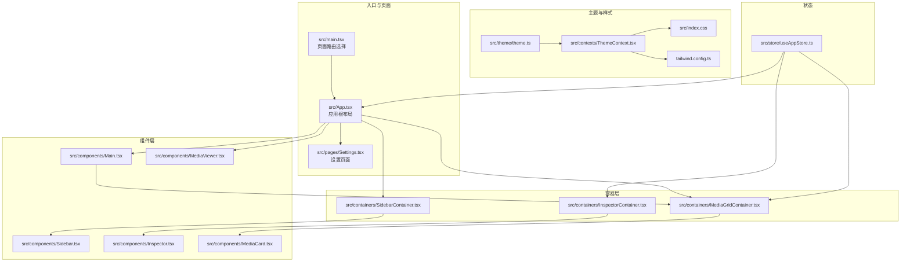
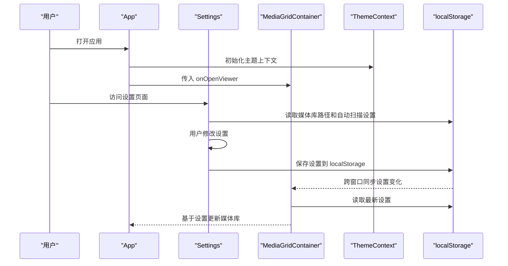
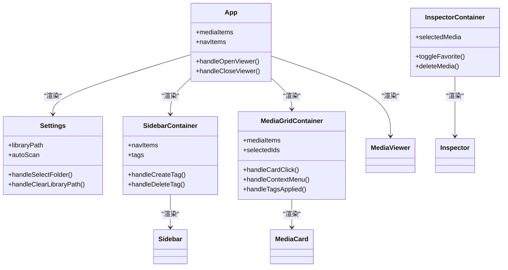
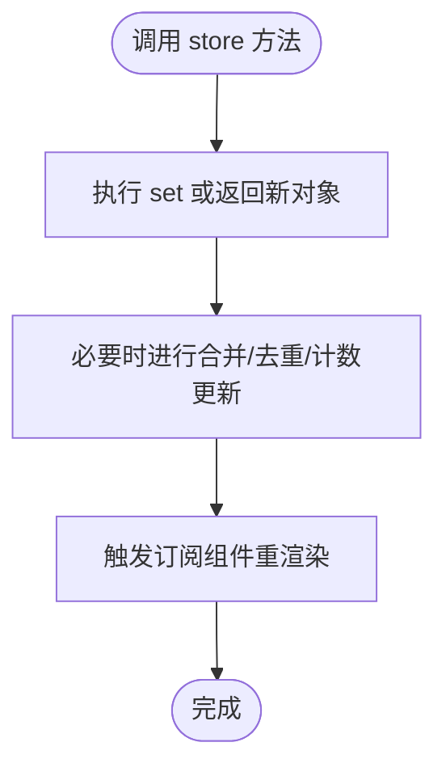
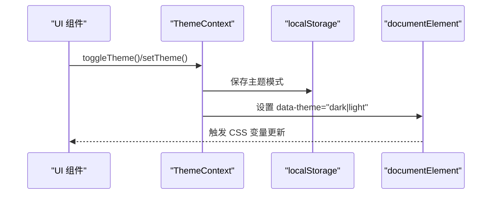
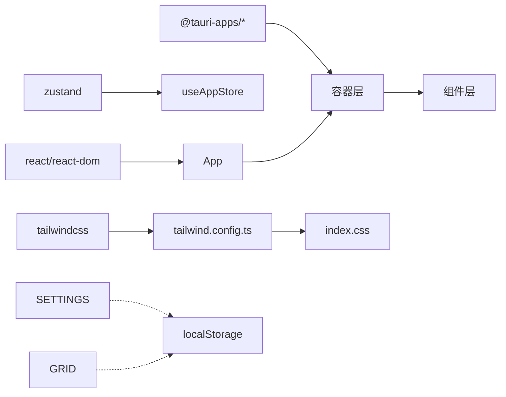

# 前端开发

<cite>
**本文引用的文件**
- [src/main.tsx](file://src/main.tsx)
- [src/App.tsx](file://src/App.tsx)
- [src/index.css](file://src/index.css)
- [tailwind.config.ts](file://tailwind.config.ts)
- [src/contexts/ThemeContext.tsx](file://src/contexts/ThemeContext.tsx)
- [src/theme/theme.ts](file://src/theme/theme.ts)
- [src/store/useAppStore.ts](file://src/store/useAppStore.ts)
- [src/components/Sidebar.tsx](file://src/components/Sidebar.tsx)
- [src/components/Main.tsx](file://src/components/Main.tsx)
- [src/components/Inspector.tsx](file://src/components/Inspector.tsx)
- [src/components/MediaCard.tsx](file://src/components/MediaCard.tsx)
- [src/components/MediaViewer.tsx](file://src/components/MediaViewer.tsx)
- [src/containers/SidebarContainer.tsx](file://src/containers/SidebarContainer.tsx)
- [src/containers/MediaGridContainer.tsx](file://src/containers/MediaGridContainer.tsx)
- [src/containers/InspectorContainer.tsx](file://src/containers/InspectorContainer.tsx)
- [src/pages/Settings.tsx](file://src/pages/Settings.tsx)
- [package.json](file://package.json)
</cite>

## 目录
1. [简介](#简介)
2. [项目结构](#项目结构)
3. [核心组件](#核心组件)
4. [架构总览](#架构总览)
5. [详细组件分析](#详细组件分析)
6. [依赖关系分析](#依赖关系分析)
7. [性能考量](#性能考量)
8. [故障排查指南](#故障排查指南)
9. [结论](#结论)
10. [附录](#附录)

## 简介
本文件面向 Medex 前端开发，系统性梳理 React + TypeScript + TailwindCSS 技术栈在项目中的落地方式，重点覆盖以下方面：
- 组件架构与容器-组件模式
- Zustand 全局状态管理的设计与使用
- 主题系统（CSS 变量 + Tailwind 集成 + 主题切换）
- 关键组件功能与实现：Sidebar、Main、Inspector、MediaCard、MediaViewer
- **localStorage 持久化系统**（包括 Settings 页面的自动扫描设置持久化和跨组件状态同步）
- 用户交互与状态反馈机制
- 代码规范、最佳实践与性能优化建议
- 具体使用模式与参考路径

## 项目结构
项目采用"容器-组件"分层组织，按职责划分为：
- 容器层：负责与状态、外部服务交互，向下传递 props
- 组件层：纯展示或轻交互组件，专注 UI 表现
- 上下文与主题：统一主题上下文与样式变量
- 状态层：Zustand store 管理全局状态
- 页面入口：主应用入口与页面路由选择
- **设置页面**：专门处理用户配置与持久化

**图表来源**
- [src/main.tsx:1-44](file://src/main.tsx#L1-L44)
- [src/App.tsx:1-73](file://src/App.tsx#L1-L73)
- [src/pages/Settings.tsx:1-283](file://src/pages/Settings.tsx#L1-L283)
- [src/containers/SidebarContainer.tsx:1-79](file://src/containers/SidebarContainer.tsx#L1-L79)
- [src/containers/MediaGridContainer.tsx:1-619](file://src/containers/MediaGridContainer.tsx#L1-L619)
- [src/containers/InspectorContainer.tsx:1-32](file://src/containers/InspectorContainer.tsx#L1-L32)
- [src/components/Sidebar.tsx:1-145](file://src/components/Sidebar.tsx#L1-L145)
- [src/components/Main.tsx:1-25](file://src/components/Main.tsx#L1-L25)
- [src/components/Inspector.tsx:1-277](file://src/components/Inspector.tsx#L1-L277)
- [src/components/MediaCard.tsx:1-318](file://src/components/MediaCard.tsx#L1-L318)
- [src/components/MediaViewer.tsx:1-186](file://src/components/MediaViewer.tsx#L1-L186)
- [src/contexts/ThemeContext.tsx:1-99](file://src/contexts/ThemeContext.tsx#L1-L99)
- [src/theme/theme.ts:1-159](file://src/theme/theme.ts#L1-L159)
- [src/index.css:1-156](file://src/index.css#L1-L156)
- [tailwind.config.ts:1-36](file://tailwind.config.ts#L1-L36)
- [src/store/useAppStore.ts:1-395](file://src/store/useAppStore.ts#L1-L395)

**章节来源**
- [src/main.tsx:1-44](file://src/main.tsx#L1-L44)
- [src/App.tsx:1-73](file://src/App.tsx#L1-L73)

## 核心组件
- 应用根布局与页面选择：根据路径选择渲染 App、Settings 或 Update 页面，并包裹主题 Provider。
- 根组件 App：聚合侧边栏、主内容区与媒体查看器；维护媒体列表筛选与查看器状态；调用后端接口标记媒体已观看并触发全局更新事件。
- **设置页面 Settings**：专门处理用户配置，包括语言、主题、媒体库路径和自动扫描设置的持久化管理。
- 容器-组件模式：
  - SidebarContainer：从 store 读取导航与标签，处理标签 CRUD，监听标签变更事件，向 Sidebar 传递 props。
  - MediaGridContainer：负责媒体过滤、批量选择、多选键盘交互、上下文菜单、标签批量应用、缩略图队列与并发控制、库路径变更监听、与后端交互等。
  - InspectorContainer：根据选中媒体映射为 Inspector 所需的 props，传递收藏与删除操作。
- 组件层：
  - Sidebar：导航与标签 UI，支持新建标签、删除标签、标签选择与导航切换。
  - Main：主区域布局，承载工具栏与媒体网格。
  - Inspector：媒体详情面板，支持标签增删、收藏切换、删除媒体。
  - MediaCard：媒体卡片，支持收藏切换、标签移除、双击打开查看器、右键上下文菜单。
  - MediaViewer：全屏媒体查看器，支持键盘左右切换、ESC 关闭、前后按钮。

**章节来源**
- [src/App.tsx:1-73](file://src/App.tsx#L1-L73)
- [src/pages/Settings.tsx:1-283](file://src/pages/Settings.tsx#L1-L283)
- [src/containers/SidebarContainer.tsx:1-79](file://src/containers/SidebarContainer.tsx#L1-L79)
- [src/containers/MediaGridContainer.tsx:1-619](file://src/containers/MediaGridContainer.tsx#L1-L619)
- [src/containers/InspectorContainer.tsx:1-32](file://src/containers/InspectorContainer.tsx#L1-L32)
- [src/components/Sidebar.tsx:1-145](file://src/components/Sidebar.tsx#L1-L145)
- [src/components/Main.tsx:1-25](file://src/components/Main.tsx#L1-L25)
- [src/components/Inspector.tsx:1-277](file://src/components/Inspector.tsx#L1-L277)
- [src/components/MediaCard.tsx:1-318](file://src/components/MediaCard.tsx#L1-L318)
- [src/components/MediaViewer.tsx:1-186](file://src/components/MediaViewer.tsx#L1-L186)

## 架构总览
Medex 前端采用"容器-组件"分层与 Zustand 状态管理，结合主题上下文与 TailwindCSS，形成清晰的职责边界与可维护的 UI 结构。**新增的 localStorage 持久化系统**确保用户配置在应用重启后得以保留。

**图表来源**
- [src/App.tsx:28-46](file://src/App.tsx#L28-L46)
- [src/pages/Settings.tsx:15-32](file://src/pages/Settings.tsx#L15-L32)
- [src/containers/MediaGridContainer.tsx:270-308](file://src/containers/MediaGridContainer.tsx#L270-L308)
- [src/contexts/ThemeContext.tsx:34-54](file://src/contexts/ThemeContext.tsx#L34-L54)

## 详细组件分析

### 组件层次与容器-组件模式
- 容器层职责：
  - 与 Zustand store 交互，读写状态
  - 与后端 Tauri 接口交互，封装业务动作
  - 监听全局事件，驱动 UI 更新
  - 维护本地交互状态（如多选、上下文菜单）
- 组件层职责：
  - 专注 UI 表现与基础交互
  - 通过 props 接收行为回调
  - 尽量无副作用，便于测试与复用

**图表来源**
- [src/App.tsx:1-73](file://src/App.tsx#L1-L73)
- [src/pages/Settings.tsx:1-283](file://src/pages/Settings.tsx#L1-L283)
- [src/containers/SidebarContainer.tsx:1-79](file://src/containers/SidebarContainer.tsx#L1-L79)
- [src/containers/MediaGridContainer.tsx:1-619](file://src/containers/MediaGridContainer.tsx#L1-L619)
- [src/containers/InspectorContainer.tsx:1-32](file://src/containers/InspectorContainer.tsx#L1-L32)
- [src/components/Sidebar.tsx:1-145](file://src/components/Sidebar.tsx#L1-L145)
- [src/components/MediaCard.tsx:1-318](file://src/components/MediaCard.tsx#L1-L318)
- [src/components/Inspector.tsx:1-277](file://src/components/Inspector.tsx#L1-L277)
- [src/components/MediaViewer.tsx:1-186](file://src/components/MediaViewer.tsx#L1-L186)

**章节来源**
- [src/containers/SidebarContainer.tsx:1-79](file://src/containers/SidebarContainer.tsx#L1-L79)
- [src/containers/MediaGridContainer.tsx:1-619](file://src/containers/MediaGridContainer.tsx#L1-L619)
- [src/containers/InspectorContainer.tsx:1-32](file://src/containers/InspectorContainer.tsx#L1-L32)

### Zustand 状态管理实现
- 全局状态设计
  - 导航项、标签、媒体列表、视图模式、媒体类型过滤、选中媒体 ID
  - 提供导航点击、标签点击、媒体点击、视图模式切换、类型过滤、收藏切换、删除媒体、从数据库设置媒体/标签、本地增删标签、标记已观看等方法
- 状态更新机制
  - 使用 create 创建 store，通过 set 或返回新对象的方式更新状态
  - 针对复杂合并逻辑（如从数据库合并媒体列表、标签计数联动）进行集中处理
- 状态订阅模式
  - 各容器通过选择器订阅所需字段，减少重渲染
  - 通过全局事件（如 medex:media-updated、medex:tags-updated）驱动 UI 刷新

**图表来源**
- [src/store/useAppStore.ts:145-394](file://src/store/useAppStore.ts#L145-L394)

**章节来源**
- [src/store/useAppStore.ts:1-395](file://src/store/useAppStore.ts#L1-L395)

### 主题系统实现原理
- CSS 变量系统
  - 在 :root 与 [data-theme='light'|'dark'] 下定义主题变量，覆盖背景、文本、边框、交互、输入、标签、按钮、遮罩与功能色
- Tailwind 集成
  - tailwind.config.ts 将 CSS 变量映射为 Tailwind 颜色别名，使类名直接使用主题色
- 主题切换机制
  - ThemeContext 提供主题模式（dark/light/system），检测系统偏好，持久化到 localStorage，更新 html 的 data-theme 属性
  - 支持跨窗口主题同步（监听 storage 事件）
- 响应式设计
  - 主题切换带过渡动画，整体颜色与边框平滑变化

**图表来源**
- [src/contexts/ThemeContext.tsx:46-54](file://src/contexts/ThemeContext.tsx#L46-L54)
- [src/index.css:5-108](file://src/index.css#L5-L108)
- [tailwind.config.ts:7-29](file://tailwind.config.ts#L7-L29)

**章节来源**
- [src/contexts/ThemeContext.tsx:1-99](file://src/contexts/ThemeContext.tsx#L1-L99)
- [src/theme/theme.ts:1-159](file://src/theme/theme.ts#L1-L159)
- [src/index.css:1-156](file://src/index.css#L1-L156)
- [tailwind.config.ts:1-36](file://tailwind.config.ts#L1-L36)

### Settings 设置页面
- **localStorage 持久化系统**
  - **初始化读取**：组件挂载时从 localStorage 读取媒体库路径和自动扫描设置，确保用户配置在应用重启后得以保留
  - **自动扫描设置持久化**：当用户切换"启动时自动扫描媒体库"选项时，立即保存到 localStorage，支持布尔值序列化
  - **媒体库路径持久化**：用户选择媒体库路径时，同时保存到 localStorage 和组件状态，确保跨组件同步
- **功能要点**
  - 语言设置（简体中文/英语）
  - 主题设置（深色/浅色/跟随系统）
  - 媒体库路径选择与管理
  - 自动扫描设置（启动时自动扫描媒体库）
  - 数据清理功能
- **交互细节**
  - 使用 useEffect 钩子管理生命周期，确保只在组件挂载时读取一次配置
  - 扫描过程中禁用按钮，提供视觉反馈
  - 成功扫描后显示用户提示

**更新** 新增了完整的 localStorage 持久化系统，包括自动扫描设置的双向绑定和跨组件状态同步机制

**章节来源**
- [src/pages/Settings.tsx:1-283](file://src/pages/Settings.tsx#L1-L283)

### MediaGridContainer 组件
- **localStorage 跨组件同步**
  - **定期检查机制**：每 500ms 检查 localStorage 中的 libraryPath 变化，确保跨窗口状态同步
  - **Tauri 事件监听**：监听 `medex:library-path-cleared` 事件，实现跨窗口数据清理后的状态同步
  - **自动扫描触发**：当 libraryPath 发生变化时，自动重新加载媒体数据
- **功能要点**
  - 媒体过滤与批量选择
  - 多选键盘交互与上下文菜单
  - 标签批量应用与缩略图队列管理
  - 媒体库路径变更监听与自动刷新
- **性能优化**
  - 使用防抖和节流机制避免频繁检查
  - 合理的清理逻辑防止内存泄漏

**更新** 新增了完整的 localStorage 跨组件同步机制，包括定期检查和事件监听

**章节来源**
- [src/containers/MediaGridContainer.tsx:270-308](file://src/containers/MediaGridContainer.tsx#L270-L308)

### Sidebar 组件
- 功能要点
  - 导航项高亮与切换
  - 标签列表展示与选择
  - 新建标签（回车确认）、删除标签
  - 主题色透传，保证视觉一致性
- 交互细节
  - 悬停态与选中态的颜色与边框变化
  - 输入框聚焦态边框强调

**章节来源**
- [src/components/Sidebar.tsx:1-145](file://src/components/Sidebar.tsx#L1-L145)
- [src/containers/SidebarContainer.tsx:1-79](file://src/containers/SidebarContainer.tsx#L1-L79)

### Main 组件
- 功能要点
  - 主区域标题与工具栏容器
  - 媒体网格容器占位，承载媒体网格与上下文菜单
- 设计要点
  - 使用 Tailwind medex* 颜色变量，与主题系统联动

**章节来源**
- [src/components/Main.tsx:1-25](file://src/components/Main.tsx#L1-L25)

### Inspector 组件
- 功能要点
  - 媒体预览（图片/视频）、文件名、标签列表、信息展示
  - 标签增删（输入校验、重复检查、调用后端接口）
  - 收藏切换与删除媒体
- 交互细节
  - 标签移除使用右键菜单或点击按钮
  - 加载状态与错误提示
  - 通过全局事件同步标签变更

**章节来源**
- [src/components/Inspector.tsx:1-277](file://src/components/Inspector.tsx#L1-L277)
- [src/containers/InspectorContainer.tsx:1-32](file://src/containers/InspectorContainer.tsx#L1-L32)

### MediaCard 组件
- 功能要点
  - 媒体缩略图（图片优先，视频占位图/懒加载）
  - 收藏按钮（悬停态透明遮罩）
  - 标签展示与移除（点击移除标签）
  - 选中态与悬停态颜色变化
- 性能优化
  - 使用 memo 并自定义比较函数，避免不必要重渲染
  - 图片加载失败降级与视频缩略图懒加载

**章节来源**
- [src/components/MediaCard.tsx:1-318](file://src/components/MediaCard.tsx#L1-L318)

### MediaViewer 组件
- 功能要点
  - 全屏预览图片/视频
  - 键盘左右键与左右按钮切换
  - ESC 关闭
  - 自动播放视频
- 交互细节
  - 索引安全边界处理
  - ear 键盘事件监听与清理

**章节来源**
- [src/components/MediaViewer.tsx:1-186](file://src/components/MediaViewer.tsx#L1-L186)

## 依赖关系分析
- 技术栈与版本
  - React、ReactDOM、Zustand、TailwindCSS、@tauri-apps/* 插件
- 组件间依赖
  - App 依赖容器与组件
  - 容器依赖 store 与 ThemeContext
  - 组件依赖 ThemeContext 与 props
  - **Settings 依赖 localStorage 进行状态持久化**
  - **MediaGridContainer 依赖 localStorage 进行跨组件状态同步**
- 外部集成
  - Tauri 对话框、存储、事件系统用于库路径选择、状态持久化与事件通知

**图表来源**
- [package.json:12-34](file://package.json#L12-L34)
- [src/store/useAppStore.ts:1](file://src/store/useAppStore.ts#L1)
- [tailwind.config.ts:1-36](file://tailwind.config.ts#L1-L36)
- [src/index.css:1-156](file://src/index.css#L1-L156)

**章节来源**
- [package.json:1-36](file://package.json#L1-L36)

## 性能考量
- 渲染优化
  - MediaCard 使用 memo 与自定义比较函数，避免 props 变化导致的重渲染
  - MediaGridContainer 使用虚拟滚动范围回调，仅在可见范围内构建任务队列
- 异步与并发
  - 缩略图请求限制并发数量与队列大小，避免资源争用
  - 使用请求中集合与排队集合去重，防止重复请求
  - **localStorage 操作采用防抖机制，避免频繁写入**
- 事件与清理
  - 键盘事件与窗口事件在组件卸载时清理，避免内存泄漏
  - Tauri 事件监听在组件卸载时解除
  - **MediaGridContainer 使用 500ms 间隔检查，平衡实时性和性能**
- 主题与样式
  - CSS 变量与 Tailwind 颜色映射，减少运行时计算与类名拼接成本

**更新** 新增了 localStorage 操作的性能考量，包括防抖机制和间隔检查策略

**章节来源**
- [src/components/MediaCard.tsx:277-317](file://src/components/MediaCard.tsx#L277-L317)
- [src/containers/MediaGridContainer.tsx:353-487](file://src/containers/MediaGridContainer.tsx#L353-L487)
- [src/components/MediaViewer.tsx:39-63](file://src/components/MediaViewer.tsx#L39-L63)

## 故障排查指南
- 主题不生效
  - 检查 ThemeContext 是否包裹应用根节点
  - 确认 html 的 data-theme 属性是否正确设置
  - 校验 tailwind.config.ts 中颜色映射是否完整
- 标签无法增删
  - 检查后端接口调用是否成功（create_tag、add_tag_to_media、remove_tag_from_media）
  - 确认全局事件 medex:tags-updated 与 medex:media-tags-updated 是否触发
- 媒体库为空
  - 确认库路径是否设置（localStorage.libraryPath）
  - 检查 scan_and_index 是否成功触发
  - **检查 Settings 页面的 localStorage 读取是否正常工作**
- 缩略图不显示
  - 检查 thumbnail_ready 事件是否到达
  - 确认并发队列与请求中集合状态
- 收藏状态不同步
  - 检查 set_media_favorite 调用与 toggleFavorite 的状态更新
- **localStorage 持久化问题**
  - **检查浏览器的 localStorage 是否被禁用或清理**
  - **验证 Settings 页面的 useEffect 钩子是否正确执行**
  - **确认 MediaGridContainer 的跨组件同步机制是否正常工作**

**更新** 新增了 localStorage 持久化相关的故障排查指南

**章节来源**
- [src/contexts/ThemeContext.tsx:46-54](file://src/contexts/ThemeContext.tsx#L46-L54)
- [src/pages/Settings.tsx:15-32](file://src/pages/Settings.tsx#L15-L32)
- [src/containers/MediaGridContainer.tsx:270-308](file://src/containers/MediaGridContainer.tsx#L270-L308)

## 结论
Medex 前端以清晰的容器-组件分层、Zustand 状态管理与主题上下文为核心，结合 TailwindCSS 实现了高内聚、低耦合的 UI 架构。**新增的 localStorage 持久化系统**确保了用户配置的可靠保存和跨组件状态同步，提升了用户体验的一致性。通过合理的事件驱动与并发控制，兼顾了交互体验与性能表现。后续可在以下方向持续优化：
- 增加更细粒度的状态拆分与模块化
- 引入组件单元测试与可视化回归
- 优化缩略图加载策略与缓存机制
- 扩展主题变量与暗/亮主题的自动化生成规则
- **考虑引入更高级的持久化方案（如 IndexedDB）以支持更大规模的数据存储**

## 附录
- 代码规范与最佳实践
  - 使用 TypeScript 明确 props 与状态类型
  - 容器层负责副作用与状态，组件层保持纯函数式
  - 使用 memo 与选择器降低重渲染
  - 事件命名统一（如 medex:*），便于追踪
  - **localStorage 操作遵循单一职责原则，避免分散在多个组件中**
- 性能优化建议
  - 控制并发与队列长度，避免 UI 卡顿
  - 使用懒加载与占位图提升首屏体验
  - 合理使用 CSS 变量与 Tailwind 类，减少运行时样式计算
  - **localStorage 写入操作采用防抖和批量处理，减少 I/O 次数**
  - **跨组件同步使用合理的检查间隔，平衡实时性和性能**